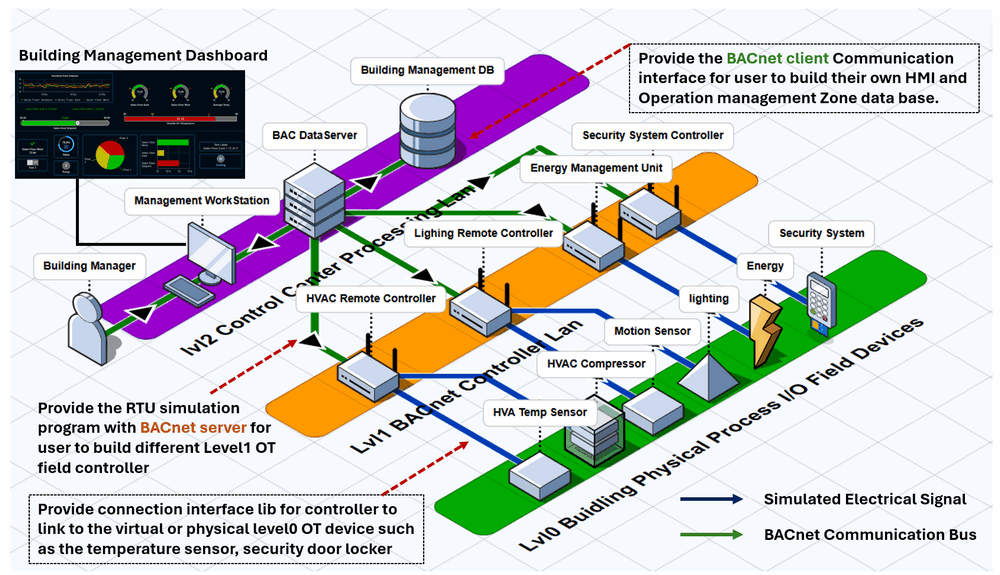
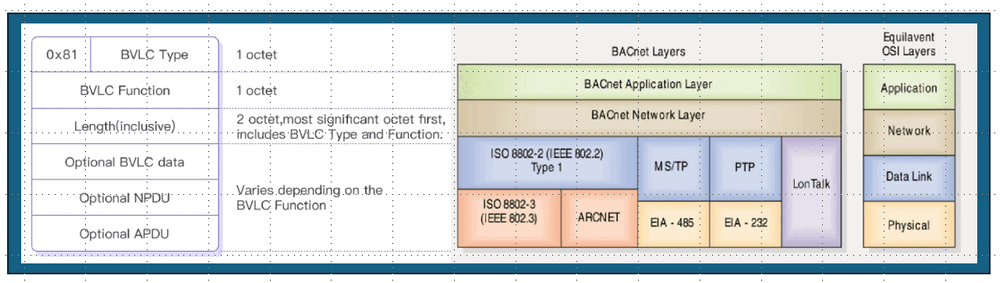

# Python Visual Building Controller (RTU) with ISO 16484-5 BACnet Communication Protocol

**Project Design Purpose** : In this project, I extend the [Python-Based virtual Remote Terminal Unit Simulator System](https://www.linkedin.com/pulse/python-virtual-plc-rtu-simulator-yuancheng-liu-elkgc) (which interfaced to SCADA system via Modbus-TCP, Siemens-S7Comm, IEC 60870-5-104 and IEC 62541 OPC-UA-TCP)  by adding the support for **ISO 16484-5 BACne**t protocol. The BACnet (Building Automation and Control Networks) is an open communication protocol defined in ANSI/ASHRAE 135 and ISO 16484-5. It is widely used in building automation to integrate systems such as HVAC, lighting, energy management, security, and access control. By providing a common communication language, BACnet enables devices from different manufacturers to interoperate seamlessly.

The enhanced virtual RTU simulator developed in this project focuses on modeling the core behaviors of BACnet devices and controllers, including data acquisition, value exchange, processing, and automated control according to the ISO 16484-5 specification which can help build the OT components in cyber range. This project delivers three key capabilities:

- **BACnet Communication Module** – A Python BACnet communication layer (server and client) supporting interaction among Sensors, Controllers, RTUs, BACnet Gateways, and SCADA/HMI systems, enabling analog and discrete BACnet data exchange.
- **RTU Simulator Framework** – A virtual building-system controller framework that simulates physical components such as HVAC, lighting, and security systems, supporting monitoring and automatic control based on predefined logic rules.
- **Data Processing and Control Module** – A plug-in Python module for BACnet data storage, processing, and control-signal generation, integrated with the RTU simulator framework to execute control strategies.

```python
# Author:      Yuancheng Liu
# Created:     2026/01/08
# Version:     v_0.0.1
# Copyright:   Copyright (c) 2026 Liu Yuancheng
# License:     MIT License
```

**Table of Contents**

[TOC]

------

### 1. Introduction

The **Python ISO 16484-5 BACnet Simulator** is designed to construct virtual building-automation components—such as HVAC, lighting, security, and environmental monitoring systems—within an OT cyber twin/range environment. It serves as both a learning platform and a testing bench for BACnet-based building automation applications, enabling users to explore protocol behavior without requiring physical building-automation hardware.

The RTU simulator does **not** attempt to be a 1:1 emulation of every feature of real BACnet devices. Instead, it focuses on the essential operational behaviors of a BACnet remote controller, including:

- BACnet variable/object storage models
- data exchange and interaction patterns
- cyclic control-logic execution and decision making

#### 1.1 Introduction of System Architecture

The simulator allows users to construct cyber-twin architectures that reflect the **three-level structure commonly found in real OT systems**.  Within this virtual environment, users can prototype BACnet-enabled field controllers, RTUs, I/O servers and Building management SCADA/HMI clients  over the BACnet protocol. As shown in the system structure diagram below:



The platform supports interactions across OT layers from:

- **Level 0** – physical-world devices and sensors such HVAC temp sensor, security door looker, lighting motion sensor.
- **Level 1** – field controllers and RTUs such as the HVAC auto controller, light controller. 
- **Level 2** – control center / processing LAN environments such as the building monitor and management station.

Then communication functionality in this project is implemented using the Python library  [BACpypes](https://bacpypes.readthedocs.io/en/latest/gettingstarted/gettingstarted001.html) , which provides a software stack conforming to the ISO 16484-5 BACnet standard. The BACnet node communication topology in the simulator supports both host–connector and publish–subscribe interaction models, depending on configuration:

- lower-level OT components (RTUs, field controllers) expose process data via embedded BACnet **server/publisher** modules.

- higher-level components (HMI, SCADA, historians, database servers) use BACnet **client/subscriber** modules to browse, read, write, and subscribe to exposed data.

By modeling these core aspects, the simulator provides an effective environment for education, prototyping, and experimentation in the following domains:

- Academic research in building and industrial automation
- Students learning OT communication protocols and BACnet device behavior
- Developers designing or verifying BACnet-enabled systems
- OT cybersecurity professionals analyzing protocol traffic and system interactions

In this article I will also show the detailed usage of the RTU frame work to build on automated HVAC controlling system.


------

### 2. BACnet Background Knowledge

BACnet (Building Automation and Control Networks) is an open communication protocol standardized as **ANSI/ASHRAE 135** and **ISO 16484-5**. It is designed specifically for building automation and control systems, enabling interoperability among devices from different manufacturers including: `HVAC controllers`, `lighting and energy management systems`, `access control and security systems`, `environmental monitoring devices` and `building management platforms and SCADA systems`. These BACnet devices expose their functions and data as standardized *BACnet objects* (such as Analog Input or Binary Output), enabling common semantics for monitoring and control across heterogeneous systems.

BACnet supports multiple transport layers, including:

- BACnet/IP (UDP over IP networks)
- BACnet MS/TP (RS-485 serial bus)
- BACnet Ethernet
- BACnet over LonTalk
- BACnet over ARCNET

In this project, the simulator focuses on **BACnet/IP**, which is the most widely deployed option in modern building automation networks. The BACnet messages are encapsulated in **UDP/IP packets** and sent over Ethernet. The protocol uses **UDP port 47808 (0xBAC0)** by default.

#### 2.1 BACnet/IP Protocol Packet Structure 

BACnet/IP uses the UDP protocol for data transmission, a typical BACnet/IP frame can be conceptually divided into the following parts as shown below:



- **UDP/IP Header** : Standard network layer and transport layer addressing.
- **BACnet Virtual Link Control(BVLC)** : Identifies BACnet/IP messages and handles broadcasts and forwarding.
- **Network Protocol Data Unit(NPDU)** : Performs BACnet network layer routing contains `version`, `control flags`, `destination/source network info`,  `hop count` and `network message type`.
- **Application Protocol Data Unit(APDU)** : Encodes application layer services includes `PDU type`, `invoke ID` , `service choice` and `service parameters`.

#### 2.4 BACnet Data Structure and Object Model

BACnet organizes data in standardized objects with properties. Each BACnet object represents a functional element inside a device. The typical object types defined in ISO 16484-5 include: `Analog Input`, `Analog Output`, `Analog Value`, `Binary Input` , `Binary Output`, `Binary Value`, `Multi-State Input/Output/Value`, `Device`, `Schedule`, `Calendar`, `Trend Log` and `Event Enrollment`. 

Each object has a unique **Object Identifier (Object ID)** and a **Object Name** within the device. Every BACnet object contains a set of **properties**, some mandatory and some optional. Examples include:

- **Present_Value** : Current physical or logical value of the object
- **Description** : Human-readable text
- **Status_Flags** : In-alarm, fault, overridden, out-of-service
- **Units** : Engineering unit (°C, %, Pa, etc.)
- **Event_State and Alarm Limits** : Used for alarm handling

An example of BACnet Object: 

```python
{
    "objectName": "Temperature",
    "objectIdentifier": ("analogValue", 1),
    "presentValue": 22.5,
    "description": "Room Temperature",
    "units": "degreesCelsius"
},
```

Properties are accessed through `ReadProperty` or `WriteProperty` services, the request `ReadProperty`  and `WriteProperty` request is shown below:


------

### 3. Design of The Virtual RTU

In this section, I will use the workflow of how to create a building auto HVAC remote controlling system 


https://www.optigo.net/whats-in-a-bacnet-packet-capture/

https://www.emqx.com/en/blog/bacnet-protocol-basic-concepts-structure-obejct-model-explained

https://youtu.be/xxZrl2InHuM?si=bPPfYq2hx5O53adJ