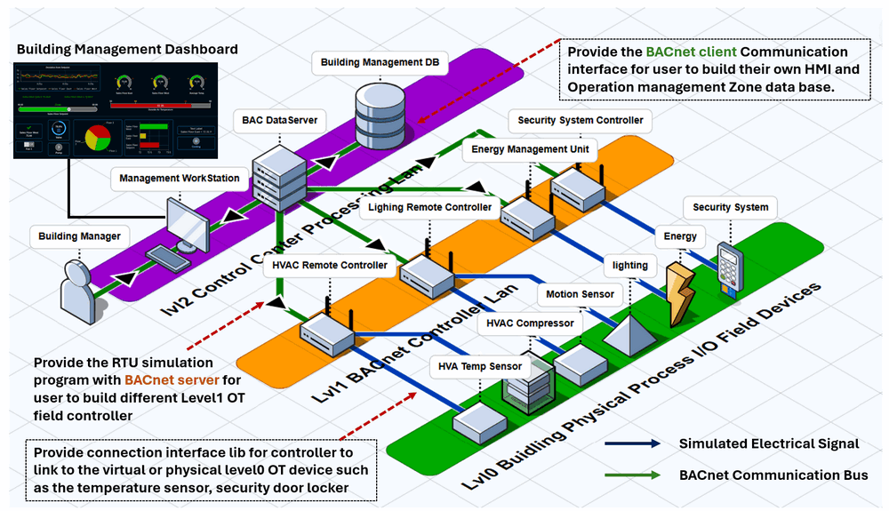
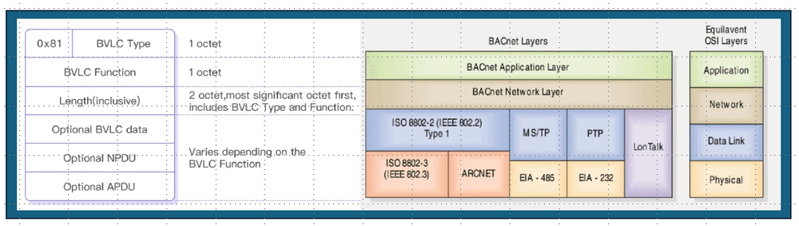
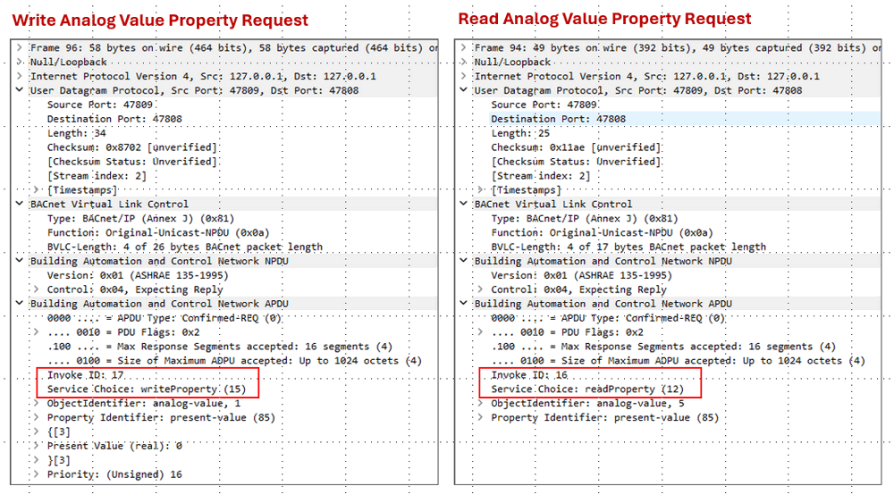
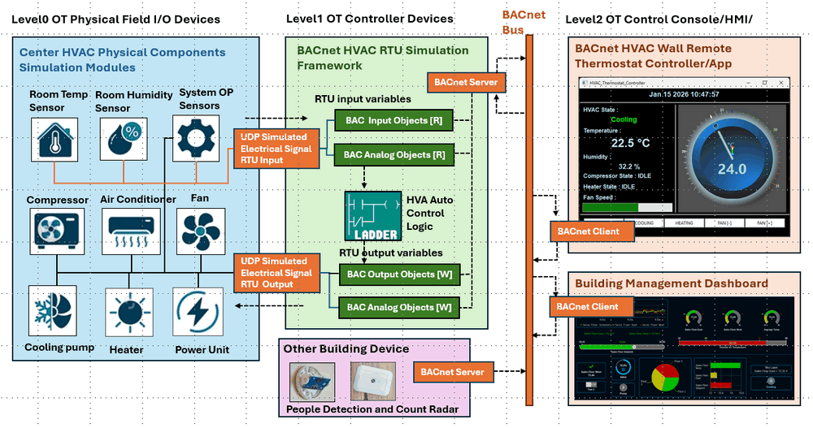
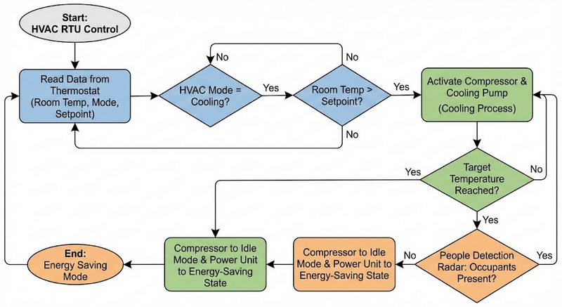
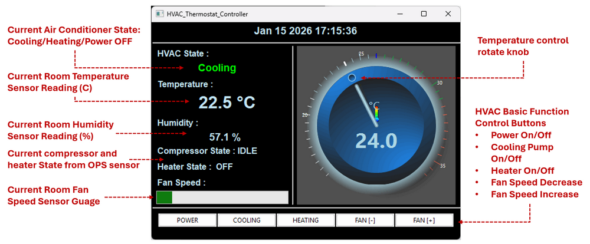

# Python Visual Building Controller (RTU) with ISO 16484-5 BACnet to Simulate Building HVAC System

[us English](Readme.md) | **cn 中文**

**项目设计目的**：在这个项目中，我扩展了[基于 Python 的虚拟远程终端单元模拟器系统](https://www.linkedin.com/pulse/python-virtual-plc-rtu-simulator-yuancheng-liu-elkgc)（该系统通过 `Modbus-TCP`、`Siemens-S7Comm`、`IEC 60870-5-104` 和 `IEC 62541 OPC-UA-TCP` 连接到 Lvl3-OT SCADA 系统），增加了对 **ISO 16484-5 BACnet**（楼宇自动化和控制网络）协议的支持。在本文中，我还将展示 RTU 库框架的详细用法，以模拟一个自动化的 HVAC 控制系统。

本项目中开发的增强型虚拟 RTU 模拟器专注于建模 BACnet 设备和控制器的核心行为，包括数据采集、值交换、处理以及根据 ISO 16484-5 规范进行的自动控制，这有助于在网络靶场中构建 OT 组件。本项目提供三个关键功能：

- **BACnet 通信模块** – 一个 Python BACnet 通信层（服务器和客户端），支持传感器、控制器、RTU、BACnet 网关和 SCADA/HMI 系统之间的交互，从而实现模拟和离散 BACnet 数据的交换。
- **RTU 模拟器框架** – 一个虚拟建筑系统远程控制器框架，模拟 HVAC、照明和安全系统等物理组件，支持基于预定义逻辑规则的监控和自动控制。
- **数据处理和控制模块** – 一个用于 BACnet 数据存储、处理和控制信号生成的插件 Python 模块，与 RTU 模拟器框架集成以执行控制策略。

```python
# Author:      Yuancheng Liu
# Created:     2026/01/08
# Version:     v_0.0.1
# Copyright:   Copyright (c) 2026 Liu Yuancheng
# License:     MIT License
```

**Table of Contents**

[TOC]

- [Python Visual Building Controller (RTU) with ISO 16484-5 BACnet to Simulate Building HVAC System](#python-visual-building-controller--rtu--with-iso-16484-5-bacnet-to-simulate-building-hvac-system)
    + [1. 項目简介](#1-----)
      - [1.1 系统架构简介](#11-------)
    + [2. BACnet 背景知识](#2-bacnet-----)
      - [2.1 BACnet/IP 协议数据包结构](#21-bacnet-ip--------)
      - [2.4 BACnet 数据结构和对象模型](#24-bacnet----------)
    + [3. 虚拟 RTU 的设计](#3----rtu----)
      - [3.1 通信模块](#31-----)
      - [3.2 BACnet 数据结构模块](#32-bacnet-------)
      - [3.3 RTU 自动控制逻辑模块](#33-rtu---------)
    + [4. 用例和用法示例](#4--------)
      - [4.1 项目模块概述](#41-------)
      - [4.2 使用示例：HVAC 系统仿真](#42------hvac-----)
    + [5.结论和参考](#5-----)

------

### 1. 項目简介

BACnet（楼宇自动化和控制网络）是在 ANSI/ASHRAE 135 和 ISO 16484-5 中定义的开放通信协议。它广泛应用于楼宇自动化中，以集成 HVAC、照明、能源管理、安全和门禁控制等系统。通过提供通用的通信语言，BACnet 使来自不同制造商的设备能够无缝互操作。

该 **Python ISO 16484-5 BACnet 模拟器** 旨在构建虚拟楼宇自动化组件，例如 OT 网络孪生/靶场环境中的 HVAC、照明、安全和环境监控系统。它既可以作为学习平台，也可以作为基于 BACnet 的楼宇自动化应用的测试平台，使用户无需物理楼宇自动化硬件即可探索协议行为。

RTU 模拟器**并非**试图 1:1 模拟真实 BACnet 设备的每个功能。相反，它侧重于 BACnet 远程控制器的基本操作行为，包括：

- BACnet 变量/对象存储模型
- 数据交换和交互模式
- 循环控制逻辑执行和决策

#### 1.1 系统架构简介

该模拟器允许用户构建反映真实 OT 系统中常见的三层结构的赛博孪生架构。在这个虚拟环境中，用户可以通过 BACnet 总线对支持 BACnet 的现场控制器、RTU、I/O 服务器和楼宇管理 SCADA/HMI 客户端进行原型设计。如下图所示的系统结构图：



该平台支持跨 OT 层的交互，从：

- **0 级** – 物理世界设备和传感器，例如 HVAC 温度传感器、安全门锁、照明运动传感器。
- **1 级** – OT 现场控制器和 RTU，例如 HVAC 自动控制器、照明控制器。
- **2 级** – 管理室/处理 LAN 环境，例如楼宇监控站。

本项目中的通信功能是使用 Python 库 [BACpypes](https://bacpypes.readthedocs.io/en/latest/gettingstarted/gettingstarted001.html) 实现的，该库提供了一个符合 ISO 16484-5 BACnet 标准的软件堆栈。模拟器中的 BACnet 节点通信拓扑支持主机-连接器和发布-订阅交互模型，具体取决于配置：

- 较低级别的 OT 组件（RTU、现场控制器）通过嵌入式 BACnet 服务器/发布者模块公开过程数据。
- 较高级别的组件（HMI、SCADA、历史记录器、数据库服务器）使用 BACnet 客户端/订阅者模块来浏览、读取、写入和订阅公开的数据。

通过对这些核心方面进行建模，该模拟器为以下领域的教育、原型设计和实验提供了有效的环境：

- 楼宇和工业自动化领域的学术研究
- 学习 OT 通信协议和 BACnet 设备行为的学生
- 设计或验证支持 BACnet 的系统的开发人员
- 分析协议流量和系统交互的 OT 网络安全专业人员

 

------

### 2. BACnet 背景知识

BACnet 是一种开放通信协议，标准化为 ANSI/ASHRAE 135 和 ISO 16484-5。它专门为楼宇自动化和控制系统而设计，可实现来自不同制造商的设备之间的互操作性，包括：`HVAC 控制器`、`照明和能源管理系统`、`门禁控制和安全系统`、`环境监控设备` 以及 `楼宇管理平台和 SCADA 系统`。这些 BACnet 设备将其功能和数据公开为标准化的 BACnet 对象（例如模拟输入或二进制输出），从而为跨异构系统的监控和控制提供通用语义。

BACnet 支持多个传输层，包括：

- BACnet/IP（基于 IP 网络的 UDP）
- BACnet MS/TP（RS-485 串行总线）
- BACnet 以太网
- BACnet over LonTalk
- BACnet over ARCNET

在这个项目中，模拟器侧重于 **BACnet/IP**，它是现代楼宇自动化网络中部署最广泛的选项。BACnet 消息封装在 UDP/IP 数据包中，并通过以太网发送。该协议默认使用 **UDP 端口 47808 (0xBAC0)**。

#### 2.1 BACnet/IP 协议数据包结构

BACnet/IP 使用 UDP 协议进行数据传输，典型的 BACnet/IP 帧可以概念性地分为以下几个部分，如下图所示：



- **UDP/IP 标头**：标准网络层和传输层寻址。
- **BACnet 虚拟链路控制 (BVLC)**：标识 BACnet/IP 消息并处理广播和转发。
- **网络协议数据单元 (NPDU)**：执行 BACnet 网络层路由，包含 `version`、`control flags`、`destination/source network info`、`hop count` 和 `network message type`。
- **应用协议数据单元 (APDU)**：编码应用层服务，包括 `PDU type`、`invoke ID`、`service choice` 和 `service parameters`。

#### 2.4 BACnet 数据结构和对象模型

BACnet 以具有属性的标准化对象组织数据。每个 BACnet 对象代表设备内部的功能元素。ISO 16484-5 中定义的典型对象类型包括：`Analog Input`、`Analog Output`、`Analog Value`、`Binary Input`、`Binary Output`、`Binary Value`、`Multi-State Input/Output/Value`、`Device`、`Schedule`、`Calendar`、`Trend Log` 和 `Event Enrollment`。

每个对象在设备中都有一个唯一的 **对象标识符 (Object ID)** 和一个 **对象名称**。每个 BACnet 对象都包含一组 **属性**。示例包括（一些是强制性的，一些是可选的）：

- **Present_Value**：对象的当前物理或逻辑值
- **Description**：人类可读的文本
- **Status_Flags**：报警、故障、被覆盖、停止服务
- **Units**：工程单位（°C、%、Pa 等）
- **Event_State 和 Alarm Limits**：用于报警处理

BACnet 对象示例：

```json
{
    "objectName": "Temperature",
    "objectIdentifier": ("analogValue", 1),
    "presentValue": 22.5,
    "description": "Room Temperature",
    "units": "degreesCelsius"
},
```

属性通过 `ReadProperty` 或 `WriteProperty` 服务访问，`ReadProperty` 和 `WriteProperty` 请求如下所示：




------

### 3. 虚拟 RTU 的设计

本节介绍基于 Python 的虚拟楼宇控制器 (RTU) 的设计，以中央楼宇 HVAC 自动化系统为例。目的是演示软件定义的 HVAC 控制器 RTU 如何监控模拟物理设备、处理 I/O 信号、执行控制逻辑，并通过 ISO 16484-5 BACnet 协议与 0 级现场设备和 2 级 SCADA/HMI 应用无缝集成。

如下图所示的系统工作流程图所示，虚拟 RTU 架构分为三个主要 OT 层：



- **0 级 – OT 物理现场 I/O 设备**：模拟 HVAC 组件和传感器，代表物理环境。
- **1 级 – OT 控制器设备**：虚拟 HVAC RTU，负责通信、数据处理和控制逻辑。
- **2 级 – OT 控制台/HMI**：基于 BACnet 的墙式恒温器、楼宇管理仪表板和监控应用程序。

架构的中心 – 1 级 OT 控制器设备 – 代表虚拟 HVAC 中心控制器 (RTU)。此 RTU 模拟由四个紧密耦合的功能模块组成：`Communication Module`、`BACnet Data Structure Module` 和 `RTU Auto Control Logic Module`。

#### 3.1 通信模块

通信模块充当虚拟 RTU 与周围 OT 生态系统之间的外部接口。它支持与 0 级现场设备和 2 级监控系统进行双向数据交换，如架构图的橙色部分所示。

**3.2.1 基于 UDP 的模拟电信号 I/O**

使用基于 UDP 的数据交换来模拟 HVAC 系统中常用的电气和现场总线连接（例如 RS-232、RS-485、CAN 总线或离散电信号）。

- **RTU 输入（UDP 入站）**：模拟 HVAC 传感器（包括室温、房间湿度和系统运行状态）定期生成测量数据，并通过 UDP 数据包将其传输到 RTU。
- **RTU 输出（UDP 出站）**：RTU 向模拟执行器发送控制命令，例如 `compressor`、`fan`、`heater`、`cooling pump` 和 `power unit`。

**3.2.2 BACnet (BAC01) 通信堆栈**

在模拟电 I/O 的基础上，RTU 嵌入了一个 **BACnet/IP 通信堆栈**，该堆栈使用 Python **BACpypes** 库实现，用于浏览 RTU BACnet 对象、读取传感器和状态值、写入控制设定点。主要特点包括：

- RTU 内部的嵌入式 BACnet 服务器将内部 I/O 变量公开给 BACnet 总线。
- 2 级组件，例如墙式 HVAC 恒温器控制器、楼宇管理仪表板和带有 BACnet 客户端的数据历史记录器。
- 外部楼宇设备（例如，人员检测或运动雷达传感器）也可以通过 BACnet 发布或交换数据。

#### 3.2 BACnet 数据结构模块

BACnet 数据结构模块（由图中的深绿色部分表示）定义了如何将 RTU 内部变量映射到标准化的 BACnet 对象和属性。

**3.3.1 只读 BACnet 对象（输入建模）**

传感器读数和物理输入状态公开为只读 BACnet 对象：

- `BACnet Input Objects [R]`：表示离散或电信号状态（例如，开/关、故障状态）。
- `BACnet Analog Objects [R]`：表示连续传感器值，例如温度、湿度和电压...

HMI 或恒温器控制器将发送 BACnet `ReadProperty` 请求以从 HVAC RTU 获取数据。

**3.3.2 可写 BACnet 对象（控制建模）**

控制命令和操作状态使用可写 BACnet 对象建模：

- `BACnet Analog Objects [W]`：用于控制设定点、阈值和操作参数。
- `BACnet Output Objects [W]`：用于表示发送到 HVAC 组件的执行器状态和控制信号。

可写对象的属性 `Present_Value` 可以通过 BACnet 数据集 `WriteProperty` 函数更改。

#### 3.3 RTU 自动控制逻辑模块

RTU 自动控制逻辑模块是一个基于 Python 的执行引擎，用于实现虚拟 HVAC 系统的闭环控制行为。控制周期按如下方式运行：

1. 从以下位置获取输入数据：`BACnet Input Objects [R]`、`BACnet Analog Objects [R]` 和 `BACnet Analog Objects [W]`。
2. 执行预定义的控制逻辑规则。
3. 通过将结果写入 `BACnet Output Objects [W]` 来更新执行器状态。

以下是用于冷却房间的示例控制方案：



HVAC RTU 模块从恒温器读取室温、HVAC 模式（制冷/制热）和目标设定点。如果系统处于制冷模式且室温超过设定点，则将激活压缩机和冷却泵。冷却过程将持续到达到目标温度。当室温达到目标温度时，如果人员检测雷达报告房间内无人，则压缩机将转换为怠速模式，并且电源单元将切换到节能状态。


------

### 4. 用例和用法示例

本节提供了一个实践演练，用于使用项目中包含的 Python 模块构建和运行简化的基于 BACnet 的虚拟 RTU 模拟器。该示例演示了 BACnet 设备、RTU 和控制器如何在模拟的楼宇自动化环境中进行交互，并以中央 HVAC 系统作为代表性用例。

#### 4.1 项目模块概述

以下 Python 模块构成了 BACnet RTU 模拟器的基线实现：

| 程序文件                              | 执行环境       | 描述                                                         |
| :------------------------------------ | :------------- | :----------------------------------------------------------- |
| `src/BACnetComm.py`                   | Python 3.7.8 + | 实现 ISO 16484-5 BACnet 客户端和服务器 API 的核心库。它提供 BACnet 对象管理以及 RTU 和 SCADA/HMI 系统之间的数据/命令交换。 |
| `src/BACnetCommTest.py`               | Python 3.7.8 + | `BACnetComm.py` 的测试用例程序。它在子线程中启动 BACnet 服务器，并初始化客户端以验证数据读/写操作和自动控制逻辑执行。 |
| `testcase /bacnetRtuClientTest.py`    | Python 3.7.8 + | 模拟连接到 RTU 的 SCADA 或监控控制器的示例 BACnet 客户端程序。 |
| `testcase /bacnetRtuServerTest.py`    | Python 3.7.8 + | 模拟 BACnet RTU 设备的示例 BACnet 服务器程序。               |
| `testcase/HvacMachineSimulator.py`    | Python 3.7.8 + | 表示物理组件模拟器与支持 BACnet 的 RTU 相结合的中央 HVAC 机器模拟器。 |
| `testcase/HvacControllerSimulator.py` | Python 3.7.8 + | 带有图形用户界面的墙式 HVAC 恒温器控制器模拟器。             |

要构建一个简单的 RTU 和控制器系统，您可以参考存储库中提供的示例测试用例：https://github.com/LiuYuancheng/PLC_and_RTU_Simulator/tree/main/BACnet_PLC_Simulator/testCase

#### 4.2 使用示例：HVAC 系统仿真

在这个 HVAC 用例示例中，一个中央 HVAC RTU 在自动控制模式下运行，而一个或多个温控器远程控制器通过 BACnet 连接到它，以监控传感器数据并发出控制命令。

**4.2.1 HVAC 机器模拟器（虚拟 RTU）**

对于 HVAC 机器模拟器模块：https://github.com/LiuYuancheng/PLC_and_RTU_Simulator/blob/main/BACnet_PLC_Simulator/testCase/hvacMachineSimulator.py，它代表一个 Level 1 OT 控制器，结合了部分 level0 物理组件，这些组件公开 BACnet 对象并执行内部 HVAC 控制逻辑。

传感器数据（如房间湿度和温度）被建模为只读 BACnet 模拟值对象。这些对象在 `initInternalParams()` 函数中定义，如下例所示：

```json
{
    "objectName": "Sensor_Humidity",
    "objectIdentifier": ("analogValue", PARM_ID4),
    "presentValue": 45.0,
    "description": "Room Humidity",
    "units": "percent"
}...
```

控制参数和执行器状态被建模为可写 BACnet 对象，在 `initControlParams()` 函数中定义，如下例所示：

```python
elif power == 1:
    print("Start cooling process.")
    print("[*] Make sure heater is off")
    self.server.setObjValue("Heater_Power", 0)
    if sensorTemp > ctrlTemp:
        print("[*] Sensor_Temperature > Control_Temperature, set compressor [power on]")
        self.server.setObjValue("Compressor_Power", 2)
        newSensorTemp = sensorTemp - 0.1 # update the room temp sensor value when cooling pump activated.
        self.server.setObjValue("Sensor_Temperature", newSensorTemp)
    else:
        print("[*] Sensor_Temperature <= Control_Temperature, set compressor [idle]")
        self.server.setObjValue("Compressor_Power", 1)
```

**4.2.2 墙装式 HVAC 温控器控制器**

对于 HVAC 温控器远程控制器模拟器模块：https://github.com/LiuYuancheng/PLC_and_RTU_Simulator/blob/main/BACnet_PLC_Simulator/testCase/hvacControllerSimulator.py。该模块代表一个 Level 2 OT 控制界面，提供一个图形用户界面，用于监控和控制，如下所示：



每个温控器控制器启动一个 BACnet 客户端子线程，该线程定期连接到 HVAC RTU 以获取传感器数据并发出控制命令。要连接到模拟的 HVAC 机器，请设置 HVAC IP 地址，并将温控器远程控制器注册到 HVAC，如下所示：

```
DEV_ID = 123456
DEV_NAME = "HVAC_Thermostat_Controller_01"
HVAC_IP = '127.0.0.1'
```

启动后，温控器尝试注册并与目标 HVAC RTU 通信。连接建立后：

- 传感器值显示在左侧信息面板中
- 用户可以使用旋转控制旋钮调整温度设定点
- 可以通过 UI 按钮选择 HVAC 运行模式和风扇速度

当用户确认设置后，BACnet 客户端将相应的 `WriteProperty` 请求发送到 HVAC RTU，从而触发立即控制逻辑执行。


------

### 5.结论和参考

总之，该项目通过集成 ISO 16484-5 BACnet 协议成功扩展了基于 Python 的虚拟 RTU 模拟器，从而创建了一个通用的平台来模拟建筑 HVAC 自动化系统。通过实施 BACnet 通信堆栈、模块化 RTU 框架和自动化控制逻辑，该模拟器为原型设计、测试和教育目的提供了一个功能性的数字孪生。它演示了软件定义的控制器如何模拟真实 OT 环境的数据交换和控制行为，从而为学习 BACnet、开发楼宇自动化策略以及在安全、虚拟化的网络靶场中进行网络安全研究提供了一个实用的工具。

#### 5.1 项目参考

- https://breezecontrols.com/product-category/bacnet-thermostat/?gad_source=1&gad_campaignid=21081655336&gbraid=0AAAAAqHBHJ_z39_2CQAMXZRKkUAiNXLHt&gclid=Cj0KCQiA1JLLBhCDARIsAAVfy7j4DeFjZ1aXiF3JMAuehML2u1xRfXH74sITK7QjAnp_K2ZjRrwK4HoaAtsrEALw_wcB
- https://www.optigo.net/whats-in-a-bacnet-packet-capture/
- https://www.emqx.com/en/blog/bacnet-protocol-basic-concepts-structure-obejct-model-explained
- https://youtu.be/xxZrl2InHuM?si=bPPfYq2hx5O53adJ
- https://www.majestic-ac.com/how-a-residential-hvac-system-works-a-homeowners-guide/
- https://github.com/kdschlosser/wxVolumeKnob


------

>  last edit by LiuYuancheng (liu_yuan_cheng@hotmail.com) by 16/01/2026 if you have any problem, please send me a message. 