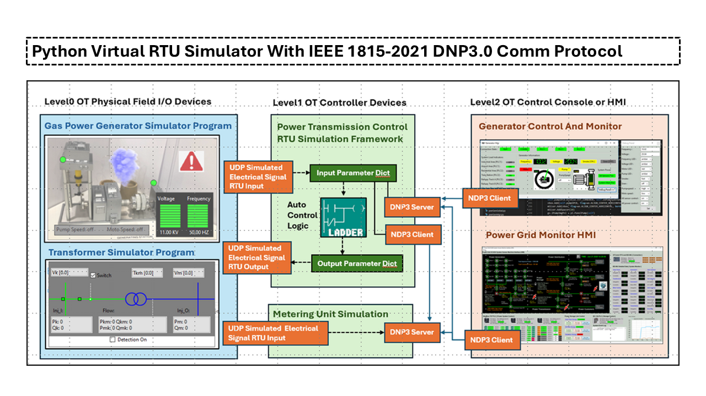
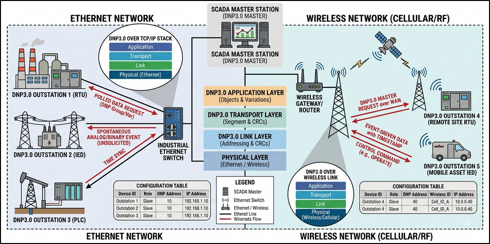
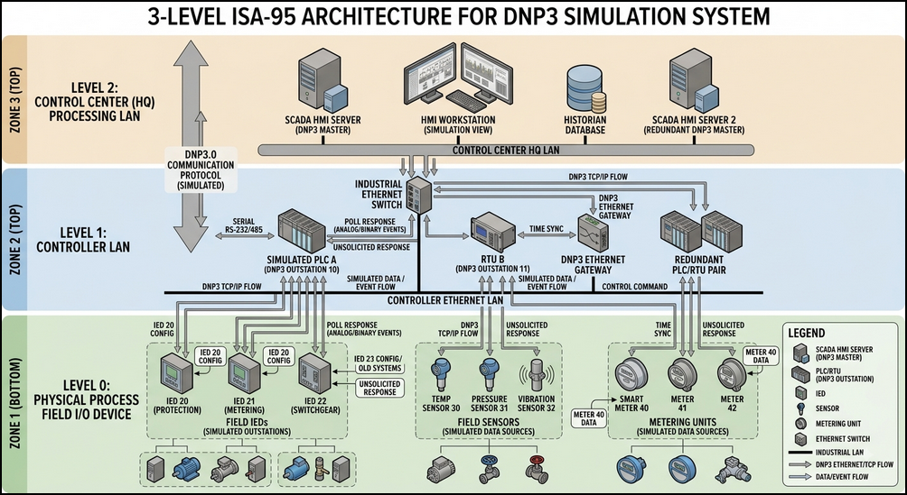
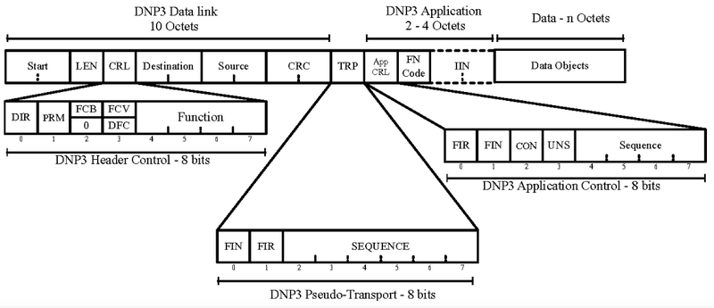
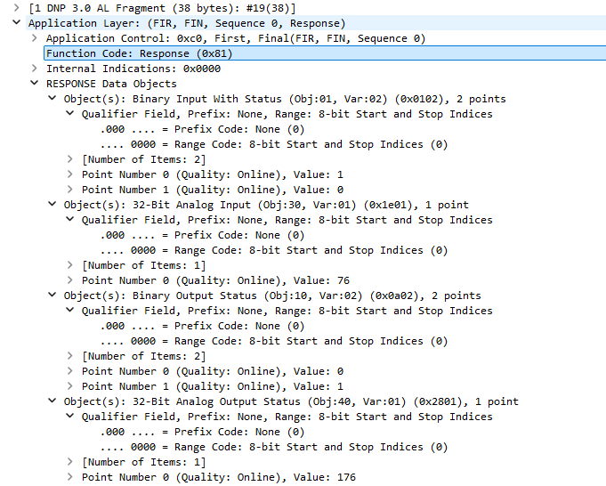
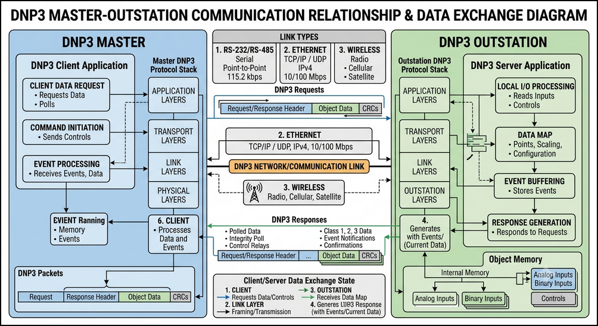
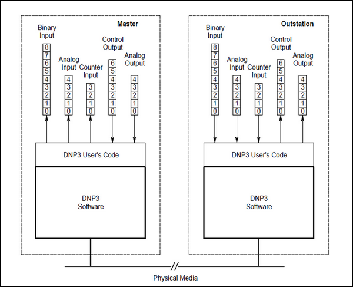
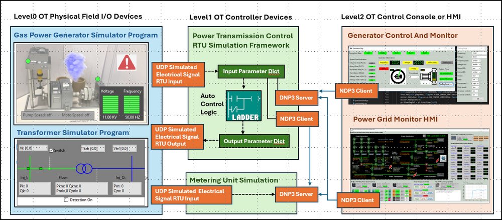
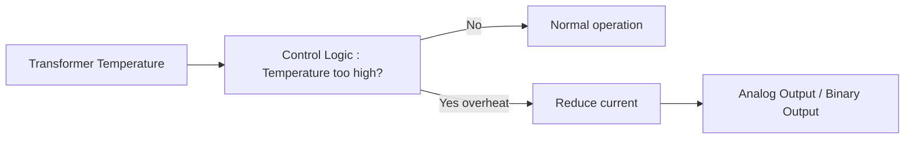

# Python Virtual RTU Simulator With IEEE 1815-2021 DNP3.0 Communication Protocol

**Project Design Purpose** : In this project, I did extend my previous Python-based virtual PLC/RTU/MU/IED simulator library (which interfaced to SCADA systems via Modbus-TCP and S7Comm, related link:  https://www.linkedin.com/pulse/python-virtual-plc-rtu-simulator-yuancheng-liu-elkgc)  by adding the support function for IEEE 1815-2021 Distributed Network Protocol 3 (DNP3) protocol. 



The new implementation consists of two main components :

- **DNP3.0 Communication Lib** : The DNP3.0 Communication Module implements a minimal and lib dependency-free DNP3 protocol stack, providing the data exchange between the DNP3 master and outstation. Compare with other DNP3 lib, this module is implement by basic Python standard socket + struct library without special tool-set such as C++ compiler. 
- **RTU Simulator Framework** : The RTU Simulator Framework models the operational behavior of industrial OT field devices such as RTU/PLC. It manages the cyber twin's virtual device inputs and outputs, processes DNP3.0 messages, interfaces with physical-world simulation modules, and executes user-defined control logic.

```python
# Author:      Yuancheng Liu
# Created:     2026/07/29
# Version:     v_0.0.1
# Copyright:   Copyright (c) 2026 Liu Yuancheng
# License:     MIT License
```

**Table of Contents**

[TOC]

------

### 1. Project Introduction

There are several different type of good Python DNP3.0 lib such as the `FreyrSCADA-NDP3` Lib https://github.com/FreyrSCADA/DNP3 which provide the full function of DNP3 communication, but most of them needs the  C/C++ or require platform-specific development environments, compilers, SDKs, or additional dependencies. This can make them less convenient when the primary objective is to quickly deploy a lightweight protocol simulator across different cyber-range nodes or virtual machines. 

Therefore, this project takes a different approach: implement a minimal DNP3 communication stack using only the Python standard library, primarily `socket` and `struct`. The goal is to provide the essential DNP3 communication mechanisms required to simulate "Data Link" between a DNP3 Master and DNP3 Outstation. The DNP3 data exchange can go through serial link such as RS232/RS485, Ethernet and Wireless, this comm lib only provide the data exchange in the Ethernet and Wireless. The use case of the DNP3 RTU devices configuration is shown below:



For more information about DNP3, please refer to https://www.dnp.org/About/Overview-of-DNP3-Protocol

#### 1.1 DNP3 Simulation System Overview

The simulator project is **NOT** designed for1:1 emulate the real RTU hardware function (not used for a digital twin system), it focuses on reproducing the core operational behaviors commonly found in the DNP3 industrial devices, including:

- Device internal data parameter/variable storage management
- DNP3.0 Telemetry and control data exchange workflows
- DNP3.0 RTU device automated control logic execution cycles
- Interactions between field devices, controllers, and supervisory systems

And the main purpose of the system application will be on the effective educational, prototyping, and research environment such as :

- Academic researchers studying industrial automation and OT system architectures
- Students learning OT communication protocols and DNP3 device behaviors
- Developers building, testing, or validating DNP3 applications, digital forensics (DNP3 traffic data capture and analysis)
- OT cybersecurity professionals analyzing industrial communication flows and attack scenarios

#### 1.2 DNP3 System ISA-95 Architecture 

The simulator enables users to construct cyber twins' components that mirror the hierarchical architecture commonly found in modern industrial environments. As shown in the figure below, the framework follows a simplified four-level OT architecture based on the ISA-95 model as shown in the below diagram : 



- At **Level 0 (Physical Process Field I/O Devices)**, simulated IED devices, sensors, and metering units generate operational data representing measurements collected from physical processes. The data will be transferred by using the UDP data to simulate the electrical analog signal to the level 1 devices (DNP3 outstation).

- At **Level 1 (Controller Processing LAN)**, the RTU simulator act as the main components of the DNP3 outstation, it collects the analog signal data from field devices, manages data storage and executes server-side processing logic when required. Then provide a DNP server interface for the level 2 components to fetch the data and control the device.
- At **Level 2 (Control Center/HQ Processing LAN)**, supervisory applications (NDP3 mater) such as monitoring workstations, engineering desktops, mobile devices, and touchscreen operator panels run DNP3 client services to fetch device data, visualize process information, and issue control commands. 


------

### 2. DNP3 Protocol Background Knowledge

If you are familiar about the DNP3 protocol, you can skip this section.

**Distributed Network Protocol 3** (**DNP3**) is a set of ICS communications protocols used between components in process automation systems. Its main use is in utilities such as electric and water companies. Usage in other industries is not common. It was developed for communications between various types of data acquisition and control equipment. It plays a crucial role in SCADA systems, where it is used by SCADA Master Stations (a.k.a. Control Centers), remote terminal units (RTUs), and intelligent electronic devices (IEDs). It is primarily used for communications between a master station and RTUs or IEDs. 

DNP3 Wiki Reference: https://en.wikipedia.org/wiki/DNP3

#### 2.1 NDP 3 Protocol Packet Structure

DNP3 communication uses a layered packet structure designed to provide reliable communication between a DNP3 Master and DNP3 Outstation. A DNP3 frame consists of a Data Link Layer header, followed by a Transport Layer header and an Application Layer message. CRC values are also used to detect transmission errors. The Port for DNP3 communication use 20000. 

The main DNP3 packet structure is shown below:



Image Reference: https://www.semanticscholar.org/paper/DNP3-network-scanning-and-reconnaissance-for-Rodofile-Radke/5d628548e00319009dad6afb08f80c7ed58cf29c/figure/0

- The **Data Link Layer** identifies the beginning and length of the DNP3 frame and contains the source and destination addresses. 
- The **Transport Layer** is responsible for fragmenting and reassembling larger application messages. 
- The **Application Layer** contains the actual DNP3 operation, such as `READ`, `WRITE`, control operations, or responses containing process data.

**2.1.1 DNP3 Function Code**

In the application layer data, the "FN Code" will identify the function of this packet. As show in the below, the function code `0x81` identify it is a response for the data reading request from the DNP outstation: 




The DNP3 protocol uses 27 basic function codes to allow communication between master stations and remote units, in the DNP3 lib I created, I only implement below 7 function for data exchange and simplify control: 

| Name                      | FN Code | Hex Value | Direction / Purpose                                          |
| ------------------------- | ------- | --------- | ------------------------------------------------------------ |
| FUNC_CONFIRM              | 0       | `0x00`    | Application-layer confirmation connection                    |
| FUNC_READ                 | 1       | `0x01`    | Master requests data from Outstation                         |
| FUNC_WRITE                | 2       | `0x02`    | Master writes configuration/data to Outstation               |
| FUNC_DIRECT_OPERATE       | 5       | `0x05`    | Execute a control directly                                   |
| FUNC_DIRECT_OPERATE_NR    | 6       | `0x06`    | Direct control without application confirmation              |
| FUNC_RESPONSE             | 129     | `0x81`    | Standard Response from outstation to the master request      |
| FUNC_UNSOLICITED_RESPONSE | 130     | `0x82`    | Unsolicited Response (initiated autonomously by the outstation rather than replying to a direct request |

Reference : https://www.dpstele.com/blog/how-to-understand-dnp3-protocol.php

#### 2.2 Project DNP3 Master and Outstation Implementation 

DNP3 plays an important role in SCADA (Supervisory Control and Data Acquisition) architectures. In a typical deployment, a DNP3 Master—usually implemented as part of a SCADA server or control center—communicates with multiple **DNP3 Outstations,** such as RTUs, PLCs, or IEDs. The Master can acquire real-time measurements, receive events and alarms, synchronize device time, and issue control commands to field equipment.

The project will provide the multiple DNP clients to plug in the master to fetch data from different DNP Outstation devices which contents one DNP server. The data exchange and components diagram is shown below: 



**2.2.1 DNP3 Master Implementation **

The Master is typically the SCADA server or control center. Its responsibilities include:

- Polling outstations for measurements (voltage, current, temperature, etc.)
- Reading binary and analog inputs
- Sending control commands (open/close breakers, start/stop equipment)
- Synchronizing the outstation's clock
- Configuring or querying device parameters
- Receiving alarms and event reports

A single master often communicates with **many outstations** simultaneously.

**2.2.2 DNP3 Outstation Implementation**

The **Outstation** is the field device, such as an RTU, PLC, or IED. Its responsibilities include:

- Monitoring connected sensors and actuators
- Maintaining a database of process values
- Recording time-stamped events
- Responding to master requests
- Executing control commands received from the master
- Optionally sending **unsolicited messages** when significant events occur

An outstation generally serves one or more authorized masters, depending on the system design.


------

### 3. Design of Virtual DNP3 RTU Simulator

This section presents the detailed design of the Virtual DNP3 RTU Simulator, including its DNP3 communication modules and integration with an OT cyber-twin environment.

#### 3.1 DNP3 Communication Module Design

The DNP3 communication module implements the lightweight essential functions using the Python standard library rather than a complete commercial or production-grade DNP3 stack. The current model provides the following capabilities:

- Establish a TCP connection using the standard DNP3 port **TCP/20000**.
- Process DNP3 Application Layer **READ (**`0x01`**)** requests.
- Read **Binary Inputs (Group 1 Variation 2)**.
- Read **Analog Inputs (Group 30 Variation 1)**.
- Read **Binary Output Status (Group 10 Variation 2)**.
- Read **Analog Output Status (Group 40 Variation 1)**.
- Process **DIRECT OPERATE (**`0x05`**)** requests.
- Operate a Binary Output using **Control Relay Output Block (CROB), Group 12 Variation 1**.
- Set an Analog Output using **Analog Output Command, Group 41 Variation 1**.
- Generate syntactically valid DNP3 frames containing the required synchronization bytes, length field, control information, source/destination addresses, and **CRC-16/DNP** checksums.

>  Remark: This is NOT a full/compliant DNP3 stack (no unsolicited responses, no multi-fragment transport reassembly, no confirm/retry handling, no serial support). It is intended for lab / training / detection-content use, not for production ICS deployments. The data types supported are limited to bool and int.

**3.1.1 Design of DNP3 Server Module**

The DNP3 Server acts as the DNP3 Outstation endpoint and hosts the virtual RTU's DNP3 point database. It is designed to execute as a sub-thread within the main PLC/RTU simulator process, allowing DNP3 communication to operate concurrently with the physical-process interface and automatic control logic.

The server will keep the DNP3 data structure(point) as shown in the below diagram: 



| Object               | Group / Variation | Access     | Python Type | Description                                |
| -------------------- | ----------------- | ---------- | ----------- | ------------------------------------------ |
| Binary Input         | Group 1 Var 2     | Read-only  | `bool`      | Digital/process status from physical world |
| Analog Input         | Group 30 Var 1    | Read-only  | `int`       | Analog measurement from physical world     |
| Binary Output Status | Group 10 Var 2    | Read/Write | `bool`      | Digital output state to physical world     |
| Analog Output Status | Group 40 Var 1    | Read/Write | `int`       | Analog output state to physical world      |

The implementation also uses the following DNP3 object definitions for control operations:

```python
# Object group/variation pairs used by this implementation
GRP_BINARY_INPUT = (1, 2)           # Binary Input w/ flags        (1 byte/obj)
GRP_BINARY_OUTPUT_STATUS = (10, 2)  # Binary Output status w/flags (1 byte/obj)
GRP_CROB = (12, 1)                  # Control Relay Output Block  (11 bytes/obj)
GRP_ANALOG_INPUT = (30, 1)          # 32-bit Analog Input w/flag   (5 bytes/obj)
GRP_ANALOG_OUTPUT_STATUS = (40, 1)  # 32-bit Analog Output status  (5 bytes/obj)
GRP_ANALOG_OUTPUT_CMD = (41, 1)     # 32-bit Analog Output cmd     (5 bytes/obj)
```

A DNP3 Master can currently perform two major categories of operations:

- **READ (**`0x01`**)** — retrieve the supported binary and analog input/output status objects.
- **DIRECT OPERATE (**`0x05`**)** — operate a CROB to change a Binary Output or send an Analog Output Command to change an Analog Output.

**3.1.2 Design of DNP3 Client Module**

The **DNP3 Client** implements the Master-side interface and is designed as a reusable **plug-in component** that can be embedded into other Python applications.

The client hides the lower-level DNP3 packet construction and parsing from the application developer. Other simulator modules, SCADA/HMI applications, and RTU control components can therefore use simple Python functions to communicate with a DNP3 Outstation. The current client API provides four primary functions:

| Function                          | Purpose                                            |
| --------------------------------- | -------------------------------------------------- |
| `connect(ipaddress)`              | Establish a connection to a DNP3 Server/Outstation |
| `readAll()`                       | Read all supported input and output data           |
| `writeBinaryOutput(index, value)` | Change a Binary Output parameter value             |
| `writeAnalogOutput(index, value)` | hange an Analog Output value                       |

The `connect()` function allows the same client implementation to establish connections with different Outstations. Consequently, a Master application can instantiate multiple DNP3 clients to communicate with **one or many RTUs/Outstations**.

#### 3.2 RTU Framework Cyber-Twin Integration

To demonstrate the application of the Virtual DNP3 RTU Simulator, the DNP3 communication module was integrated into a power-grid cyber-twin environment containing a simulated gas power generator and transformer/metering-unit components.

The overall integration architecture is shown below: 



The DNP3 communication module is integrated directly into the Level 1 RTU framework. The RTU frame work will have 3 main components: 

- Physical-World Connectors
- RTU Automatic Control Logic
- DNP3 Server and DNP3 Clients 

**3.2.1 Physical-World Connectors**

The framework provides multiple UDP-based physical-world connectors for receiving simulated sensor and process data from external physical-process simulators. 

For example, the Gas Power Generator Simulator can generate operational parameters such as: `Output voltage` , `Frequency`, `Oil pump pressure` , `Motor RPM` , `Pump status` and `Motor status`. These values are transmitted to the RTU Framework through the simulated UDP interface. The framework then maps the received values into the corresponding DNP3 point database entries, such as the `Binary Input` and `Analog Input` dictionaries.

**3.2.2 RTU Automatic Control Logic**

The RTU Framework contains internal automatic control logic that processes the received process values and determines appropriate control actions.

For example the control sequence of temperature: 



The control logic continuously reads the input data, evaluates predefined operating conditions, and updates the corresponding output parameters. The resulting control values are stored in the corresponding Binary Output Status and Analog Output Status points.

**3.2.3 DNP3 Server and DNP3 Clients**

The RTU Framework contains a DNP3 Server that exposes the RTU's process data to Level 2 SCADA/HMI systems.

At the same time, the framework can contain multiple **DNP3 Clients** for communicating with other field devices, such as Metering Units (MUs).

**3.2.4 Generator and Transformer Data Flow**

The complete data flow of the cyber twin can be divided into three stages.

- **Stage 1 – Process Data Acquisition** : The Gas Power Generator Simulator and Transformer Simulator generate simulated physical-process data. The RTU receives generator data through UDP and receives additional metering information through DNP3 communication with the Metering Unit. 
- **Stage 2 – Control Processing** : The RTU Framework periodically collects the available sensor and metering data and passes it to the internal control logic. The control logic evaluates the current state of the simulated power system and updates the output parameters accordingly.
- **Stage 3 – Supervisory Monitoring and Control** : The DNP3 Server exposes the RTU's process and control points to the Level 2 HMI/SCADA applications. Each HMI can use one or more DNP3 Clients to connect to the appropriate RTU or Metering Unit and perform monitoring or control operations.


------

### 4. Use Case Example

The following Python modules are provided as baseline examples and can be extended to build more complex DNP3 simulators.

| Program File                    | Execution Env | Description                                                  |
| ------------------------------- | ------------- | ------------------------------------------------------------ |
| `src/dnp3Comm.py`               | python 3.7+   | Core library implementing IEEE 1815-2021 DNP3.0 client/server APIs used to simulate data and command interactions between RTU and SCADA software. |
| `src/dnp3CommTest.py`           | python 3.7+   | This module is the test case program for the (IEEE 1815) DNP3.0  library <dnp3Comm.py>, it will start a server in sub-thread and init 2 clients to test the data read and write function. |
| `testcase/dnp3RtuServerTest.py` | python 3.7+   | A simple RTU simulation program use the DNP3 lib module  to simulate a PLC/RTU with one DNP3.0 serverand one execution logic to handle variable read and changeable value set from client side. |
| `testcase/dnp3RtuClientTest.py` | python 3.7+   | A simple RTU simulation program use the DNP3 lib module  to simulate a HMI with one DNP3.0 client to read and write data from the connected DNP3.0 server side |

#### 4.1 Implementing the Outstation(RTU) Module

To implement the RTU module, init the parameters as shown below:

```python
class DNP3ServerThread(threading.Thread):
    def __init__(self):
        threading.Thread.__init__(self)
        self.server = dnp3Comm.DNP3Server(maxConn=3)
        # Add the parameters:
        self.server.addBinaryInput(0, False)
        self.server.addBinaryInput(1, True)
        self.server.addAnalogInput(0, 0)
        self.server.addBinaryOutput(0, False)
        self.server.addBinaryOutput(1, True)
        self.server.addAnalogOutput(0, 0)
```

Then in the thread main loop, implement the auto control logic as shown in the example below:

```python
    # Run the RTU logic
    print("[_] Start the RTU ladder logic loop")
    while True:
        o1 = serverObj.getBinaryOutput(0)
        serverObj.setBinaryInput(0, not o1)
        o2 = serverObj.getBinaryOutput(1)
        serverObj.setBinaryInput(1, not o2)
        o3 = serverObj.getAnalogOutput(0)
        print("o1:%s, o2:%s, o3:%s" %(str(o1), str(o2), str(o3)))
        i1 = serverObj.getBinaryInput(0)
        i2 = serverObj.getBinaryInput(1)
        if i1 and i2:
            serverObj.setAnalogInput(0, 100-o3)
        else:
            serverObj.setAnalogInput(0, 100+o3)
        time.sleep(0.3)
```


#### 4.2 Implementing the Master(HMI) Module

To init the client as shown below:

```python
SEV_IP = '127.0.0.1'
SEV_PORT = dnp3Comm.DNP3_PORT

def main():
    print("DNP3 RTU Client Test Start ...")
    dnp3Client = dnp3Comm.DNP3Client(SEV_IP, port=SEV_PORT)
    dnp3Client.connect()

    if dnp3Client.getConnectionState():
        print("DNP3 RTU Client connected to server.")
    else:
        print("DNP3 RTU Client connect to server failed.")
        exit()
```

For the data read and set control call the related function as shown below:

```python
print("[_] Start to read the RTU input data")
data = dnp3Client.readAll()
print("[_] Start to overwrite the RTU output data")
ob1 = random.choice([True, False])
ob2 = random.choice([True, False])
oa1 = random.randint(0, 100)
print("Output Binary 0: %s" % str(ob1))
print("Output Binary 1: %s" % str(ob2))
print("Output Analog 0: %s" % str(oa1))
dnp3Client.writeBinaryOutput(0, ob1)
dnp3Client.writeBinaryOutput(1, ob2)
dnp3Client.writeAnalogOutput(0, oa1)
time.sleep(2) # wait 1 sec to make sure the RTU data updated.
```


### 5. Conclusion 

This project successfully demonstrates a practical and accessible approach to simulating DNP3 communication in industrial control system environments. By implementing a lightweight, dependency-free DNP3 stack using only Python's standard libraries, it addresses the common challenge of deploying protocol simulators across diverse platforms without the need for complex compilers or external SDKs. The resulting Virtual RTU Simulator provides a functional core for key DNP3 operations, including data reading, writing, and direct control, effectively bridging the gap between a physical process simulation and a supervisory control system.

Furthermore, its integration into a cyber-twin framework highlights its utility beyond simple communication. By modeling the operational behavior of field devices, connecting to simulated physical world data, and executing automatic control logic, the simulator creates a realistic and holistic testbed. This makes it an invaluable tool for a wide range of users, from students and researchers learning OT protocols, to developers testing applications, and cybersecurity professionals analyzing network traffic and attack scenarios. While not intended as a replacement for a full-production DNP3 stack, this open-source project provides a robust, flexible, and educational foundation for exploring and understanding the intricacies of IEEE 1815-2021 (DNP3) communication in a safe, virtualized setting.


------

> last edit by LiuYuancheng (liu_yuan_cheng@hotmail.com) by 14/08/2026 if you have any problem, please send me a message. 