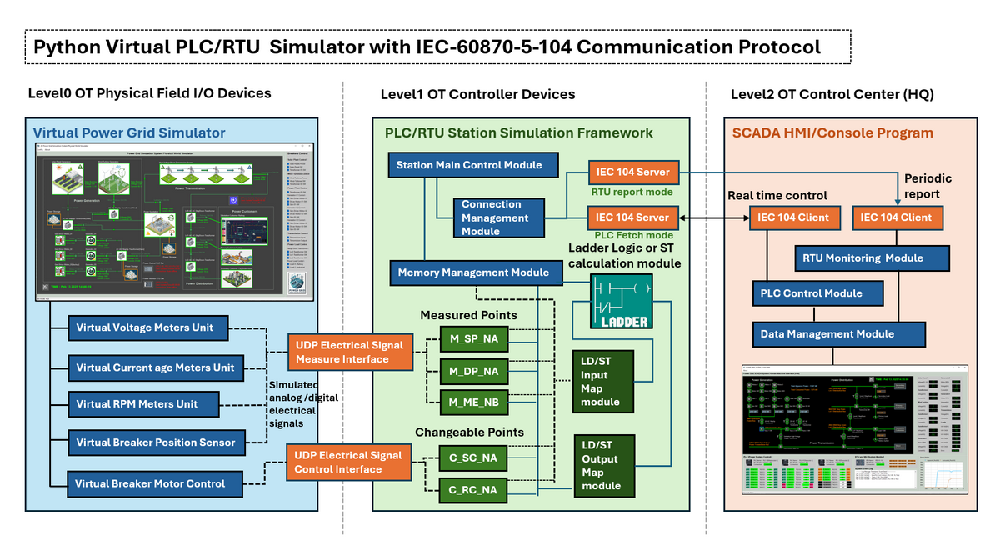
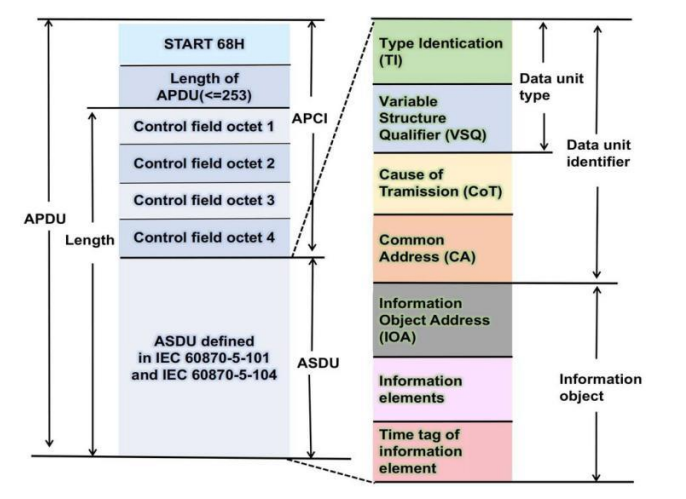
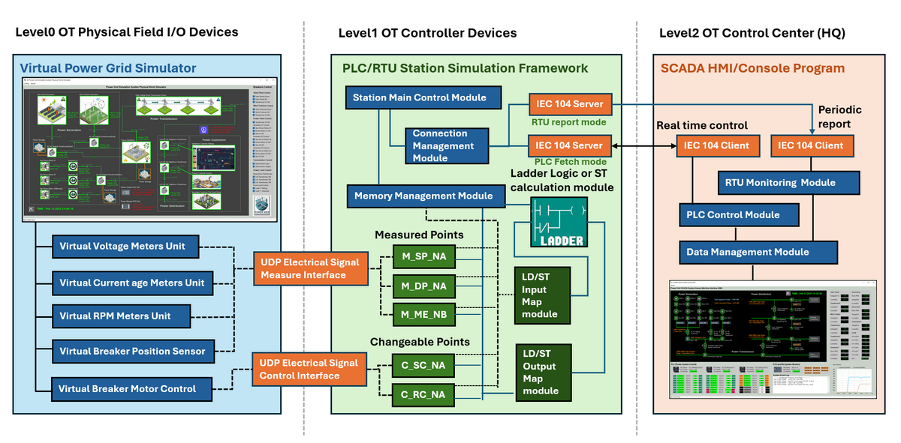
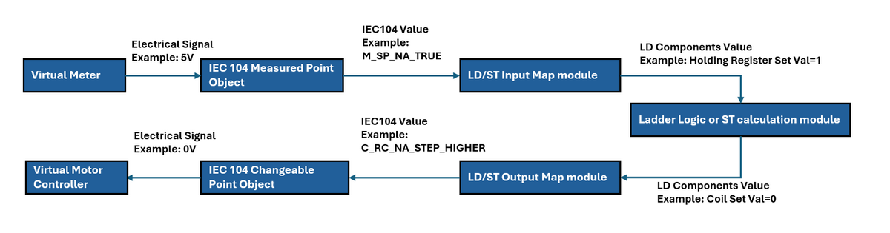
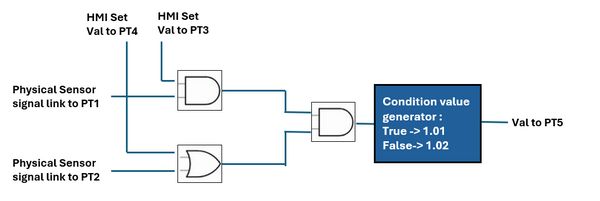
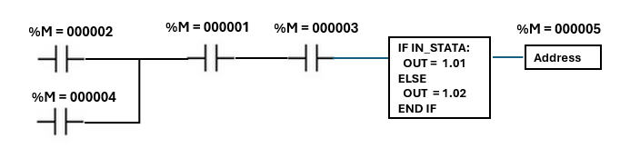

# Python Virtual PLC Simulator with IEC-60870-5-104 Communication Protocol 

**Project Design Purpose** : In this follow-up project, we extend the previous Python-based virtual PLC/RTU simulator program (which interfaced to SCADA systems via Modbus-TCP and S7Comm, related link: https://www.linkedin.com/pulse/python-virtual-plc-rtu-simulator-yuancheng-liu-elkgc ) by adding the support for IEC 60870-5-104 (IEC104) protocol -- a widely-used telecontrol standard for power system automation. This project re-implemented the PLC/RTU memory management and the OT data exchange flow based on the requirement of IEC104 standard. The new simulator is organized into three modular components:

- **IEC104 Communication Module** : an IEC104 communication module (with PLC-side server and SCADA/HMI-side client interfaces) enabling standardized IEC104 data exchange. 
- **PLC/RTU Simulation Framework** : an Framework maintains virtual PLC/RTU device memory, IEC104 station (save linked IED data) , IEC104 points (save contacts and coils data), customized operation ladder logic/Structured Text algorithm, IEC104 server linking to next level OT SCADA components and a UDP physical signal connector linking to the lower level physical components sensor simulator.
- **Ladder Logic/Structured Text Module** : a Python plugin interface program to simulate PLC/RTU operation logic behavior by processing virtual contact/memory inputs and updating coil states accordingly which same as the Ladder Logic Diagram (IEC 61131-3-LD) or Structured Text Program(IEC 61131-3-STX) running on real PLC/RTU.



```python
# Author:      Yuancheng Liu
# Created:     2025/05/10
# Version:     v_0.0.2
# Copyright:   Copyright (c) 2025 LiuYuancheng
# License:     MIT License
```

**Table of Contents**

[TOC]

- [Python Virtual PLC Simulator with IEC-60870-5-104 Communication Protocol](#python-virtual-plc-simulator-with-iec-60870-5-104-communication-protocol)
    + [Introduction](#introduction)
    + [Background knowledge](#background-knowledge)
      - [IEC 60870-5-104 Protocol Detail](#iec-60870-5-104-protocol-detail)
      - [IEC 60870-5-104 Packet Example](#iec-60870-5-104-packet-example)
      - [IEC 60870-5-104 Station and Point](#iec-60870-5-104-station-and-point)
      - [IEC 60870-5-104 Measured Point and Changeable Point](#iec-60870-5-104-measured-point-and-changeable-point)
    + [System Design Overview](#system-design-overview)
    + [Design of Communication Module](#design-of-communication-module)
      - [PLC/RTU to Physical World Electrical Signal Link](#plc-rtu-to-physical-world-electrical-signal-link)
      - [IEC 104 Server and Client Communication](#iec-104-server-and-client-communication)
    + [Design PLC/RTU Simulation Framework](#design-plc-rtu-simulation-framework)
    + [Design of Ladder Logic/Structured Text Module](#design-of-ladder-logic-structured-text-module)
    + [Use Case Example: One Rung Ladder In IEC104 PLC Simualtor](#use-case-example--one-rung-ladder-in-iec104-plc-simualtor)
    + [Project Conclusion](#project-conclusion)


------

### Introduction

IEC 60870-5-104 (commonly referred to as IEC 104) is a widely adopted communication protocol used in SCADA (Supervisory Control and Data Acquisition) systems for real-time/remote data exchange in critical infrastructure sectors such as power grids, water treatment, and industrial automation. Supported by major PLC and RTU manufacturers including Siemens, ABB, Mitsubishi Electric, and Altus Sistemas de Automação, IEC 104 plays a vital role in enabling remote monitoring and control across geographically distributed OT systems.

This project aims to develop a cross-platform Python-based virtual PLC and RTU simulator that complies with the IEC 60870-5-104 standard. The purpose is to offer an educational and prototyping tool that allows users—particularly academic researchers and automation developers—to emulate and test control systems across different layers of an operational technology (OT) environment. As illustrated in the system architecture diagram (below), the simulator supports the creation and interaction of components spanning from Level 0 (physical field devices and sensors) up to Level 2/3 (control center and operations management zones).


` Figure-01: System Architecture Overview Diagram, version v_0.0.2 (2025)`

This article presents the implementation of the virtual PLC simulator with IEC 104 communication capability. It begins with a brief overview of the IEC 104 protocol, followed by a detailed explanation of the simulator's modular design—covering the communication module, IED data storage, device memory management, electrical signal simulation links, and the ladder logic/structured text algorithm engine. Finally, a practical example will demonstrate how users can apply the simulator to model real-world OT systems in a fully virtual environment.


------

### Background knowledge 

In this section we will introduce some basic background know about the the IEC 60870-5-104 standard includes the detailed  ICE104 protocol packet structure, the data storage address configuration of station and device memory management of  the measured point and changeable point. 


#### IEC 60870-5-104 Protocol Detail

IEC 60870-5-104 (IEC 104) is a network-based extension of IEC 60870-5-101 and is designed for communication between control stations (e.g., SCADA, DCS) and substations or field equipment over TCP/IP networks. IEC 104 uses the same Application Protocol Data Unit (APDU) format as IEC 101 but encapsulated within TCP/IP packets. An IEC 104 APDU consists of the Start Byte, Length, and Application Protocol Control Information (APCI), followed optionally by Application Service Data Unit (ASDU). The traffic packet detail is shown blow: 



` Figure-02: IEC 60870-5-104 protocol packet structure, version v_0.0.2 (2025)`

As shown in the packet structure diagram, the APCI determines the message frame type and ASDU contains the control or monitoring data being transmitted, such as monitoring values or control commands. Here's a more detailed breakdown:

**APCI (Application Protocol Control Information)** : 

- **Start byte (0x68):** Indicates the beginning of a packet.

- **Length byte:** Specifies the length of the data within the packet. 
- **Four-byte control field:** Provides control information, including options for data transmission and acknowledgements. 

**ASDU (Application Service Data Unit)** :

- **Type Identification (TI)** : 1 byte to indicates the type of information (e.g., `0x01` for single-point)
- **Variable Structure Qualifier (VSQ)** : 1 byte to indicate the number of elements and addressing mode. 
- **Cause of Transmission (COT)** : 2 bytes to indicate the reason for sending (e.g., spontaneous, request, activation)
- **Common Address (CA)** : 2 bytes identifies the source device station memory address. 
- **Information Object Address  (IOA)** : 3 bytes indicate the source device station's point object memory address. 
- **Information elements (Data)** : Depends on the type (e.g., 1 byte for a boolean status, 3 bytes for float)
- **Time tag of information element** :  Time information this information is optional. 

> Reference: https://infonomics-society.org/wp-content/uploads/Passive-Security-Monitoring-for-IEC-60870-5-104-based-SCADA-Systems.pdf


#### IEC 60870-5-104 Packet Example

When we capture a simple APDU payload for responding a single digital point from PLC to the HM might look like this (hex):

```
68 0E 00 00 00 00 01 01 06 00 01 00 00 00 01
```

We can mapping it to the protocol detail to parse the detailed information: 

- `68` → APCI start byte
- `0E` → APCI length, total message length is 15 bytes
- `00 00 00 00` → I-Frame APCI (send/recv = 0)
- `01` → ASDU Type ID: Single-Point Information (M_SP_NA)
- `01` → ASDU VSQ: 1 element from memory will be transmit.
- `06 00` → Cause of Transmission: spontaneous
- `01 00` → ASDU station address 256. 
- `00 00 00` → Information Point Object Address 0.
- `01` → Data: status = ON (IEC type M_SP_NA_TRUE)


#### IEC 60870-5-104 Station and Point

In IEC 104, a station represents a physical device or a group of devices that are managed and controlled by a central system. A point, within the station, represents a specific piece of data or a command that can be exchanged between the station and the central system. The ASDU Address and the Information Object Address (IOA) define the station and its internal points: 

- **ASDU Address [Station]** : The station ASDU address is a 2-bytes field that uniquely identifies a remote station (e.g., a PLC, RTU, or IED) within the SCADA network. This station represents a logical unit that gathers or controls field data, and it acts as the source or destination of telecontrol messages. The range of a station common address is [1, 65534].
- **IOA Address [Point]** : The Information Object Address is a 3-bytes field used to uniquely identify the individual data points (e.g., sensors, switches, analog inputs) within the context of a given ASDU (station). The range of a point IO address in the station is [0, 16777215] .


#### IEC 60870-5-104 Measured Point and Changeable Point

In the context of IEC 60870-5-104 (IEC 104) communication, two fundamental data categories are used to represent the system state and support control functions : "measured points" refer to data that represent the state of a device or process, while "changeable points" represent commands or requests that can be sent to the device to control its behavior. 

- **Measured Points (Telemetry Data)** : Measured points—also known as monitoring points or telemetry objects—represent real-time values acquired from field sensors or process instruments. These points are **read-only** from the SCADA system's perspective and are periodically or event-driven sent from field devices to the control center. Example of MP: M_ME_NA (Measured value, normalized), M_ME_NB (Measured value, scaled), M_SP_NA (Single point information), M_DP_NA (Double point information). Reference Link: https://tatsoft.com/wp-content/uploads/2021/01/IEC8705104.pdf
- **Changeable Points (Telecontrol Commands)** : Changeable points, or controllable points, represent actuators or process elements that can be **remotely controlled** via SCADA commands. These include digital outputs (on/off) and analog setpoints. The commands are issued by the SCADA client and processed by the field device (PLC/RTU), which then changes its internal state or output.  example of CP: C_SC_NA (Single command), C_DC_NA (Double command), C_RC_NA (Regulating step command), C_SE_NA (Setpoint command). Reference Link: https://tatsoft.com/wp-content/uploads/2021/10/IEC8705104S.pdf


------

### System Design Overview

After understanding the detailed structure of the IEC 60870-5-104 standard protocol in previous section, we now present the system design of the Python Virtual IEC104 PLC Simulator. The goal is to focus on simulating OT monitor and control stack — from physical-level devices to SCADA/HMI systems — in a modular, flexible Python environment suitable for academic research and industrial automation education.

The system architecture is divided into three main components as illustrated in the system workflow diagram:



` Figure-03: IEC 60870-5-104 PLC System Workflow diagram, version v_0.0.2 (2025)`

The system contents 3 main components : 

- **Communication Module** : This component handles all external data exchange and real-time interfacing tasks among level0 to level 3 OT environment. As show in the orange part, the module includes IEC 60870-5-104 communication stack (IEC104 Server and Client) and UDP-based electrical signal (Measure and Control) interfaces. 
- **PLC/RTU Station Simulation Framework** : As the core of the system running in VM as a level1 OT Controller device, As show in the green section of the diagram, the virtual PLC/RTU station includes station control modules,  memory management, measured points, changeable points and IEC104 Server. 
- **Ladder Logic / Structured Text Module** : This component interprets control logic using Ladder Logic Diagram or Structured Text as defined in IEC 61131-3 standard with the related data and memory Input/Output mapping modules. 

As shown in the diagram, the physical world power grid simulation program's different components (such as the volt and current meters, sensors) electrical signal data will be collected by the PLC and saved in different memory of the PLC/RTU. After PLC and RTU processed the data based on the pre-configured LD/ST, the feed back will send back to the physical simulator and the related breaker/controller/motor will be turned on/off, at the same time, the data will also be sent to the HMI side via IEC104 for system operator to monitor. 


------

### Design of Communication Module

The Communication Module of the IEC 104 PLC Simulator is responsible for two essential data exchange pathways within the simulated OT system architecture: PLC/RTU to Physical World Electrical Signal Link (between Level 0 OT Physical Field I/O Devices and Level 1 OT Controller Devices) and PLC/RTU to SCADA-HMI Communication Link (Between Level 1 OT Controller Devices and Level 2 OT Control Center)

#### PLC/RTU to Physical World Electrical Signal Link

To simulate realistic interactions between field-level sensors/actuators and the PLC/RTU controller, this subsystem provides UDP-based electrical signal interfaces to simulate analog/digital signals from Level 0 physical I/O devices. These interfaces bridge virtual sensor readings (e.g., voltage, current, breaker status) and control commands (e.g., motor start/stop) to the PLC simulation with two UDP-based communication interfaces:

**UDP Electrical Signal Measurement Interface**

This interface simulates high-frequency analog/digital signal transmission from virtual sensors to the PLC/RTU input ports, mimicking physical hardwired connections. A dedicated simulator generates virtual signals such as voltage, current, RPM, and breaker states, which are transmitted using the following message format:

```
Measure_Signal_GET;<SensorID>;<timestamp>;{'SignalID':<ID>,'Type':<SignalType>,Val':<SignalValue>}
```

- **Example:** If a virtual circuit breaker's position sensor sends an breaker "on" position signal voltage high 5V state to the PLC input contact pin, the UDP message would appear as:

```
Measure_Signal_GET;PG_BK_S_0011;2024-12-06 10:38:29,134;{'SignalID':'POS0011','Type':VOLTAGE','Val':'5V'}
```

**UDP Electrical Signal Control Interface**

This counterpart interface allows the PLC/RTU to send control commands to virtual actuators, simulating control signal output for PLC ports such as for motor switches, relays, or breaker triggers. The message format is:

```
Control_Signal_POST;<ItemID>;<timestamp>;{'SignalID':<ID>,'Type':<SignalType>,Val':<SignalValue>}
```

- **Example** : To activate a virtual breaker motor for switching, the following command would be sent:

```
Control_Signal_POST;PG_BK_M_0011;2024-12-06 10:51:41,122;{'SignalID':'CTRL', 'Type':'MOTO_IN', 'Val':'Voltage_High'}
```

#### IEC 104 Server and Client Communication

To Implement the IEC 60870-5-104 communication stack, supporting both server (PLC/RTU side) and client (SCADA/HMI side) roles. The system uses the [**iec104-python** library](https://github.com/Fraunhofer-FIT-DIEN/iec104-python) developed by Fraunhofer-FIT, enabling multi-threaded IEC 60870-5-104 client-server communication. This integration ensures compatibility with standard SCADA protocols used in critical infrastructure.

**IEC 104 Server (PLC/RTU Side)**

The server module runs on the PLC/RTU simulation and supports two modes:

- **Fetch Mode**: Simulates real-time control operations. When a client sends a request (e.g., to read or write a data point), the server responds immediately, emulating interactive SCADA control.
- **Report Mode**: Simulates automatic periodic reporting from RTU to SCADA. The server broadcasts data updates to all connected clients at configurable intervals, reflecting real-world telemetry behavior.

**IEC 104 Client (SCADA-HMI Side)**

The IEC104 client module operates on the SCADA/HMI side and manages data acquisition and control commands:

- Reads measurement values (status, analog inputs) from the PLC/RTU.
- Writes control signals or setpoints back to the PLC/RTU.
- Interacts with real-time or historical data management modules in the SCADA system.


------

### Design PLC/RTU Simulation Framework

The **PLC/RTU Simulation Framework** is a multi-threaded virtual control engine that emulates the behavior of real industrial PLC or RTU devices within the IEC 60870-5-104 SCADA ecosystem. It serves as the core computational and communication layer between virtual field sensors (Level 0) and the SCADA control system (Level 2).

**Framework Initialization**: Upon startup, the PLC/RTU simulator performs the following initialization tasks:

- **Point & Station Configuration**: Reads system configuration to define the IEC 104 station address, and initialize a set of measured and changeable points, following standard point types (e.g., `M_SP_NA`, `M_ME_NC`, `C_RC_TA`).
- **Memory Management Module**: Initializes an internal mapping dictionary that associates UDP electrical signal identifiers with IEC 104 point types and values. This acts as a bridge between signal-level data and protocol-specific data formats.

To emulate the asynchronous behavior of actual PLCs/RTUs, the simulation framework launches multiple background threads:

**UDP Signal Handling Thread** will provide below functions:

- Manages multiple instances of UDP Electrical Signal Measure Interfaces and UDP Electrical Signal Control Interfaces, according to the number of connected virtual devices or physical world simulators.
- Periodically fetches sensor signals (e.g., voltage, current, RPM) and control command states.
- Converts signal values to their IEC 104 equivalents and stores them in the associated memory-mapped points.

After the PLC get the simulated physical value, it will convert the raw signal value to IEC104 type and save the value to the related point, for example a `0V` can be saved as M`_SP_NA_FALSE` and `5V` can be saved as `M_SP_NA_TRUE`. `Voltage_Signal_Low` can be saved as  `C_RC_NA_STEP_LOWER` and voltage high can be saved as `C_RC_NA_STEP_HIGHER`. 

**LD/ST Logic Execution Thread** 

This thread handles logic operations and mimics the PLC scan cycle behavior based on a configured operation clock cycle:

- **Input Mapping Stage**: The `LD/ST Input Map Module` fetches current values from measured (`M_*`) and changeable (`C_*`) points and maps them to logical operands (e.g., coils, contacts, memory registers) for Ladder Logic or Structured Text processing.
- **Logic Execution Stage**: The Ladder Logic / ST Calculation Module executes user-defined logic using the mapped inputs, updating internal states and determining output/control values.
- **Output Mapping Stage**: The `LD/ST Output Map Module` processes the logic result and updates corresponding **changeable points** (e.g., breaker control status, voltage steps), simulating coil/relay actions.

The work flow example will be show below:



` Figure-04: IEC 60870-5-104 PLC Data Workflow diagram, version v_0.0.2 (2025)`

**Supported IEC 104 Point Types (Current Version v0.0.2)**

In the currently version, we haven't implement all the measured and changeable IEC104 value type, in the current version we only provide 3 type support which used to represent the state, value and step as shown below:

- **Server measured bool value (M_SP_NA**):  Single-point information, can be read from server and client, but can only be changed from server via `point.value = <val>`, Expected value: `True/False`
- **Server measured number value (M_ME_NC)** : Short floating point number, can be read from server and client, but can only be changed from server via `point.value = <val>`, Expected value: `float number`, need to do round if do value compare.
- **Server changeable value (C_RC_TA)** : Regulating step command , can be read from server and client, but can only be changed from client via transmit call. Expected value: `iec104.Step.HIGHER/LOWER/INVALID_0/INVALID_1`

**IEC 104 Server Integration**

To enable interaction with the upper-level SCADA (HMI/Console), the simulation framework launches a dedicated thread running an **IEC 60870-5-104 Server**, using the [Fraunhofer FIT IEC104-Python Library](https://github.com/Fraunhofer-FIT-DIEN/iec104-python). Two host modes are provides:

- **Real-Time Fetch Mode**: Responds to SCADA client queries for point states instantly.
- **Periodic Report Mode**: Broadcasts updates to all connected SCADA clients based on a defined report interval.


------

### Design of Ladder Logic/Structured Text Module

The **Ladder Logic / Structured Text (ST) Module** is a core programmable logic interface within the PLC/RTU simulation framework. It provides a customizable, Python-based interface for users to define control behavior using either ladder logic constructs or Structured Text-style operations.

The module is designed as a base **interface class** that users can inherit to implement their custom control logic. Two key methods need to be over written to add the customized logic:

- `initLadderInfo()`: Defines the structure and mapping of source registers, source coils, and destination coils.
- `runLadderLogic()`: Implements the actual logic evaluation (e.g., Boolean gates, comparisons, timers) using inputs from holding registers and coils.

In **Ladder Logic Mode**, logic circuits are constructed using symbolic references to:

- **Holding Registers** (e.g., `reg-00`, `reg-01`)
- **Source Coils** (e.g., `src-coil-00`)
- **Destination Coils** (e.g., `dest-coil-02`)

Example Ladder Diagram:

```
 Rung01: --|reg-00|--|reg-01|----------------------(src-coil-00)------------(dest-coil-02)---
```

To implement this logic:

- Define the logic operation (`AND` in this case) in `runLadderLogic()`.

- Initialize logic metadata in `initLadderInfo()`:

```python
self.holdingRegsInfo = {'address': 0, 'offset': 2}      # Registers reg-00 and reg-01
self.srcCoilsInfo    = {'address': 0, 'offset': 1}      # Coil src-coil-00
self.destCoilsInfo   = {'address': 2, 'offset': 1}      # Coil dest-coil-02
```

- Add the customized ladder object to `plcDataHandler`. When holding registers or coils change, the corresponding input values are automatically passed to `runLadderLogic()`.

- `runLadderLogic()` computes the output (e.g., destination coil state) and returns the result. `plcDataHandler` then updates the relevant memory/state accordingly. as shown below:

```python
def runLadderLogic(self, regVals, srcCoilsVals):
    output = regVals[0] and regVals[1] and srcCoilsVals[0]  # Example logic: AND gate
    return [output]
```

**Structured Text (ST) Mode**

In **ST Mode**, users can directly link logic operations to **point addresses** (e.g., IEC104 mapped points) without referencing coil/register offsets. This is suitable for users preferring symbolic or protocol-specific memory addressing.

ST Address Setup Example:

```python
self.stationAddr = 1
self.srcPointAddrList  = [1001, 1002]                  # Source point addresses
self.srcPointTypeList  = ['M_SP_NA', 'M_ME_NC']        # Source types
self.destPointAddrList = [2001]                        # Destination point address
self.destPointTypeList = ['C_RC_TA']                   # Destination type
```

This allows logic to operate on memory-based point values retrieved directly from the simulation’s IEC 104 data map.

**Execution Flow Integration**

The Ladder Logic / ST module is tightly integrated with the `plcDataHandler`, which:

- Monitors changes to input registers and coils.
- Triggers execution of `runLadderLogic()` with current input values.
- Applies the returned results to the destination coils or points.

This mimics the **scan-execute-update cycle** used in real-world PLC logic engines.


------

### Use Case Example: One Rung Ladder In IEC104 PLC Simulator

This use case will show to build a simplified IEC104 PLC simulator using the designed simulation framework. We'll simulate a basic one rung ladder logic process with signal points representing both physical sensor values and HMI (Human Machine Interface) inputs. The circuit diagram we want to implement is this : 



` Figure-05: Use case example circuit diagram version v_0.0.2 (2025)`

**PLC Configuration:**

- **PLC Station ID:** `47`
- **Ladder Logic:** Logical circuit that evaluates measured and control signal values.
- **Number of Point**: 5 points save data under 3 data types.

| Point ID | Point Address | Point Type       | Point Data Type | Ladder Rung I/O Type |
| -------- | ------------- | ---------------- | --------------- | -------------------- |
| pt1      | `00 00 01`    | Measured Point   | `M_SP_NA`       | Input                |
| pt2      | `00 00 02`    | Measured Point   | `M_SP_NA`       | Input                |
| pt3      | `00 00 03`    | Changeable Point | `C_RC_TA`       | Input                |
| pt4      | `00 00 04`    | Changeable Point | `C_RC_TA`       | Input                |
| pt5      | `00 00 05`    | Measured Point   | `M_ME_NC`       | Output               |

Convert the circuit to the ladder logic will be shown below:



` Figure-06: Use case example ladder logic diagram version v_0.0.2 (2025)`

**PLC Initialization**: in the PLC part, we need to add the station ID and all the point as shown below. 

```
serverThread = IEC104ServerThread('0.0.0.0', 2404)
....
self.server.addStation(STATION_ADDR)
self.server.addPoint(STATION_ADDR, PT1_ADDR, pointType=M_BOOL_TYPE)
self.server.addPoint(STATION_ADDR, PT2_ADDR, pointType=M_BOOL_TYPE)
self.server.addPoint(STATION_ADDR, PT3_ADDR, pointType=C_STEP_TYPE)
self.server.addPoint(STATION_ADDR, PT4_ADDR, pointType=C_STEP_TYPE)
self.server.addPoint(STATION_ADDR, PT5_ADDR, pointType=M_FLOAT_TYPE)
```

**HMI Client Setup** : To read the data from HMI, at the HMI client side we need also add the exactly same point

```
client = iec104Comm.iec104Client('127.0.0.1')
...
client.addStation(STATION_ADDR)
client.addPoint(STATION_ADDR, PT1_ADDR, pointType=M_BOOL_TYPE)
client.addPoint(STATION_ADDR, PT2_ADDR, pointType=M_BOOL_TYPE)
client.addPoint(STATION_ADDR, PT3_ADDR, pointType=C_STEP_TYPE)
client.addPoint(STATION_ADDR, PT4_ADDR, pointType=C_STEP_TYPE)
client.addPoint(STATION_ADDR, PT5_ADDR, pointType=M_FLOAT_TYPE)
```

**Point Mapping Configuration** : In the ladder object function `initLadderInfo()`, add the point detail as shown below.

```
def initLadderInfo(self):
    self.stationAddr = STATION_ADDR 
    self.srcPointAddrList = [PT1_ADDR, PT2_ADDR, PT3_ADDR, PT4_ADDR]
    self.srcPointTypeList = [M_BOOL_TYPE, M_BOOL_TYPE, C_STEP_TYPE, C_STEP_TYPE]
    self.destPointAddrList = [PT5_ADDR]
    self.destPointTypeList = [M_FLOAT_TYPE]
```

**Logic Execution Code** : After finished all the point configuration, use python to implement the logic in the function `runLadderLogic()` function as shown below.

```python
def runLadderLogic(self):
    # Rung_01 logic 
    pt3Val = self.parent.getPointVal(self.stationAddr, self.srcPointAddrList[2])
    val3 = True if pt3Val == c104.Step.HIGHER else False
    pt4Val = self.parent.getPointVal(self.stationAddr, self.srcPointAddrList[3])
    val4 = True if pt4Val == c104.Step.HIGHER else False
    val1 = self.parent.getPointVal(self.stationAddr, self.srcPointAddrList[0])
    val2 = self.parent.getPointVal(self.stationAddr, self.srcPointAddrList[1])
    if (val2 or val4) and (val1 and val3):
        self.parent.setPointVal(self.stationAddr, self.destPointAddrList[0], 1.01)
    else:
        self.parent.setPointVal(self.stationAddr, self.destPointAddrList[0], 1.02)
```

**HMI Simulation data usage & Physical Simulation value set**

To set the point_1 and point_2 's value, when PLC get the virtual device data call the below function to set the value:

```
server.setPointVal(self, STATION_ADDR, pointAddr, value, showInfo=False)
```

To set the point_3 and point_4's value from HMI side call the function:

```
client.setServerPointStepValue(self, STATION_ADDR, pointAddr, value)
```

To read the point_5's value from the HMI side, call the function:

```
client.getServerPointValue(self, stationAddr, pointAddr)
```

For multiple rungs ladder, put the high priority rung run in the end and low priority rung and the beginning. 


------

### Project Conclusion

This project successfully extends the capabilities of a Python-based virtual PLC/RTU simulator by integrating the IEC 60870-5-104 protocol, a cornerstone of power system automation and industrial SCADA networks. Through its modular architecture—comprising an IEC 104 communication module, a PLC/RTU simulation framework, and a customizable Ladder Logic/Structured Text engine—the simulator bridges the gap between physical field devices and SCADA/HMI systems in a virtual environment. By emulating real-world OT interactions, such as UDP-based electrical signal exchanges and protocol-compliant telemetry and control operations, the tool provides a practical platform for testing, education, and prototyping. The use case demonstrates its ability to model complex logic circuits and simulate IEC 104 data flows, validating its utility for both academic research and industrial automation development. As a cross-platform solution, this simulator offers an accessible resource for engineers and researchers to explore critical infrastructure automation without requiring physical hardware. Future enhancements could expand support for additional IEC 104 data types and advanced PLC programming standards, further solidifying its role in modern industrial control system education and innovation.


------

> last edit by LiuYuancheng (liu_yuan_cheng@hotmail.com) by 12/05/2025 if you have any problem, please send me a message. 