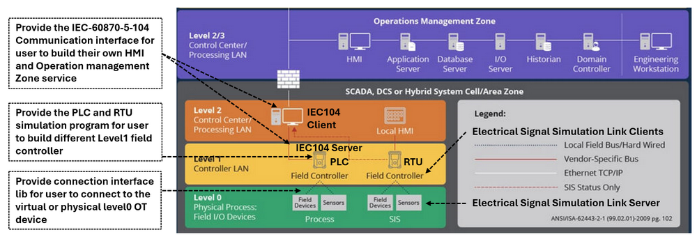

# Python Virtual PLC Simulator with IEC-60870-5-104 Communication Protocol 

**Project Design Purpose**: 

In this follow-up project, we extend the previous Python-based virtual PLC/RTU simulator program (which interfaced to SCADA systems via Modbus-TCP and S7Comm, related link: https://www.linkedin.com/pulse/python-virtual-plc-rtu-simulator-yuancheng-liu-elkgc ) by adding the IEC 60870-5-104 (IEC104) protocol. This project aims to extend the PLC simulator's capabilities with IEC104 PLC/RTU feature and integrating support for the IEC-60870-5-104 (IEC104) communication protocol -- a widely-used telecontrol standard for power system automation. 

The new simulator is organized into three modular components:

- **IEC104 Communication Module** : an IEC104 communication module (with PLC-side server and SCADA/HMI-side client interfaces) enabling standardized IEC104 data exchange. 
- **PLC/RTU Simulation Framework** : an Framework maintains virtual PLC/RTU device memory, IEC104 station (save linked IED data) , IEC104 points (save contacts and coils data), customized operation ladder logic/Structured Text algorithm, IEC104 server linking to next level OT SCADA components and a UDP physical signal connector linking to the lower level physical components sensor simulator.
- **Ladder Logic/Structured Text Module** : which uses a Python plugin interface to simulate PLC/RTU logic behavior by processing virtual contact/memory inputs and updating coil states accordingly which same as the Ladder Logic Diagram (IEC 61131-3-LD) or Structured Text Program(IEC 61131-3-STX)  

```python
# Author:      Yuancheng Liu
# Created:     2025/05/10
# Version:     v_0.0.2
# Copyright:   Copyright (c) 2025 LiuYuancheng
# License:     MIT License
```

**Table of Contents**

[TOC]

------

### Introduction

IEC 60870-5-104 (commonly referred to as IEC 104) is a widely adopted communication protocol used in SCADA (Supervisory Control and Data Acquisition) systems for real-time/remote data exchange in critical infrastructure sectors such as power grids, water treatment, and industrial automation. Supported by major PLC and RTU manufacturers including Siemens, ABB, Mitsubishi Electric, and Altus Sistemas de Automação, IEC 104 plays a vital role in enabling remote monitoring and control across geographically distributed systems.

This project aims to develop a cross-platform Python-based virtual PLC and RTU simulator that complies with the IEC 60870-5-104 standard. The purpose is to offer an educational and prototyping tool that allows users—particularly academic researchers and automation developers—to emulate and test control systems across different layers of an operational technology (OT) environment. As illustrated in the system architecture diagram (below), the simulator supports the creation and interaction of components spanning from Level 0 (physical field devices and sensors) up to Level 2/3 (control center and operations management zones).



This article presents the implementation of the virtual PLC simulator with IEC 104 communication capability. It begins with a brief overview of the IEC 104 protocol, followed by a detailed explanation of the simulator's modular design—covering the communication module, IEC data storage, electrical signal simulation links, and the ladder logic/structured text algorithm engine. Finally, practical examples will demonstrate how users can apply the simulator to model real-world OT systems in a fully virtual environment.


------

### Background knowledge 

In this section we will introduce the detailed IEC 60870-5-104 protocol packet structure, the data storage address configuration of station and points, the measured point and changeable point. 


#### IEC 60870-5-104 Protocol Detail

IEC 60870-5-104 (IEC 104) is a network-based extension of IEC 60870-5-101 and is designed for communication between control stations (e.g., SCADA, DCS) and substations or field equipment over TCP/IP networks. IEC 104 uses the same Application Protocol Data Unit (APDU) format as IEC 101 but encapsulated within TCP/IP packets. An IEC 104 APDU consists of the Start Byte, Length, and Application Protocol Control Information (APCI), followed optionally by Application Service Data Unit (ASDU). The packet detail is shown blow: 


The ASDU contains the actual data being transmitted, such as monitoring values or control commands. Here's a more detailed breakdown:

**APCI (Application Protocol Control Information)** section determines the frame type:

- **Start byte (0x68):** Indicates the beginning of a packet.

- **Length byte:** Specifies the length of the data within the packet. 
- **Four-byte control field:** Provides control information, including options for data transmission and acknowledgements. 

**ASDU (Application Service Data Unit)** holds the actual control or monitoring data and has the following structure:

- **Type Identification (TI)** : 1 byte to indicates the type of information (e.g., `0x01` for single-point)
- **Variable Structure Qualifier (VSQ)** : 1 byte to indicate the number of elements and addressing mode. 
- **Cause of Transmission (COT)** : 2 bytes to indicate the reason for sending (e.g., spontaneous, request, activation)
- **Common Address (CA)** : 2 bytes identifies the source device station memory address. 
- **Information Object Address  (IOA)** : 3 bytes indicate the source device station's point object memory address. 
- **Information elements (Data)** : Depends on the type (e.g., 1 byte for a boolean status, 3 bytes for float)
- **Time tag of information element** :  Time information this information is optional. 

> Reference: https://infonomics-society.org/wp-content/uploads/Passive-Security-Monitoring-for-IEC-60870-5-104-based-SCADA-Systems.pdf


#### IEC 60870-5-104 Packet Example

When we capture a simple ASDU payload for a single digital point might look like this (hex):

```
68 0E 00 00 00 00 01 01 06 00 01 00 00 00 01
```

We can mapping it to the protocol detail to parse the information: 

- `68` → Start byte
- `0E` → Length
- `00 00 00 00` → I-Frame APCI (send/recv = 0)
- `01` → Type ID: Single-Point Information (M_SP_NA)
- `01` → VSQ: 1 element
- `06 00` → Cause of Transmission: spontaneous
- `01 00` → ASDU station address 256. 
- `00 00 00` → Information Object Address 0.
- `01` → Data: status = ON (IEC type M_SP_NA)

After analysis the packet, we it it is a repose data from PLC to the HMI to report one point's bool state.


#### IEC 60870-5-104 Station and Point

In IEC 104, a station represents a physical device or a group of devices that are managed and controlled by a central system. A point, within the station, represents a specific piece of data or a command that can be exchanged between the station and the central system.

The ASDU Address and the Information Object Address (IOA) define the station and its internal points: 

- **ASDU Address** is a 2-byte field that uniquely identifies a **remote station** (e.g., a PLC, RTU, or IED) within the SCADA network. This station represents a logical unit that gathers or controls field data, and it acts as the source or destination of telecontrol messages. The range of a station address is [1, 65534].
- **IOA Address** is The **Information Object Address** is a 3-byte field used to uniquely identify **individual data points** (e.g., sensors, switches, analog inputs) within the context of a given ASDU (station). The range of a point address in the station is n [0, 16777215]


#### IEC 60870-5-104 Measured Point and Changeable Point

In the context of IEC 60870-5-104 (IEC 104) communication, two fundamental data categories are used to represent the system state and support control functions:"measured points" refer to data that represent the state of a device or process, while "changeable points" represent commands or requests that can be sent to the device to control its behavior. 

- **Measured Points (Telemetry Data)** : Measured points—also known as *monitoring points* or *telemetry objects*—represent real-time values acquired from field sensors or process instruments. These points are **read-only** from the SCADA system's perspective and are periodically or event-driven sent from field devices to the control center. Example of MP: M_ME_NA (Measured value, normalized), M_ME_NB (Measured value, scaled), M_SP_NA (Single point information), M_DP_NA (Double point information). Link: https://tatsoft.com/wp-content/uploads/2021/01/IEC8705104.pdf
- **Changeable Points (Telecontrol Commands)** : Changeable points, or *controllable points*, represent actuators or process elements that can be **remotely controlled** via SCADA commands. These include digital outputs (on/off) and analog setpoints. The commands are issued by the SCADA client and processed by the field device (PLC/RTU), which then changes its internal state or output.  example of CP: C_SC_NA (Single command), C_DC_NA (Double command), C_RC_NA (Regulating step command), C_SE_NA (Setpoint command). Link: https://tatsoft.com/wp-content/uploads/2021/10/IEC8705104S.pdf


------

### System Design 

After understand the detailed IEC 60870-5-104 communication protocol, we will introduce the detailed system design of our IEC104 PLC Simulator program. 

The system work flow is shown below: 

Three modular components:

- **Communication Module** : The communication an IEC104 communication module (with PLC-side server and SCADA/HMI-side client interfaces) enabling standardized IEC104 data exchange. An UDP physical signal connector linking to the lower level physical components sensor simulator.

- **PLC/RTU Simulation Framework** : an Framework maintains virtual PLC/RTU device memory, IEC104 station (save linked IED data) , IEC104 points (save contacts and coils data), customized operation ladder logic/Structured Text algorithm, IEC104 server linking to next level OT SCADA components . 

- **Ladder Logic/Structured Text Module** : which uses a Python plugin interface to simulate PLC/RTU logic behavior by processing virtual contact/memory inputs and updating coil states accordingly which same as the Ladder Logic Diagram (IEC 61131-3-LD) or Structured Text Program(IEC 61131-3-STX)  

  

#### Design of Communication Module

The Communication Module of the IEC 104 PLC simulator includes 2 Part PLC/RTU to Physical World Electrical Signal Link (Level0 OT Physical Field I/O Devices to Level1 OT Controller Devices ) and PLC to SCADA-HMI link (Level1 OT Controller Devices to Level2 OT Control Center (HQ). 

##### LC/RTU to Physical World Electrical Signal Link

The physical world components simulator program will generate the related electrical signal (such as voltage value, currently value, RPM value, frequency ). 

We create a UDP Electrical Signal Measure Interface to send these virtual sensors' data under high frequency from the the components simulator to the PLC/RTU's input pin/contact/port to simulate the real wire connection between the physical sensor and PLC, the message follow below format:

```python
Measure_Signal_GET;<SensorID>;<timestamp>;{<SignalID>:<SignalType>:<SignalValue>}
```

If the virtual breaker position sensor send a breaker position OFF to the PLC the message will be like below:

```
Measure_Signal_GET;PG_BK_S_0011;2024-12-06 10:38:29,134;{'POS0011':'VOLTAGE':'5V'}
```


We Use the same logic we create another UDP Electrical Signal Control Interface to do the same thing for control the components in the physical world simulation program, the message follow below format:

```
Control_Signal_POST;<itemID>;<timestamp>;{<SignalID>:<SignalType>:<SignalValue>}
```

If we want to turn on the breaker motor to flip on a breaker in the power system, the message will be link below:

```
Control_Signal_POST;PG_BK_M_0011;2024-12-06 10:51:41,122;{'CTRL':'MOTO_IN':'Votalge_High'}
```

##### IEC 104  Server and Client 

The IEC104 Communication module use the c104 lib https://github.com/Fraunhofer-FIT-DIEN/iec104-python to create a multi threading based IEC104 server and client to handle the communication and related data read() and set() functions. 

- **IEC 104  Server** : IEC-60870-5-104 server class run in the PLC/RTU side to accept the connection from HMI, it provide the fetch mode and report mode, the fetch mode will simulate the real time control, every time when the server receive a request from the client it will response to the client immediately.  Report mode will simulate the remote periodic data report from RTU to HMI, it will auto manically broad cast the data to all the connected client based on the report frequency configuration. 
- **IEC 104 Client** : IEC-60870-5-104 client class run in the SCADA (HMI) side to read and set data from the PLC/RTU side. 


#### Design PLC/RTU Simulation Framework

The PLC/RTU simulation Framework will init 3 sub-thread to act as real PLC

It will start a sub-thread to host multiple UDP Electrical Signal Measure Interface objects and UDP Electrical Signal Control Interface interface objects based on the number of physical components the PLC needs to connected to. Then the PLC will keep fetching the simulated physical electrical signal value. 

When PLC inti, it will setup the station and points address based on the configuration, then management module will keep a signal to point value mapping dictionary,  After the PLC get the simulated physical value, it will convert the signal value to IEC104 type and save the value to the related point for example a 0V can be saved as M_SP_NA_0 and 5V can be saved as M_SP_NA_TRUE. Voltage_Signal_Low can be saved as  C_RC_NA_STEP_LOWER and voltage high can be saved as C_RC_NA_STEP_HIGHER. 

Based on the PLC operation clock cycle configuration, when the operation cycle start, the LD/ST Input Map module will fetch the related measured and changeable points' C104 value then covert or filled the value to related items in the ladder logic diagram such as the fill the M_SP_NA to the holding register's state. Then call the ladder Ladder Logic or ST calculation module to get the output state, then the output state such as the coil state will send to the LD/ST Output Map module and the changeable points' value will be changed. The work flow example will be show below:


In the currently version, we haven't implement all the measured and changeable value type, in the current version we only provide 3 type support which used to represent the state, value and step as shown below:

- **Server measured bool value (M_SP_NA**):  Single-point information, can be read from server and client, but can only be changed from server via `point.value = <val>`, Expected value: `True/False`
- **Server measured number value (M_ME_NC)** : Short floating point number, can be read from server and client, but can only be changed from server via `point.value = <val>`, Expected value: float number, need to do round if do value compare.
- **Server changeable value (C_RC_TA)** : Regulating step command , can be read from server and client, but can only be changed from client via transmit call. Expected value: `iec104.Step.HIGHER/LOWER/INVALID_0/INVALID_1`

Based on the PLC or RTU control configuration, the LC/RTU Simulation Framework will start a sub thread with one IEC104 server which handle the SCADA HMI or remote console's request in real time or report the data based on the periodic setting. 


#### Design of Ladder Logic/Structured Text Module

Tge ladder Logic and ST module is an python  interface class hold the ladder logic calculation algorithm, it will take the holding register's state, source coils state then generate the destination coils states. When people use it , they need to inhert the interface to create their customized Ladder Logic class by overwrite the `initLadder()` and `runLadderLogic()` functions.

For example below ladder logic:

```
 --|reg-00|--|reg-01|----------------------(src-coil-00)------------(dest-coil-02)---
```

To implement this ladder logic, the use need to below steps:

- Put the 'and' gate logic of reg-00, reg-01 and src-coil-00 in `runLadderLogic()` function. 

-  Set source register info as {'address': 0, 'offset': 2} in `initLadderInfo()` function.

-   Set source coil info as {'address': 0, 'offset': 1} in `initLadderInfo()` function.

-    Set destination coil info as {'address': 2, 'offset': 1} in `initLadderInfo()` function.

-   Add the ladder obj to `plcDataHandler()`, then when plcDataHandler holding registers changed, the list [reg-00, reg-01] and [coil-00], will auto passed in the `runLadderLogic()` function.
- runLadderLogic() will return the calculated coils list result, plcDataHandler will set 

​      the destination coils with the result.

For In `initLadder()` part, if you want to create ladder logic use the register and coils parameters as shown below  

```
self.ladderName= ladderName
self.holdingRegsInfo = {'address': None, 'offset': None}
self.srcCoilsInfo = {'address': None, 'offset': None}
self.destCoilsInfo = {'address': None, 'offset': None}
self.initLadderInfo()
```

If you want to use ST to link to the point (memory address) direct, use the address parameters as shown below:

```
self.ladderName = ladderName
self.stationAddr= None
self.srcPointAddrList = []
self.srcPointTypeList = []
self.destPointAddrList = []
self.destPointTypeList = []
self.initLadderInfo()
```

For the  detail usage, we will show an example in the next section.