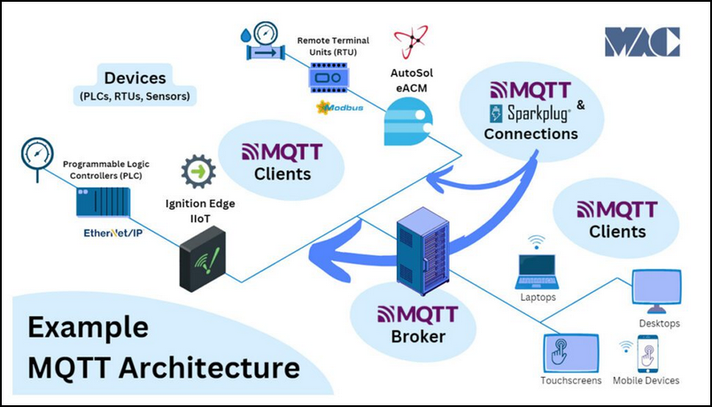
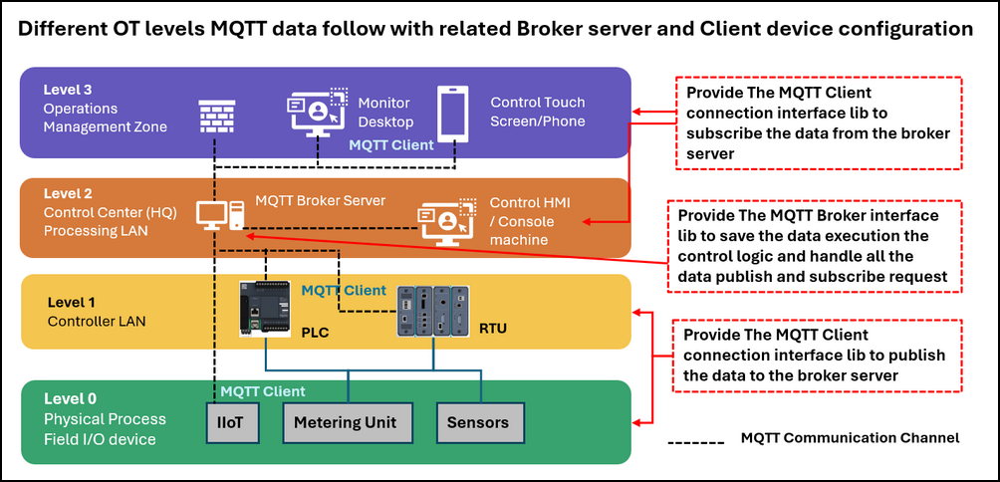

# Python Virtual RTU/IIoT Simulator with IEC-20922 MQTT Communication Protocol

**Project Design Purpose** : In this project, we extend the previous Python-based virtual PLC/RTU simulator library (which interfaced to SCADA systems via Modbus-TCP and S7Comm, related link:  https://www.linkedin.com/pulse/python-virtual-plc-rtu-simulator-yuancheng-liu-elkgc)  by adding the support function for IEC-20922 Message Queuing Telemetry Transport (MQTT) protocol.  The new feature design consists of two major components:

- **MQTT Communication Module** : The MQTT Communication Module implements the IEC 20922-compliant MQTT protocol stack, providing connectivity between virtual devices and MQTT brokers to support the message publishing and subscription, topic management, telemetry data exchange, and command/control communication. 
- **RTU/IIoT Simulator Framework** : The RTU/IIoT Simulator Framework models the operational behavior of industrial field devices, remote terminal units (RTUs), and IIoT sensors. It manages virtual device inputs and outputs, processes MQTT messages, interfaces with physical-world simulation modules, and executes user-defined control logic.

```python
# Author:      Yuancheng Liu
# Created:     2026/06/01
# Version:     v_0.0.1
# Copyright:   Copyright (c) 2026 Liu Yuancheng
# License:     MIT License
```

**Table of Contents**

[TOC]

------

### 1. Project Introduction

The **Message Queuing Telemetry Transport (MQTT)** protocol, standardized as **IEC 20922**, is a lightweight publish-subscribe messaging protocol designed for resource-constrained devices and low-bandwidth networks. Due to its simplicity, scalability, and low communication overhead, MQTT has become one of the most widely adopted communication standards in the Industrial Internet of Things (IIoT) domain and machine-to-machine (M2M) communication across industries such as manufacturing, energy, transportation, and smart infrastructure. 

In a typical IIoT deployment, field devices publish operational data to a centralized MQTT broker, while supervisory systems, Human-Machine Interfaces (HMIs), mobile applications, and monitoring platforms subscribe to the required data streams. This decoupled communication model simplifies system integration and provides a flexible architecture for large-scale industrial monitoring and control systems The usage case example of MQTT with IIoT/RTU and the architecture is shown below:



To support the development of industrial cyber twins and OT cybersecurity research platforms, I developed a Python-based Virtual RTU/IIoT Simulator with MQTT Communication Support. The project provides reusable MQTT Broker and MQTT Client modules that can be integrated into different cyber-twin components. 

#### 1.1 System Overview

The simulator is **NOT** 1:1 emulate the real RTU/IIoT/MU hardware function, it focuses on reproducing the **core operational behaviors** commonly found in MQTT-enabled industrial devices, including:

- Device variable and tag storage management
- MQTT publish and subscribe communication mechanisms
- Telemetry and control data exchange workflows
- Device control logic execution cycles
- Interactions between field devices, controllers, and supervisory systems

This lightweight design provides an effective educational, prototyping, and research environment for:

- Academic researchers studying industrial automation and IIoT architectures
- Students learning OT communication protocols and MQTT device behaviors
- Developers building, testing, or validating MQTT-enabled applications
- OT cybersecurity professionals analyzing industrial communication flows and attack scenarios

#### 1.2 System ISA-95 Architecture 

The simulator enables users to construct cyber twins' components that mirror the hierarchical architecture commonly found in modern industrial environments. As shown in the figure below, the framework follows a simplified four-level OT architecture based on the ISA-95 model as shown in the below diagram : 



- At **Level 0 (Physical Process Field I/O Devices)**, simulated IIoT devices, sensors, and metering units generate operational data representing measurements collected from physical processes. At **Level 1 (Controller LAN)**, virtual RTUs process the incoming data and operate as MQTT clients, publishing telemetry and status information to the MQTT Broker.
- The **MQTT Broker Server**, located at **Level 2 (Control Center Processing LAN)**, acts as the central communication hub. It receives published messages from field devices, manages topic subscriptions, stores device data, and executes server-side processing logic when required. Control HMIs and operator consoles within the same network segment can also subscribe to or publish MQTT messages through the broker.
- At **Level 3 (Operations Management Zone)**, supervisory applications such as monitoring workstations, engineering desktops, mobile devices, and touchscreen operator panels run MQTT client services to subscribe to device data, visualize process information, and issue control commands. 

This architecture closely resembles real-world IIoT and SCADA deployments while remaining lightweight, extensible, and suitable for simulation, training, and cybersecurity experimentation.


------

