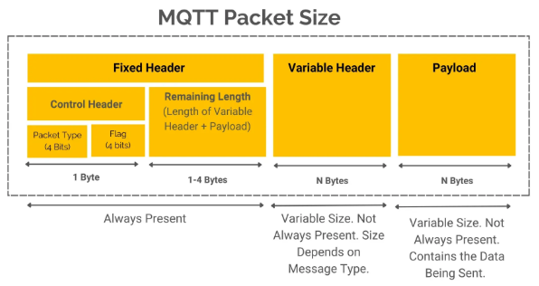
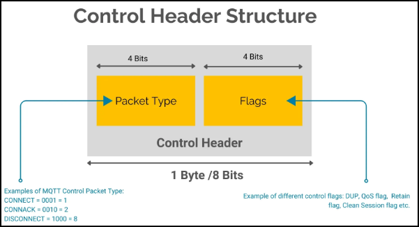
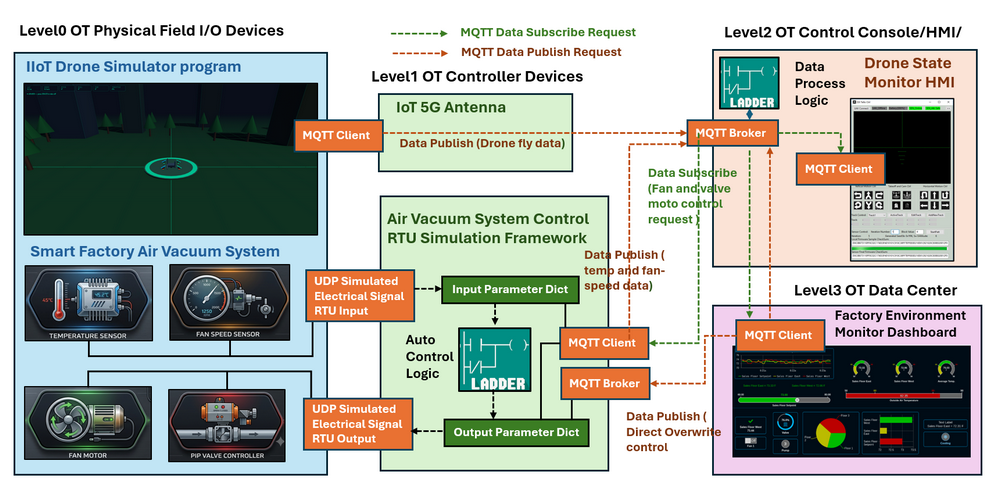

# Python Virtual RTU/IIoT Simulator with IEC-20922 MQTT Communication Protocol

**Project Design Purpose** : In this project, we extend the previous Python-based virtual PLC/RTU simulator library (which interfaced to SCADA systems via Modbus-TCP and S7Comm, related link:  https://www.linkedin.com/pulse/python-virtual-plc-rtu-simulator-yuancheng-liu-elkgc)  by adding the support function for IEC-20922 Message Queuing Telemetry Transport (MQTT) protocol.  The new feature design consists of two major components:

- **MQTT Communication Module** : The MQTT Communication Module implements the IEC 20922-compliant MQTT protocol stack, providing connectivity between virtual devices and MQTT brokers to support the message publishing and subscription, topic management, telemetry data exchange, and command/control communication. 
- **RTU/IIoT Simulator Framework** : The RTU/IIoT Simulator Framework models the operational behavior of industrial field devices, remote terminal units (RTUs), and IIoT sensors. It manages virtual device inputs and outputs, processes MQTT messages, interfaces with physical-world simulation modules, and executes user-defined control logic.

```python
# Author:      Yuancheng Liu
# Created:     2026/06/01
# Version:     v_0.0.1
# Copyright:   Copyright (c) 2026 Liu Yuancheng
# License:     MIT License
```

**Table of Contents**

[TOC]

------

### 1. Project Introduction

The **Message Queuing Telemetry Transport (MQTT)** protocol, standardized as **IEC 20922**, is a lightweight publish-subscribe messaging protocol designed for resource-constrained devices and low-bandwidth networks. Due to its simplicity, scalability, and low communication overhead, MQTT has become one of the most widely adopted communication standards in the Industrial Internet of Things (IIoT) domain and machine-to-machine (M2M) communication across industries such as manufacturing, energy, transportation, and smart infrastructure. 

In a typical IIoT deployment, field devices publish operational data to a centralized MQTT broker, while supervisory systems, Human-Machine Interfaces (HMIs), mobile applications, and monitoring platforms subscribe to the required data streams. This decoupled communication model simplifies system integration and provides a flexible architecture for large-scale industrial monitoring and control systems The usage case example of MQTT with IIoT/RTU and the architecture is shown below:


To support the development of industrial cyber twins and OT cybersecurity research platforms, I developed a Python-based Virtual RTU/IIoT Simulator with MQTT Communication Support. The project provides reusable MQTT Broker and MQTT Client modules that can be integrated into different cyber-twin components. 

#### 1.1 System Overview

The simulator is **NOT** 1:1 emulate the real RTU/IIoT/MU hardware function, it focuses on reproducing the **core operational behaviors** commonly found in MQTT-enabled industrial devices, including:

- Device variable and tag storage management
- MQTT publish and subscribe communication mechanisms
- Telemetry and control data exchange workflows
- Device control logic execution cycles
- Interactions between field devices, controllers, and supervisory systems

This lightweight design provides an effective educational, prototyping, and research environment for:

- Academic researchers studying industrial automation and IIoT architectures
- Students learning OT communication protocols and MQTT device behaviors
- Developers building, testing, or validating MQTT-enabled applications
- OT cybersecurity professionals analyzing industrial communication flows and attack scenarios

#### 1.2 System ISA-95 Architecture 

The simulator enables users to construct cyber twins' components that mirror the hierarchical architecture commonly found in modern industrial environments. As shown in the figure below, the framework follows a simplified four-level OT architecture based on the ISA-95 model as shown in the below diagram : 


- At **Level 0 (Physical Process Field I/O Devices)**, simulated IIoT devices, sensors, and metering units generate operational data representing measurements collected from physical processes. At **Level 1 (Controller LAN)**, virtual RTUs process the incoming data and operate as MQTT clients, publishing telemetry and status information to the MQTT Broker.
- The **MQTT Broker Server**, located at **Level 2 (Control Center Processing LAN)**, acts as the central communication hub. It receives published messages from field devices, manages topic subscriptions, stores device data, and executes server-side processing logic when required. Control HMIs and operator consoles within the same network segment can also subscribe to or publish MQTT messages through the broker.
- At **Level 3 (Operations Management Zone)**, supervisory applications such as monitoring workstations, engineering desktops, mobile devices, and touchscreen operator panels run MQTT client services to subscribe to device data, visualize process information, and issue control commands. 

This architecture closely resembles real-world IIoT and SCADA deployments while remaining lightweight, extensible, and suitable for simulation, training, and cybersecurity experimentation.


------

### 2. MQTT Protocol Background Knowledge

Message Queuing Telemetry Transport (MQTT) is a lightweight messaging protocol standardized as **IEC 20922**. It follows a **publish-subscribe communication model**, where devices do not communicate directly with one another. Instead, all messages are exchanged through a central **MQTT Broker**.

In an MQTT system, devices acting as **publishers** send data to specific topics hosted by the broker, while **subscribers** receive messages from topics they are interested in. This architecture reduces communication complexity, improves scalability, and enables efficient operation over low-bandwidth or unreliable networks.

#### 2.1 MQTT Protocol Packet Structure

MQTT communication is performed through a series of protocol packets exchanged between clients and the broker. Regardless of packet type, every MQTT packet consists of three logical sections:

1. Fixed Header (Mandatory)
2. Variable Header (Optional)
3. Payload (Optional)

The general MQTT packet structure is illustrated below:



For the detail packet analysis, please refer to below document : 

- http://www.steves-internet-guide.com/mqtt-protocol-messages-overview/
- https://www.hivemq.com/blog/mqtt-packets-comprehensive-guide/

#### 2.2 MQTT Protocol Key Features

**Lightweight Header:** Protocol packets are tiny (often just a few bytes), which preserves bandwidth, memory, and battery life. 

**Quality of Service (QoS):** Developers can choose the level of delivery assurance:

- *QoS 0 (At most once):* Fast delivery but messages may be lost.
- *QoS 1 (At least once):* Delivery guaranteed, but duplicates can occur.
- *QoS 2 (Exactly once):* Message delivered exactly once, with no loss or duplication. 

**Last Will and Testament (LWT):** Allows a device to pre-register a message with the broker that gets automatically broadcasted if the device unexpectedly goes offline


------

### 3. Design of The MQTT Virtual IIoT and RTU

This section introduces the detailed design of the MQTT communication modules and demonstrates how they can be integrated into cyber twin environments. Two example applications are presented: a simulated smart factory air vacuum control system and an IoT drone telemetry receiver system. These examples illustrate how MQTT-based communication can be incorporated into different layers of an industrial control architecture.

#### 3.1 MQTT Communication Module Design

The MQTT communication framework consists of two primary components: an MQTT Broker module and an MQTT Client module. Together, these components provide the messaging infrastructure required for data exchange between simulated field devices, controllers, and supervisory applications.

**3.1.1 Design of MQTT Broker** 

For the MQTT Broker module, the currently implemented MQTT packet types are shown below.



```python
# MQTT packet type constants (currently what we need, may add more in the future)
CONNECT     = 0x10	# Establish a connection to the MQTT Broker
CONNACK     = 0x20	# Connection acknowledgement from the broker
PUBLISH_Q0  = 0x30  # QoS level 0 (At most once) currently we use the QoS level0 DUP = 0, Retain = 0
PUBLISH_Q1  = 0x32  # QoS level 1 (At least once)
PUBLISH_Q2  = 0x34  # QoS level 2 (Exactly once)
PUBACK      = 0x40	# publish acknowledgement
SUBSCRIBE   = 0x82	# Subscribe to one or more topics
SUBACK      = 0x90	# Subscription acknowledgement
PINGREQ     = 0xC0	# Keep-alive request
PINGRESP    = 0xD0	# Keep-alive response
DISCONNECT  = 0xE0	# Gracefully terminate a connection
```

For each Broker module, when a new MQTT client establishes a connection with it, a dedicated client handler thread is created to manage publish and subscribe requests independently. This multi-threaded architecture allows multiple MQTT clients to communicate with the broker simultaneously.

To simplify parameter access and standardize data exchange, the following topic naming conventions are used:

| Topic Pattern                  | Purpose                                  |
| ------------------------------ | ---------------------------------------- |
| `parameters/get/<topicName>`   | Request the current value of a parameter |
| `parameters/set/<topicName>`   | Update the value of a parameter          |
| `parameters/value/<topicName>` | Subscribe to parameter value updates     |

In addition to basic message routing, the broker module provides an interface function named `executeLogic()` that allows users to implement custom data processing and control algorithms.

```python
def executeLogic(self):
    """ Interface function in the main loop for the MQTT broker to execute the control logic."""
	pass
```

Users can create a custom broker by inheriting from the base `MQTTBroker` class and overriding this function with application-specific logic. The function is automatically triggered whenever a parameter value is updated through a publish request. It can also be called periodically within the main execution loop to perform scheduled data processing tasks.

For simplicity and maximum compatibility between different simulated devices, all parameter values are internally stored as string data types. Type conversion can be performed by application-specific logic when required.

**3.1.2 Design of MQTT Client**

The MQTT Client module is implemented using the Eclipse Paho MQTT library https://pypi.org/project/paho-mqtt/ . The client provides four functions for cyber twin simulation components to use:

- `getParmVal()` – Retrieve a parameter value from the broker.
- `setParmVal()` – Update a parameter value on the broker.
- `watch()` – Subscribe to a specified parameter topic.
- `watchall()` – Subscribe to all available parameter topics.

#### 3.2 Cyber Twin Integration Design

To demonstrate the usage of the MQTT communication framework, two cyber twin components were developed: an IoT drone telemetry system and a smart factory air vacuum control system. The overall integration architecture is shown below.



**3.2.1 IoT Drone Telemetry System**

In the IoT drone simulation system, the drone simulator operates as an MQTT client and continuously publishes raw flight telemetry data to the MQTT broker. The transmitted data includes information such as: `Roll angle`, `Pitch angle`, `Yaw angle`, `Altitude`, `Speed` and `GPS position`.

The MQTT broker executes custom processing logic to convert the raw sensor measurements into human-readable flight status information. The processed results are then stored within the broker's parameter database.

The Drone State Monitor HMI operates as another MQTT client and subscribes to the processed telemetry topics. By continuously receiving updates from the broker, the HMI provides real-time visualization of the drone's operational status and flight conditions.

**3.2.2 Smart Factory Air Vacuum Control System**

The smart factory air vacuum system demonstrates the integration of MQTT communication with a traditional RTU-based control architecture.

Within the physical process simulator, the temperature sensor, pressure sensor, and fan speed sensor generate simulated measurements that are transmitted to the RTU through a UDP-based electrical signal simulation channel. The RTU stores these measurements in its internal parameter dictionary and executes local control logic to determine appropriate control actions.

Based on the current operating conditions, the RTU may issue control commands to:

- Fan motor controllers
- Air pipe valve controllers
- Other simulated field devices

These control commands are delivered through the same simulated electrical signal channel used by the physical process model.

MQTT client running inside the RTU publishes operational data and system status information to the MQTT broker. The Factory Environment Monitoring HMI subscribes to these MQTT topics and displays the information through a real-time dashboard.

The MQTT infrastructure also enables supervisory control. When an operator modifies a system configuration through the control dashboard, the command is published to the MQTT broker. The RTU subscribes to the relevant control topics and receives the updated settings. These operator-issued commands can override the RTU's automatic control decisions, allowing manual intervention when required.

After receiving the new control parameters, the RTU updates its internal control state and issues corresponding commands to the simulated field devices, causing the physical process simulator to respond accordingly.

To support rapid maintenance operations and engineering testing, the RTU additionally hosts a lightweight embedded MQTT broker linked directly to selected control parameters. This feature enables engineering consoles and local HMIs to perform low-latency direct control and parameter modification without traversing the central MQTT infrastructure.


------

