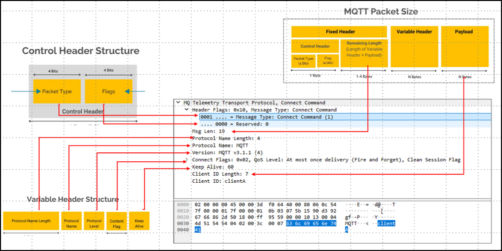
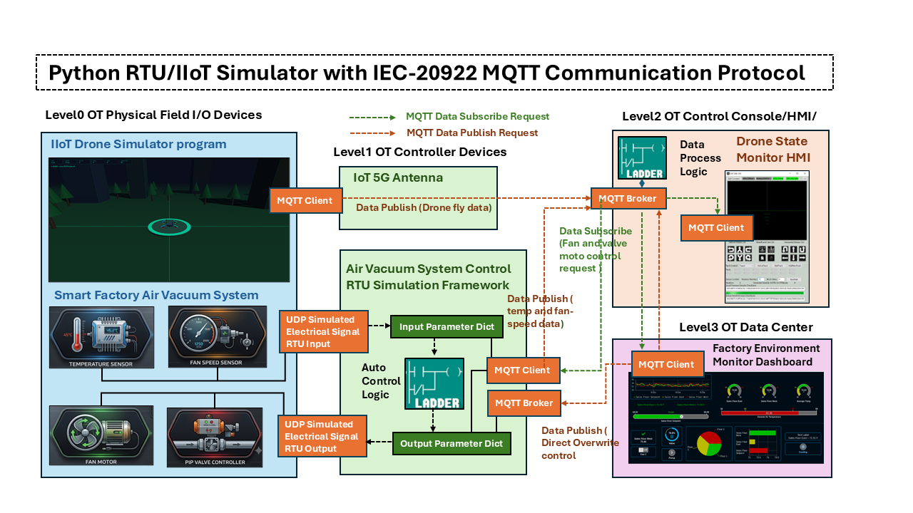

# Python 虛擬 RTU/IIoT 模擬器，支援 IEC-20922 MQTT 通訊協定

[us English](Readme.md) | **cn 中文**

**專案設計目的** ：在此專案中，我擴展了我先前基於 Python 的虛擬 PLC/RTU 模擬器函式庫（該函式庫透過 Modbus-TCP 和 S7Comm 與 SCADA 系統介接，相關連結：https://www.linkedin.com/pulse/python-virtual-plc-rtu-simulator-yuancheng-liu-elkgc），增加了對 IEC-20922 Message Queuing Telemetry Transport (MQTT) 通訊協定的支援功能。新功能設計包含兩個主要元件：

- **MQTT 通訊模組** ：MQTT 通訊模組實作了符合 IEC 20922 標準的 MQTT 通訊協定堆疊，提供虛擬裝置與 MQTT Broker 之間的連線能力，以支援訊息發布與訂閱、主題管理、遙測資料交換以及指令/控制通訊。
- **RTU/IIoT 模擬器框架** ：RTU/IIoT 模擬器框架模擬工業現場裝置、遠端終端單元 (RTU) 和 IIoT 感測器的操作行為。它管理數位分身 (cyber twin) 的虛擬裝置輸入與輸出，處理 MQTT 訊息，與實體世界模擬模組介接，並執行使用者定義的控制邏輯。

```python
# Author:      Yuancheng Liu
# Created:     2026/06/01
# Version:     v_0.0.1
# Copyright:   Copyright (c) 2026 Liu Yuancheng
# License:     MIT License
```

**Table of Contents**

[TOC]

------

### 1. 專案簡介

Message Queuing Telemetry Transport (MQTT) 通訊協定，標準化為 **IEC 20922**，是一種輕量級的發布/訂閱訊息傳輸協定，專為資源受限的裝置和低頻寬無線網路而設計。由於其簡潔性、可擴展性和低通訊開銷，MQTT 已成為工業物聯網 (IIoT) 領域以及製造、能源、交通和智慧基礎設施等行業的機器對機器 (M2M) 通訊中最廣泛採用的通訊標準之一。

在典型的 IIoT 部署中，現場裝置將操作資料發布到中央 MQTT Broker，而監管系統、人機介面 (HMI)、行動應用程式和監控平台則訂閱所需的資料串流。這種解耦的通訊模型簡化了系統整合，並為大規模工業監控和控制系統提供了靈活的架構。以下顯示了 MQTT 與 IIoT/RTU/PLC 的使用案例範例：


```
Image Reference : https://macautoinc.com/industrial-communication-protocols/mqtt/
```

為了支援工業數位分身和 OT 網路安全研究平台的開發，本專案將提供一組可重複使用的 MQTT Broker 和 MQTT Client 模組，這些模組可以整合到不同的數位分身元件中。

#### 1.1 系統概述

此模擬器專案 **並非** 1:1 模擬真實 RTU/IIoT/MU 硬體功能（非數位分身），而是著重於重現常見於支援 MQTT 的工業裝置的核心操作行為，包括：

- 裝置變數和標籤的儲存管理
- MQTT 發布和訂閱通訊機制
- 遙測和控制資料交換工作流程
- 裝置控制邏輯的執行週期
- 現場裝置、控制器和監管系統之間的互動

而系統應用程式的主要目的將是提供有效的教育、原型製作和研究環境，例如：

- 研究工業自動化和 IIoT 架構的學術研究人員
- 學習 OT 通訊協定和 MQTT 裝置行為的學生
- 開發、測試或驗證支援 MQTT 的應用程式的開發人員
- 分析工業通訊流程和攻擊情境的 OT 網路安全專業人員

#### 1.2 系統 ISA-95 架構

此模擬器使用戶能夠建構反映現代工業環境中常見的階層式架構的數位分身元件。如下圖所示，該框架遵循基於 ISA-95 模型簡化的四層 OT 架構：


- 在 **Level 0 (實體製程現場 I/O 裝置)**，模擬的 IIoT 裝置、感測器和計量單元產生操作資料，代表從實體製程收集的測量值。在 **Level 1 (控制器 LAN)**，虛擬 RTU 處理進來的資料並作為 MQTT 用戶端運作，將遙測和狀態資訊發布到 MQTT Broker。
- 位於 **Level 2 (控制中心處理 LAN)** 的 **MQTT Broker 伺服器**，充當中央通訊樞紐。它接收來自現場裝置的發布訊息，管理主題訂閱，儲存裝置資料，並在需要時執行伺服器端處理邏輯。同一網路區段內的控制 HMI 和操作員控制台也可以透過 Broker 訂閱或發布 MQTT 訊息。
- 在 **Level 3 (營運管理區)**，監管應用程式，如監控工作站、工程桌面、行動裝置和觸控螢幕操作面板，運行 MQTT 用戶端服務來訂閱裝置資料、視覺化製程資訊並發出控制指令。

------

### 2. MQTT 通訊協定背景知識

Message Queuing Telemetry Transport (MQTT) 是一種輕量級訊息傳輸協定，標準化為 **IEC 20922**。它遵循 **發布/訂閱通訊模型**，其中裝置之間不直接通訊。相反地，所有訊息都透過中央 **MQTT Broker** 交換。

在 MQTT 系統中，充當 **發布者** 的裝置將資料發送到 Broker 上託管的特定主題，而 **訂閱者** 則接收它們感興趣的主題的訊息。這種架構簡化了通訊複雜性，提高了可擴展性，並能在低頻寬或不可靠的網路上實現高效運作。

#### 2.1 MQTT 通訊協定封包結構

MQTT 通訊透過一系列在用戶端和 Broker 之間交換的通訊協定封包來執行。無論封包類型為何，每個 MQTT 封包都包含三個邏輯部分：

1. 固定標頭 (必要)
2. 變動標頭 (可選)
3. 負載 (可選)

一般的 MQTT 封包結構如下圖所示：


有關詳細的封包分析，請參閱以下文件：

- http://www.steves-internet-guide.com/mqtt-protocol-messages-overview/
- https://www.hivemq.com/blog/mqtt-packets-comprehensive-guide/

這是一個將每個封包部分對應到擷取的 MATT 連線請求訊息的範例：



#### 2.2 MQTT 通訊協定關鍵特性

**輕量級標頭：** 通訊協定封包非常小（通常只有幾個位元組），節省了頻寬、記憶體和電池壽命。

**服務品質 (QoS)：** 開發人員可以選擇傳遞保證的等級：

- *QoS 0 (最多一次)：* 快速傳遞，但訊息可能會丟失。
- *QoS 1 (至少一次)：* 保證傳遞，但可能會有重複。
- *QoS 2 (恰好一次)：* 訊息恰好傳遞一次，沒有丟失或重複。

**最後遺囑與宣告 (LWT)：** 允許裝置預先向 Broker 註冊一條訊息，如果裝置意外離線，該訊息將被自動廣播。

------

### 3. MQTT 虛擬 IIoT 和 RTU 設計

本節介紹 MQTT 通訊模組的詳細設計，並展示如何將它們整合到數位分身環境中。提供了兩個範例應用程式：

- 模擬的智慧工廠真空控制系統
- 物聯網無人機遙測接收系統

這些範例說明了如何將基於 MQTT 的通訊整合到工業控制架構的不同層級中。

#### 3.1 MQTT 通訊模組設計

MQTT 通訊框架包含兩個主要元件：一個 MQTT Broker 模組和一個 MQTT Client 模組，用於提供模擬現場裝置、控制器和監管應用程式之間進行資料交換所需的訊息基礎設施。

**3.1.1 MQTT Broker 設計**

對於 MQTT Broker 模組，目前實作的 MQTT 封包類型如下所示。


```python
# MQTT packet type constants (currently what we need, may add more in the future)
CONNECT     = 0x10	# Establish a connection to the MQTT Broker
CONNACK     = 0x20	# Connection acknowledgement from the broker
PUBLISH_Q0  = 0x30  # QoS level 0 (At most once) currently we use the QoS level0 DUP = 0, Retain = 0
PUBLISH_Q1  = 0x32  # QoS level 1 (At least once)
PUBLISH_Q2  = 0x34  # QoS level 2 (Exactly once)
PUBACK      = 0x40	# publish acknowledgement
SUBSCRIBE   = 0x82	# Subscribe to one or more topics
SUBACK      = 0x90	# Subscription acknowledgement
PINGREQ     = 0xC0	# Keep-alive request
PINGRESP    = 0xD0	# Keep-alive response
DISCONNECT  = 0xE0	# Gracefully terminate a connection
```

對於每個 Broker 模組，當一個新的 MQTT 用戶端與其建立連線時，會建立一個專用的用戶端處理器執行緒，以獨立管理發布和訂閱請求。這種多執行緒架構允許多個 MQTT 用戶端同時與 Broker 通訊。

為了簡化參數存取並標準化資料交換，使用了以下主題命名慣例：

| 主題模式            | 目的             | 請求類型 |
| :------------------ | :--------------- | :------- |
| `parameters/get/`   | 請求參數的目前值 | 發布     |
| `parameters/set/`   | 更新參數的值     | 發布     |
| `parameters/value/` | 訂閱參數值更新   | 訂閱     |

除了基本的訊息路由之外，Broker 模組還提供了一個名為 `executeLogic()` 的空介面函數，允許使用者實作自訂資料處理和控制演算法，如下所示：

```python
def executeLogic(self):
    """ MQTT Broker 在主迴圈中執行控制邏輯的介面函數。"""
	pass
```

使用者可以透過繼承基礎 `MQTTBroker` 類別並覆寫此函數來建立自訂 Broker，以實作應用程式特定的邏輯。此函數在每次透過發布請求更新參數值時自動觸發。它也可以在主執行迴圈中定期呼叫，以執行排定的資料處理任務。

為了簡化並最大化不同模擬裝置之間的相容性，所有參數值在內部都儲存為 `string` 資料類型。在需要時，可以透過應用程式特定的邏輯執行類型轉換。

**3.1.2 MQTT Client 設計**

MQTT Client 模組是使用 Eclipse Paho MQTT 函式庫實作的 https://pypi.org/project/paho-mqtt/ 。該用戶端提供了四個函數供數位分身模擬元件使用：

- `getParmVal()` – 從 Broker 檢索參數值。
- `setParmVal()` – 在 Broker 上更新參數值。
- `watch()` – 訂閱指定的參數主題。
- `watchall()` – 訂閱所有可用的參數主題。

#### 3.2 數位分身整合設計

為了展示 MQTT 通訊框架的用法，開發了兩個數位分身元件：一個物聯網無人機遙測系統和一個智慧工廠真空控制系統。整體整合架構如下所示。


### 4. 用例示例

为了演示 MQTT 虚拟 RTU/IIoT 模拟器的用法，本节介绍了一个简单的风扇控制器 RTU 实现。该示例展示了如何集成 MQTT 代理和 MQTT 客户端模块来创建一个能够执行自动控制逻辑，同时通过 MQTT 暴露遥测和控制接口的 RTU。

以下 Python 模块作为基础示例提供，可以扩展以构建更复杂的支持 MQTT 的工业设备模拟器。

| 程序文件                       | 执行环境    | 描述                                                         |
| :----------------------------- | :---------- | :----------------------------------------------------------- |
| `src/mqttComm.py`              | python 3.7+ | 核心库，实现了 IEC-20922 MQTT 客户端/代理 API，用于模拟 IIoT/RTU 与 SCADA 软件之间的数据和命令交互。 |
| `src/mqttCommTest.py`          | python 3.7+ | ``的测试用例模块。它在一个后台线程中启动一个 MQTT 代理服务，创建两个客户端，并测试参数值发布/订阅操作和控制逻辑。 |
| `testcase/mqtRtuClientTest.py` | python 3.7+ | 该模块是一个简单的 RTU 连接程序，使用 MQTT 库模块 ``来模拟一个 SCADA 设备，其中包含一个 MQTT 客户端，用于连接到 ``，设置参数的随机值并读取相关响应以验证结果。 |
| `testcase/mqtRtuBrokerTest.py` | python 3.7+ | 该模块是一个简单的 RTU 模拟程序，使用库模块 ``来模拟一个 RTU，其中包含一个 MQTT 代理和一个自动控制逻辑，用于处理来自客户端的可变读取和可更改值设置。 |

#### 4.1 实现 Broker 控制逻辑

在此示例中，在 MQTT Broker 中实现了一个自动风扇控制器。控制要求很简单：

- 如果运行模式设置为“自动”且温度超过 50°C，则风扇开启并将风扇速度设置为 50%。
- 否则，风扇关闭。

为了实现此行为，通过继承基类 `MQTTBroker` 并覆盖 `executeLogic()` 接口函数来创建一个自定义的 broker 类。

```python
class TestBroker(mqttComm.MQTTBroker):
    """ 测试 broker 类，它将在子线程中启动一个 broker 和多个客户端
        来测试数据的读取和传输。
    """
    def __init__(self, brokerName='testBroker', brokerPort=1883):
        super().__init__()
        self.mqttClients = []
    def executeLogic(self):
        """ 风扇控制逻辑覆盖了 mqttComm.MQTTBroker 中的 executeLogic。 """
        print("> 执行控制逻辑")
        temp = float(self.getParmVal('temperature'))
        mode = self.getParmVal('mode')
        if mode == 'auto':
            if temp > 50:
                self.setParmVal('fan', 'on')
                self.setParmVal('fanSpeed', '50')
            else:
                self.setParmVal('fan', 'off')
                self.setParmVal('fanSpeed', '0')
```

#### 4.2 实现 RTU 模块

RTU 模拟器在一个专用的后台线程中托管 MQTT Broker，并初始化控制应用程序所需的参数。

```python
class MQTTbrokerThread(threading.Thread):
    """ MQTT broker 线程类。 """
    def __init__(self):
        threading.Thread.__init__(self)
        self.mqttBroker = TestBroker()
        self.mqttBroker.addParm('temperature', '25.0')
        self.mqttBroker.addParm('mode', 'manual')
        self.mqttBroker.addParm('fan', 'off')
        self.mqttBroker.addParm('fanSpeed', '0')
```

RTU 定期与物理过程模拟器交换数据。在每个执行周期中，从模拟环境中收集传感器值，存储在 MQTT Broker 参数数据库中，并由自动控制算法处理。

```python
    def run(self):
        while not self.terminate:
            self.fetchDataFromPhysicalWorld()
            self.brokerObj.setParmVal('temperature', str(self.srcValDict['temperature']))
            self.brokerObj.executeLogic()
            time.sleep(0.1) # 休眠 0.1 秒等待 broker 的
            self.srcValDict['autoMode'] = self.brokerObj.getParmVal('mode') == 'auto'
            self.destValDict['fanPwr'] = self.brokerObj.getParmVal('fan') == 'on'
            self.destValDict['fanSpeed'] = int(self.brokerObj.getParmVal('fanSpeed'))
            print("源参数: %s" % str(self.srcValDict))
            print("目标参数: %s" % str(self.destValDict))
```

#### 4.3 实现 RTU 连接器模块

外部应用程序，如 HMI、SCADA 系统、工程工作站或监控仪表板，可以通过 MQTT Client 模块与 RTU 通信。

要建立连接，将创建一个客户端对象并连接到 Broker，如下所示：

```bash
class RtuConnector(object):
    def __init__(self, clientId, host, port=1883):
        self.mHost = host
        self.mPort = port
        self.mClientId = clientId
        self.client = mqttComm.MQTTClient(clientId, host, port=1883)
        self.client.connect()
    #-----------------------------------------------------------------------------
    def startTest(self):
        index = 0
        print("开始客户端测试")
        index += 1
        print("\n测试-%d 从服务器订阅数据。" % index)
        temp = self.client.getParmVal('temperature')
        mode = self.client.getParmVal('mode')
        fan = self.client.getParmVal('fan')
        fanS = self.client.getParmVal('fanSpeed')
```


------

### 5. 项目仓库链接



本项目扩展了一个基于 Python 的虚拟 PLC/RTU 模拟器库，支持 IEC 20922 (MQTT) 协议，为工业数字孪生和 OT 安全研究实现了发布-订阅通信。实现包括两个主要组件：一个符合标准数据包结构的 MQTT 通信模块（支持 CONNECT、PUBLISH、SUBSCRIBE、PING、DISCONNECT），以及一个 RTU/IIoT 模拟器框架，该框架模拟现场设备行为、管理虚拟 I/O 并执行用户定义的控制逻辑。该系统遵循四级 ISA‑95 架构，从模拟的物理过程设备到运营管理应用程序。提供了两个演示用例：一个物联网无人机遥测系统和一个智能工厂真空控制系统。一个简单的风扇控制器示例说明了如何实现自定义 Broker 逻辑并集成 MQTT 客户端进行遥测交换和监控控制。该模拟器可用于教育、原型设计和网络安全分析，服务于研究人员、学生、开发人员和 OT 专业人员。

**项目仓库链接：**

```python
https://github.com/LiuYuancheng/PLC_and_RTU_Simulator/tree/main/MQTT_RTU_Simulator
```


------

> last edit by LiuYuancheng (liu_yuan_cheng@hotmail.com) by 06/07/2026 if you have any problem, please send me a message. 