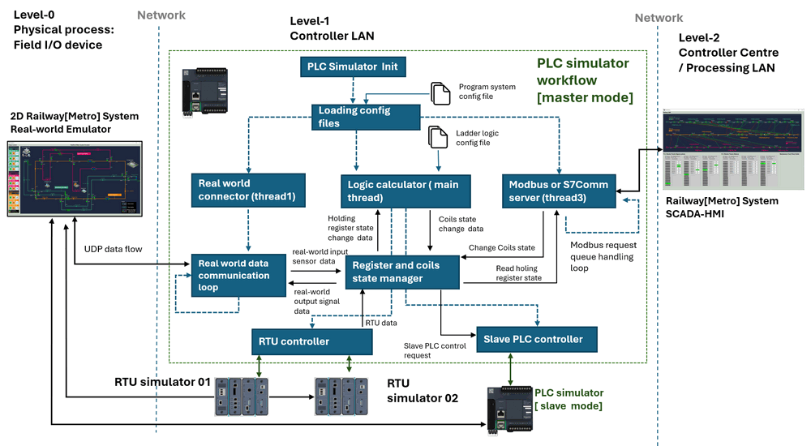

# Modbus PLC Simulator [ Usage Manual ]

```powershell
# Library Usage Manual
```

**Project Design Purpose**: The main objective of this project is to develop a Python library capable of simulating the OT PLCs (Programmable Logic Controllers)  device which use the Modbus-TCP protocol. 

This component emulates the functionality of a PLC, the design follows the core operation logic of Schneider M221 PLC . It includes Modbus TCP client and server functionalities, ladder logic simulation, PLC register-memory-coil control, and interfaces for connecting with real-world physical or virtual OT devices. The program module workflow diagram is shown below:



```
# Version:     v0.1.4
# Created:     2023/06/22
# Copyright:   Copyright (c) 2023 LiuYuancheng
# License:     MIT License
```

**Table of Contents** 

[TOC]

- [Modbus PLC Simulator [Usage Manual]](#modbus-plc-simulator--usage-manual-)
    + [Introduction](#introduction)
      - [Module 1: plcSimulator](#module-1--plcsimulator)
      - [Module 2: modbusTcpCom](#module-2--modbustcpcom)
    + [Program Setup](#program-setup)
        * [Development Environment](#development-environment)
        * [Additional Lib/Software Need](#additional-lib-software-need)
        * [Hardware Needed : None](#hardware-needed---none)
        * [Program Files List](#program-files-list)
    + [Program Usage](#program-usage)
        * [Run the Test Case](#run-the-test-case)
        * [Build a Customized PLC](#build-a-customized-plc)
        * [Build a Ladder Logic](#build-a-ladder-logic)

------

### Introduction 

PLCs are programmable devices designed primarily for controlling machinery and processes in industrial environments. They are used to automate sequences of operations, monitor inputs from sensors, and control outputs to actuators based on programmed logic. This library provides the software simulation solution for user to build their customized PLC by using a virtual machine, physical server or Raspberry PI, then integrated the emulation App as a bridge to link the OT level-0 components (physical field device) and level-2/3 components (HMI or remote field control console). This lib provides two main modules: `plcSimulator` and `modbusTcpCom`

#### Module 1: plcSimulator

A simple PLC simulation lib module to connect and control the real-world emulator via UDP (to simulate the electrical signals change) and handle SCADA system Modbus TCP request. The module contents three components: 

- `RealWorldConnector`: A UDP/TCP client to fetch and parse the data from the real world simulation app and update the real world components. (simulate fetch electrical signal from sensor and change the switch state)
- `modBusService`: A sub-threading service class to run the Modbus-TCP server parallel with  the main program thread to handler the Modbus TCP request.
- `plcSimuInterface`:  A interface class with the basic PLC function for the user to inherit it to build their PLC module.

#### Module 2: modbusTcpCom

This module will provide the Modbus-TCP client and server communication API for testing or simulating the data flow connection between PLC and SCADA  system. The module is implemented based on python pyModbus lib module: https://github.com/sourceperl/pyModbusTCP. Four components will be provided in this module: 

- `ladderLogic`: An interface class holds the ladder logic calculation algorithm, it will take the holding register's state, source coils state then generate the destination coils states.
- `plcDataHandler`: A pyModbusTcp.dataHandler module to keep one allow read IPaddr white list and one allow write white list to filter the client's coils or registers read and write request. As most of the PLC are using the input => register (memory) parameter config, they are not allowed to change the input directly, we only provide the coil and holding register write functions.
- `modbusTcpClient`: Modbus-TCP client module to read/write holding register and coils data from/to the target PLC. 
- `modbusTcpServer`: Modbus-TCP server module will be used by PLC module to handle the Modbus data read/set request. If the input data handler is None, the server will create and keep one empty databank inside.


------

### Program Setup

Follow the below configuration before run the program. The library folder contents 3 section in different sub folders:

- `Modbus_PLC_Simulator / src`: All the python library files are under this folder, you can develop you app in this folder by import them or copy it in your project. 
- `Modbus_PLC_Simulator / testcase`: The PLC server and client test case programs, you can follow the code to integrate the Modbus-TCP client and server in your program.
- `Modbus_PLC_Simulator / example`:  The detail example to use the lib to create a complex PLC simulation program.(You can follow the design in the example, but the example program may not be execute directly)

##### Development Environment

- python 3.7.2rc2+ 64bit [ Windows11 ]

##### Additional Lib/Software Need

- pyModbusTCP: https://pymodbustcp.readthedocs.io/en/latest/, install: `pip3 install pyModbusTCP`

##### Hardware Needed : None

##### Program Files List 

| Program File                 | Execution Env | Description                                                  |
| ---------------------------- | ------------- | ------------------------------------------------------------ |
| src/plcSimulator.py          | python 3.7 +  | The main PLC simulator lib provides the simulator interface, Real world emulation app connector and the Modbus-TCP sub-threading service. |
| src/modbusTcpCom.py          | python 3.7 +  | The Modbus-TCP protocol handling lib provides the Modbus-TCP client, server, data handler and the PLC ladder logic execution interface. |
| src/modbusTcpComTest.py      | python 3.7 +  | Unit test program used to test lib module `<modbusTcpCom.py>` |
| src/udpCom.py                | python 3.7 +  | UDP communication handling library module.                   |
| testcase/plcClientTest.py    | python 3.7 +  | A test case program of lib module `<modbusTcpCom.py>` to start a Modbus-TCP client connecting to the <plcServerTest.py> to test set and read the data from PLC server. |
| testcase/plcServerTest.py    | python 3.7 +  | A test case program of the lib `<modbusTcpCom.py>` to start a Modbus-TCP server to simulate a PLC to handle holding register and coils set and read request. |
| example/plcSimulatorTrain.py | python 3.7 +  | An example of how to inherit the plcSimulator interface to build a customized  RTU application. |


------

### Program Usage

To create a Modbus TCP server, follow the example in test case program `plcServerTest.py` , to create a Modbus client to connect other PLC device follow the example in the test case program `plcClientTest.py`

##### Run the Test Case

Run PLC server testcase program: 

```shell
python/python3 plcServerTest.py
```

Run PLC client testcase program: 

```powershell
python/python3 plcClientTest.py
```

##### Build a Customized PLC

To build a customized PLC, please import `plcSimulator` and follow the example `plcSimulatorTrain.py` with the below steps:

**Step-1**: Inherit the PLC simulator interface class : 

```python
class trainPowerPlcSet(plcSimulator.plcSimuInterface)
```

**Step-2**: Inherit the ladder logic interface and overwrite the function `initLadderInfo()` and `runLadderLogic()` as shown in the below example: 

```python
class onlyCoilLadderLogic(modbusTcpCom.ladderLogic):
    def __init__(self, parent, ladderName) -> None:
        super().__init__(parent, ladderName=ladderName)
    def initLadderInfo(self):
        self.holdingRegsInfo['address'] = 0
        self.holdingRegsInfo['offset'] = 10
        self.srcCoilsInfo['address'] = None
        self.srcCoilsInfo['offset'] = None
        self.destCoilsInfo['address'] = 0
        self.destCoilsInfo['offset'] = 11
    def runLadderLogic(self, regsList, coilList=None):
        print(regsList)
        return None
```

Init the ladder logic as an object and pass it into the PLC simulator obj, so every time when there is a PLC internal state update the ladder logic will be executed:

```python
gv.iLadderLogic = onlyCoilLadderLogic(None, ladderName='only_coil_control')
plc = trainPowerPlcSet(None, gv.PLC_NAME, addressInfoDict, gv.iLadderLogic)
```

**Step-3**: Overwrite the private function `_initInputState` to init the PLC input contact as shown below example:

```python
    def _initInputState(self):
        self.regsAddrs = (0, 10)
        self.regSRWfetchKey = gv.gRealWorldKey
        self.regs2RWmap = OrderedDict()
        self.regs2RWmap['weline'] = (0, 4)
        self.regs2RWmap['nsline'] = (4, 7)
        self.regs2RWmap['ccline'] = (7, 10)
        self.regsStateRW = OrderedDict()
        self.regsStateRW['weline'] = [0]*4
        self.regsStateRW['nsline'] = [0]*3
        self.regsStateRW['ccline'] = [0]*3
```

**Step-4**: Overwrite the private function `_initCoilState` to init the PLC output coils as shown below example:

```python
    def _initCoilState(self):
        self.coilsAddrs = (0, 11)
        self.coilsRWSetKey = gv.gRealWorldKey
        self.coils2RWMap = OrderedDict()
        self.coils2RWMap['weline'] = (0, 4)
        self.coils2RWMap['nsline'] = (4, 7)
        self.coils2RWMap['ccline'] = (7, 10)
        self.coils2RWMap['config'] = (10, 11)
        self.coilStateRW = OrderedDict()
        self.coilStateRW['weline']  = [False]*4
        self.coilStateRW['nsline']  = [False]*3 
        self.coilStateRW['ccline']  = [False]*3
        self.coilStateRW['config']  = [True]
```


##### Build a Ladder Logic

If the user want to build a complex ladder logic which execute inside the RTU, they can inherit the `modbusTcpCom.LadderLogic` class. For example below ladder logic:

```
--|reg-00|--|reg-01|----------------------(src-coil-00)------------(dest-coil-02)---
```

1. Put the 'and' gate logic of reg-00, reg-01 and src-coil-00 in `runLadderLogic()` function. 

2. Set source register info as {'address': 0, 'offset': 2} in `initLadderInfo()` function.

3. Set source coil info as {'address': 0, 'offset': 1} in `initLadderInfo()` function.

4.   Set destination coil info as {'address': 2, 'offset': 1} in `initLadderInfo()` function.

5.   Add the ladder obj to `plcDataHandler()`. 
6. When the `plcDataHandler`'s holding registers changed, the list [ reg-00, reg-01 ] and [ coil-00 ], will auto passed in the `runLadderLogic()` function.
7. `runLadderLogic()` will return the calculated coils list result, `plcDataHandler` will set the destination coils with the result.


------

> last edit by LiuYuancheng (liu_yuan_cheng@hotmail.com) by 11/04/2024 if you have any problem, please send me a message. 