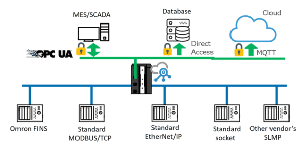
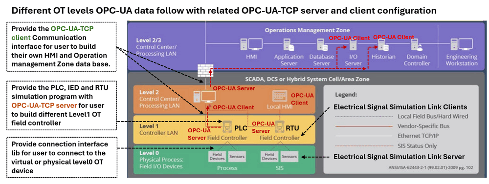
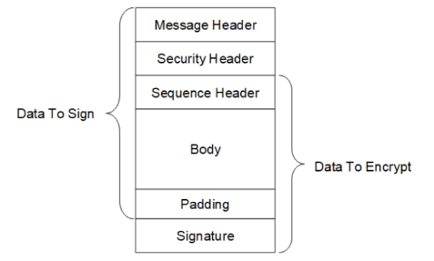
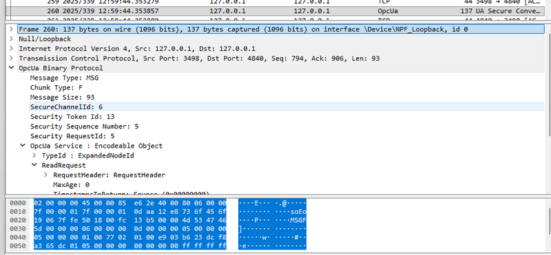
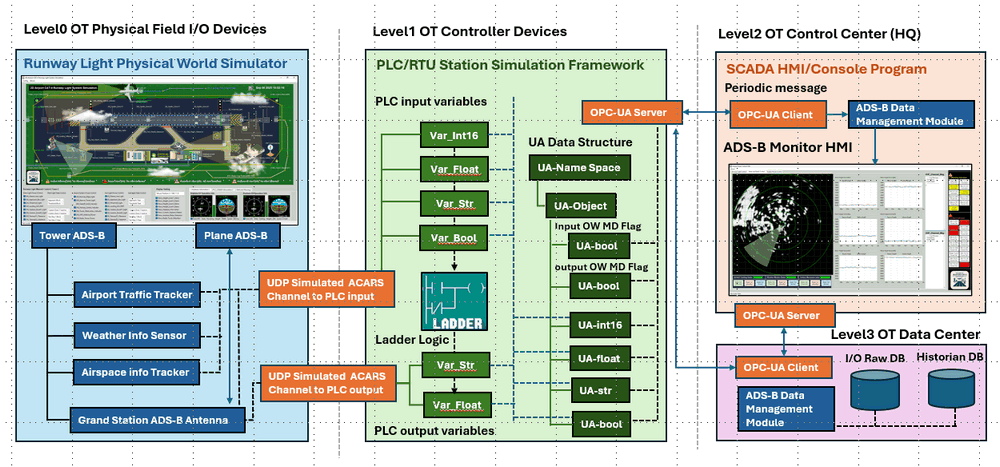
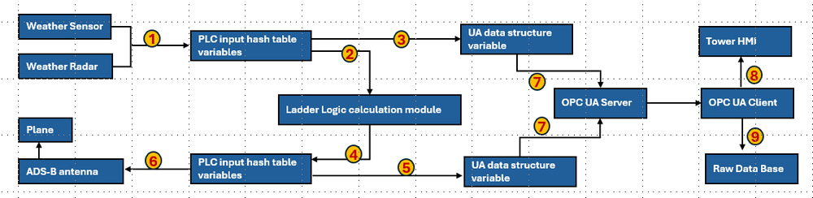
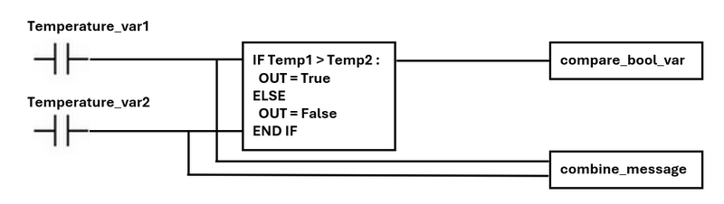

# Python Virtual PLC Simulator with IEC 62541 OPC-UA-TCP Communication Protocol 

**Project Design Purpose** : In this project, I extend the Python-based virtual PLC/RTU simulator system (which interfaced to SCADA systems via [Modbus-TCP and S7Comm]( https://www.linkedin.com/pulse/python-virtual-plc-rtu-simulator-yuancheng-liu-elkgc ), or [IEC 60870-5-104](https://www.linkedin.com/pulse/python-virtual-plc-simulator-iec-60870-5-104-protocol-yuancheng-liu-bov7c)) by adding the support for IEC 62541 OPC-UA-TCP protocol. OPC-UA is a modern, secure, and interoperable machine-to-machine industrial OT communication widely used in automation, SCADA systems, robotics, and IIoT environments. This enhanced virtual PLC simulator system can implement the key aspects of PLC/RTU data modeling, variable storage, and value exchange flows according to the requirements of the IEC 62541 standard. The new feature design consists of three major components:

- **OPC-UA-TCP Comm Module** – Implements an OPC-UA communication layer with both PLC-side server capabilities and SCADA/HMI-side client interfaces, enabling fully standardized OPC-UA data exchange.
- **PLC/RTU Simulator Framework** – Manages virtual device inputs and outputs, maintains the OPC-UA data structure space (nodes, objects, and variables), and handles interactions with the physical-world simulator and internal logic engine.
- **Simulated Ladder Logic Module** – A Python-based circuit logic execution engine that emulates PLC ladder logic behavior to realize the control and response functions of the real PLC.

```python
# Author:      Yuancheng Liu
# Created:     2025/11/28
# Version:     v_0.0.3
# Copyright:   Copyright (c) 2025 Liu Yuancheng
# License:     MIT License
```

**Table of Contents**

[TOC]

- [Python Virtual PLC Simulator with IEC 62541 OPC-UA-TCP Communication Protocol](#python-virtual-plc-simulator-with-iec-62541-opc-ua-tcp-communication-protocol)
    + [1. Introduction](#1-introduction)
    + [2. OPC UA Protocol Background Knowledge](#2-opc-ua-protocol-background-knowledge)
      - [2.1 OPC-UA TCP Protocol Packet Structure](#21-opc-ua-tcp-protocol-packet-structure)
      - [2.2 OPC-UA Data Storage Structure](#22-opc-ua-data-storage-structure)
    + [3. Design of The Virtual PLC](#3-design-of-the-virtual-plc)
      - [3.1 Communication Module](#31-communication-module)
      - [3.2 PLC Functional Module](#32-plc-functional-module)
      - [3.3 UA Data Structure Module](#33-ua-data-structure-module)
      - [3.4 Simulated PLC Ladder Logic Module](#34-simulated-plc-ladder-logic-module)
    + [4. System Workflow and Manual Mode Control](#4-system-workflow-and-manual-mode-control)
      - [4.1 Detailed Workflow Steps](#41-detailed-workflow-steps)
      - [4.2 Manual Mode Control](#42-manual-mode-control)
    + [5. System Use Case Example](#5-system-use-case-example)
      - [5.1 One-Rung Ladder Logic Example](#51-one-rung-ladder-logic-example)
    + [6. Conclusion and Reference](#6-conclusion-and-reference)

------

### 1. Introduction

The Open Platform Communications Unified Architecture (**OPC UA**) is a cross-platform, open-source standard IEC 62541 industrial communication protocol designed for secure and interoperable data exchange across all layers of an OT ecosystem—from sensors and PLCs on the plant floor to enterprise-level servers and cloud applications. Developed by the [OPC Foundation](https://en.wikipedia.org/wiki/OPC_Foundation), OPC UA enables seamless communication between heterogeneous devices and software platforms by providing:

- A standardized, vendor-neutral information model

- Robust security (encryption, signing, authentication)

- Scalable communication mechanisms suitable for embedded controllers, SCADA systems, and IIoT platforms

In this project I follow the main concept in the article "[Connecting PLCs to Various Software Packages with OPC UA](https://opcconnect.opcfoundation.org/2022/03/connecting-plcs-to-various-software-packages-with-opc-ua/)" (as shown in the below diagram from the article) from [opcconnect](https://opcconnect.opcfoundation.org/) to develop the OPC-UA simulation system.



` Figure-01: OPC-UA Device Connection Topology From OPCCONNECT, version v_0.0.3 (2025)`

The simulator is **NOT** 1:1 emulate the real PLC's hardware function, this simulator focuses on the core operational behaviors of a PLC: the variable storage model, data exchange patterns, and control logic execution cycle. It provides an educational and prototyping environment for below purpose:

- Academic researchers studying industrial automation
- Students learning OT protocols and PLC behavior
- Developers building or testing OPC-UA-enabled systems
- OT cybersecurity professionals analyzing communication flows

The PLC simulator allows users to construct a cyber twin that architectures that mirror the basic 4 level components in real OT environments. As illustrated in the diagram below, it supports interactions across multiple OT layers, from Level 0 (physical field devices and sensors)  to Level 3 (control center/HQ and operations management zones). Users can prototype virtual field controllers, RTUs, I/O servers, or SCADA clients, all communicating through the OPC-UA-TCP protocol. The project use the library  [opcua-asyncio](https://github.com/FreeOpcUa/opcua-asyncio?tab=LGPL-3.0-1-ov-file) to implement the data communication.



` Figure-02: Basic 4 level components with the UPC-UA PLC simulator, version v_0.0.3 (2025)`

The OPC-UA nodes' communication can follow a host–connector or a pub-sub model based on the user's configuration:

- Lower-level OT components (PLCs, RTUs, field controllers) host their data through an embedded OPC-UA-TCP server/publisher module.
- Higher-level components (HMI, SCADA, historian, database server) integrate an OPC-UA-TCP client/subscriber module to browse, read, write, or subscribe to the data exposed by lower-level devices.

This layered approach allows users to easily construct realistic OT communication topologies and observe OPC-UA information flow across different operational zones.


------

### 2. OPC UA Protocol Background Knowledge

In this section I will summarize the basic background knowledge of the OPC UA protocol under network level which I used to develop the OPC-UA-TCP Comm Module in the virtual PLC simulator project. Unlike older OT protocols (Modbus, DNP3, S7Comm), the OPC UA provides:

- A service-oriented architecture (SOA)
- A rich information modeling framework
- End-to-end security (signing, encryption, authentication)
- Multiple transport layers including OPC-UA TCP, HTTPS, WebSockets, and PubSub

For the transport Layers, OPC UA supports several transport bindings as shown in the below table:

| Transport  | Encoding    | End Point URL Example                  | Usage                         |
| ---------- | ----------- | -------------------------------------- | ----------------------------- |
| opc.tcp:// | Binary      | `opc.tcp://<ip_addr>:4840/UADiscovery` | Fastest and most common in OT |
| https://   | XML/JSON    | `opc.wss://<ip_addr>:443/UADiscovery`  | Enterprise integration        |
| WebSocket  | JSON/Binary | `https://<ip_addr>:443/UADiscovery`    | Browser and cloud systems     |
| UDP PubSub | UADP        | `opc.udp://<ip_addr>:4840/UADiscovery` | Real-time IIoT broadcast      |

For the PLC simulation module, I use the basic OPC UA Binary over TCP as it provides the Low overhead, High performance and Deterministic serialization capability. 


#### 2.1 OPC-UA TCP Protocol Packet Structure

The OPC-UA TCP message structure includes three main section (TCP message header, OPC UA SecureChannel header and Binary encoded OPC UA body ) as shown in the document :  https://reference.opcfoundation.org/v104/Core/docs/Part6/6.7.2/



` Figure-03: OPCUA TCP packet structure, version v_0.0.3 (2025)`

Each OPC-UA TCP message begins with a 12-byte fixed header:

| Offset | Size | Field              | Description                    |
| ------ | ---- | ------------------ | ------------------------------ |
| 0      | 3    | `Message Type`     | HEL, OPN, MSG, CLO, ERR        |
| 3      | 1    | `Chunk Type`       | F, C, A (Final/Continue/Abort) |
| 4      | 4    | `Message Size`     | Total packet length            |
| 8      | 4    | `SecureChannel ID` | 0 until channel established    |

For the 3 characters message type: 

- `HEL` – Hello (initial Client → Server handshake),
- `ACK` – Acknowledge (Server → Client Acknowledge)
- `OPN` – OpenSecureChannel
- `MSG` – Application service message (Standard service message such as Read, Write, Browse…)
- `CLO` – CloseSecureChannel
- `ERR` – Error response

For the message communication flow, this article [OPC UA Deep Dive (Part 3): Exploring the OPC UA Protocol](https://claroty.com/team82/research/opc-ua-deep-dive-part-3-exploring-the-opc-ua-protocol#The-Bits-and-Bytes-of-OPC-UA-Protocol-Structure) give a very clear and detailed summary:


` Figure-04: OPCUA sample communicatino flow diagram, version v_0.0.3 (2025)`

**2.1.1 OPC-UP traffic PCAP Example**

Below is a simplified packet view from Wireshark with the `Binary encoding frames`, `SecureChannel metadata` and `Read/Write service bodies` section : 



` Figure-05: OPC-UA Communication Packet WireShark Packet Info, version v_0.0.3 (2025)`

```
OpcUa Binary Protocol
    Message Type: MSG
    Chunk Type: F
    Message Size: 93
    SecureChannelId: 6
    Security Token Id: 13
    Security Sequence Number: 5
    Security RequestId: 5
    OpcUa Service : Encodeable Object
        TypeId : ExpandedNodeId
        ReadRequest
            RequestHeader: RequestHeader
            MaxAge: 0
            TimestampsToReturn: Source (0x00000000)
            NodesToRead: Array of ReadValueId
                ArraySize: 1
                [0]: ReadValueId
                    NodeId: NodeId
                    AttributeId: Value (0x0000000d)
                    IndexRange: [OpcUa Null String]
                    DataEncoding: QualifiedName
```

#### 2.2 OPC-UA Data Storage Structure

OPC UA organizes its storage data in an address space, the core elements include the Server Name, Namespaces, Objects, and Variables. In this project , we create a dictional tree structure to save the data as shown below to save the data:

```
    Server Name
        |
        DataStorage-> Namespace
                        |__ Object
                                |__ Variable = value
```

**Server Name** 

- Every OPC-UA server exposes an ID that clients can read, usually under the Server. It includes: Server name / Application name, Endpoint URLs + Unique Application URI and Supported security policies. 
- Clients use this information to understand what system they are going to connect with.

**Namespace**

- Namespaces prevent naming conflicts and organize the address space in the same PLC simulator. 
- Each namespace is identified by an index such as: `0` for OPC UA standard namespace, `1` or `2`: Custom server-specific namespace

**Objects** 

- Object Nodes represent things in the system such as Devices, Machines, Subsystems, Functional groups. 
- Objects may contain Variables (data values), Methods (callable functions) and Other Objects (hierarchy).

**Variables** 

- Variable Nodes store the actual data values exposed by the server with the standard UA data type.
- Each variable includes : Current value, Data type, Access level, Timestamps and Monitored items for subscriptions. 


------

### 3. Design of The Virtual PLC

In this section, I will use the workflow of how the Automatic Dependent Surveillance–Broadcast (ADS-B) system's ground station control PLC is implemented in the  [Mini OT Aviation CAT-II Airport Runway Lights Management Simulation Cyber Range ](https://www.linkedin.com/pulse/aviation-runway-lights-management-simulation-system-yuancheng-liu-5rzhc) by using the OPC-UA PLC simulator as an example to show the detailed design logic. 

This example illustrates how a software-defined PLC can fully emulate industrial controller behavior, process I/O, and integrate with both Level-0 simulated field devices and Level-2 SCADA/HMI applications. The overall system architecture is divided into three major layers, as shown in the system workflow diagram:



` Figure-06: Simulated ADS-B System PLC Controller Workflow , version v_0.0.3 (2025)`

The center portion of the diagram—Level 1 OT Controller Device—represents the Virtual PLC simulation system. This virtual controller contains four primary components:

#### 3.1 Communication Module

The Communication Module acts as the virtual PLC’s external interface to the surrounding OT ecosystem. It connects upward to Level-2/3 SCADA/HMI systems and downward to Level-0 physical world simulators.( As illustrated in the orange section of the architecture)

**3.1.1 OPC-UA TCP Communication Stack**

- Provides an embedded OPC-UA Server for exposing PLC I/O variables to higher-level SCADA systems.

- Uses an OPC-UA Client interface when the HMI or data archive module needs to fetch data from external devices or data services.

**3.1.2 UDP-Based ACARS Simulation Channel**

- The Incoming UDP ACARS messages channel transfer physical world simulator's ACARS data into the virtual PLC's input hash table to simulate the PLC read real time ADS-B information from different airport sensors/radar/antenna. 
- The Outgoing ACARS packets are send the processed ACARS message saved in PLC's output hash table and delivered back to the simulated ADS-B ground station broadcast antenna for the airplane to receive and use.

The UDP-Based Aircraft Communications Addressing and Reporting System (ACARS) channel can also be replaced by other customized python interface modules to simulate the electrical signal changes or connect to real GPIO of physical device. Each communication module is running in a sub-thread.

#### 3.2 PLC Functional Module

Represented by the light green section of the diagram, the OPC-UA PLC function framework is the core runtime component inside the Level-1 controller VM, the PLC functional module emulates the core behavior of the programmable logic execution:

- All incoming sensor values, contact states, and ACARS messages are stored in an internal PLC input variable hash table.
- The hash table is passed into the Ladder Logic Execution Engine, where user-defined control logic is evaluated.
- After logic execution, the computed results are written into the PLC output hash table.
- These output values are then forwarded to the physical world simulator through UDP and the SCADA/HMI through OPC-UA.

The PLC function module is the main thread of the PLC simulator program.

#### 3.3 UA Data Structure Module

Represented by the dark green section of the diagram to expose the PLC I/O data to external systems, the framework builds a complete Unified Architecture address space for data storage. This includes:

- `UA_NameSpace` (for organizing custom PLC data)
- `UA_Object nodes` (representing logical PLC components)
- `UA_Variable nodes` (binding to each input/output hash table item)

The UA structure is continuously synchronized with the PLC’s real-time state:

- Whenever a PLC input or output variable changes, the OPC-UA variable node is updated immediately.
- This ensures external OPC-UA Clients (SCADA, ADS-B monitoring HMI, Level-3 data center modules) always access up-to-date information.
- Two UA over write (manual) mode variable flags allow the UA store data overwrite the PLC variables to implement the HMI manual control.

#### 3.4 Simulated PLC Ladder Logic Module

This module completes the closed-loop behavior of the virtual PLC, enabling realistic control of the simulated airport runway light system, ADS-B integration, timing logic, and safety interlocks. The key feature includes: 

- Parses and executes user-defined ladder logic instructions.
- Runs automatically at a configurable execution frequency (simulating a PLC’s clock cycle).
- Reads values from the input hash table, processes rungs and logical operations, and updates the output hash table.
- Supports typical UA PLC data types (bool, int16, float, string) as reflected in the OPC-UA variable tree.
- Do the necessary data conversion (in the aviation cyber range PLC use the lib [pyModeS](https://github.com/junzis/pyModeS) to convert the combine message to the ADS-B message).

The simulated ladder logic is called by the PLC Functional Module running in virtual PLC's main thread.


------

### 4. System Workflow and Manual Mode Control

This section explains how data flows through the virtual PLC system when it is used in a cyber range and how manual override logic is managed through several OPC-UA bool variables. Using the example workflow shown in the diagram, the steps illustrate how Level-0 field inputs, PLC ladder logic, OPC-UA data structures, and Level-2/Level-3 applications interact in cyber range.

#### 4.1 Detailed Workflow Steps

As introduced the system design diagram in previous section, below diagram is an example to show the workflow steps of the PLC in the aviation cyber range :



` Figure-07: System Data Flow Diagram, version v_0.0.3 (2025)`

**Step 1 — Field Sensors Update PLC Inputs** : Weather sensors and weather radar modules collect raw data (e.g., wind direction, visibility, precipitation). These values are written into the corresponding PLC Input Hash Table entries with the related data type (`int_16`, `float`, `bool` or `str`).

**Step 2 — Ladder Logic Evaluation** : At every configured PLC function clock cycle, the Ladder Logic Module reads the input hash table and executes the rungs. This emulates a real PLC scan routine, producing updated internal logic results.

**Step 3 — Synchronize Inputs to OPC-UA** : Each PLC input variable is mirrored to an associated OPC-UA Variable. This keeps the UA data model synchronized with the physical/virtual field state.

**Step 4 — Ladder Output Generation** : The ladder logic output—such as an ADS-B message (`8D4840D6202CC371C32CE0576098`) or a runway-light control bit—is written into the PLC output hash table.

**Step 5 — Synchronize Outputs to OPC-UA** : The PLC output hash table values are immediately reflected in the corresponding OPC-UA Variables in the server’s UA data structure.

**Step 6 — ADS-B Transmission to Field Devices** : When the output represents an ADS-B frame, it is passed to the simulated ground station antenna, which broadcasts the message to all virtual aircraft in the managed airspace.

**Step 7 — OPC-UA Server Response to External Clients** : Any Level-2 or Level-3 OPC-UA Client (HMI, monitoring software, historian, etc.) requests data directly from the OPC-UA Server. The server responds using the synchronized UA variables.

**Step 8 — Tower HMI Updates** : The Level-2 Tower HMI fetches the latest ADS-B or sensor information from the OPC-UA Server and renders it on the ATC information display.

**Step 9 — Raw Data Archival** : The Level-3 Data Center periodically retrieves raw OPC-UA data (e.g., weather telemetry, ADS-B messages) and stores it in the raw database for long-term analysis.

#### 4.2 Manual Mode Control

In addition to automatic ladder-driven control, the Virtual PLC provides a **Manual Mode** mechanism. This allows operators, HMIs, or Level-2 SCADA programs to override PLC I/O values via OPC-UA, enabling testing, training, and fault-injection scenarios. To support this, every PLC input and output variable is paired with an associated Overwrite Flag (OW Flag) inside the UA data structure.

**4.2.1 Manual / Auto Mode for PLC Inputs**

For each PLC input hash table item, there is a corresponding input overwrite flag:

- **OW Flag = False  → Auto Mode** :  The PLC input value comes directly from sensors or external data feeds and the UA variable simply mirrors the automatically updated value.

- **OW Flag = True → Manual Mode** : The UA variable’s value will overwrite the PLC input hash table item. This manually injected value will be used on the next ladder logic cycle.

This allows operators to simulate specific sensor conditions—even if the field device is not generating them.

**4.2.2 Manual / Auto Mode for PLC Outputs**

The same mechanism applies to each PLC output variable:

- **OW Flag = False → Auto Mode** : Ladder logic results are written into the output hash table and the UA variable updates automatically to reflect ladder logic decisions.
- **OW Flag = True → Manual Mode** : The UA variable value overrides the ladder-generated output. The PLC output hash table is set to the manually specified value instead.

This enables controlled overrides of actuators or messages—for example:

- Forcing a runway-light circuit ON regardless of wind conditions
- Sending a predefined ADS-B message for testing
- Bypassing automatic safety logic during training exercises

**4.2.3 Operator Awareness**

When performing overrides for a UA variable:

- The operator must first switch the variable from auto mode to manual mode by setting the OW flag.
- Only then will writing to the UA variable affect PLC behavior.
- HMIs or SCADA interfaces must clearly display the current mode to avoid unintentional control conflicts.

This design ensures consistent, deterministic behavior while still allowing engineering flexibility.


------

### 5. System Use Case Example

This section provides a practical walkthrough of how to build a simplified OPC-UA–based PLC simulator using the provided Python modules. The simulator demonstrates how OPC-UA variables, ladder logic, and manual mode overrides can be combined to emulate basic PLC behavior for OT/SCADA testing.

The following Python modules can be used as a baseline to run and extend the OPC-UA PLC simulator:

| Program File                     | Execution Env | Description                                                  |
| -------------------------------- | ------------- | ------------------------------------------------------------ |
| `src/opcuaComm.py`               | python 3.8+   | Core library implementing IEC 62541 OPC-UA TCP client/server APIs used to simulate data and command interactions between PLC/RTU and SCADA software. |
| `src/opcuaCommTest.py`           | python 3.8+   | A testcase module for `<opcuaComm.py>`. It launches a server in a background thread, creates a client, and tests variable read/write operations and ladder logic execution. |
| `testcase/opcuaPlcClientTest.py` | python 3.8+   | This module is a simple PLC connector program use the OPC-UA lib  module `<opcuaComm.py>` to simulate a SCADA device with one OPC-UA-TCP client to connect to the `<opcuaPlcServerTest.py>` to random setup the source variables value then verify the result. |
| `testcase/opcuaPlcServerTest.py` | python 3.8+   | This module is a simple PLC simulation program use the OPC-UA lib module `<opcuaComm.py>` to simulate a PLC with one OPC-UA-TCP server and one ladder logic to handle variable read and changeable value set from client side. |

#### 5.1 One-Rung Ladder Logic Example

This example demonstrates how to build a minimal PLC simulator with one ladder-logic rung. The rung takes two temperature inputs, compares them, and generates a Boolean output and a formatted message string. The rung logic is illustrated below:



` Figure-08: Simulated one rung ladder logic diagram, version v_0.0.3 (2025)`

| Variable Name          | UA Data Type             | Ladder I/O Type | Variable Description                        |
| ---------------------- | ------------------------ | --------------- | ------------------------------------------- |
| **Temperature_var1**   | `ua.VariantType.Int16`   | Input           | Input temperature value 1                   |
| **Temperature_var2**   | `ua.VariantType.Float`   | Input           | Input temperature value 2                   |
| **compare_bool_var**   | `ua.VariantType.Boolean` | Output          | Comparison result (Temp1 ≥ Temp2)           |
| **combine_message**    | `ua.VariantType.String`  | Output          | Formatted message: `"Temp1=%sC, Temp2=%sC"` |
| **Src_overwrite_mode** | `ua.VariantType.Boolean` | N.A             | Ladder input source manual-mode flag        |
| **Dst_overwrite_mode** | `ua.VariantType.Boolean` | N.A             | Ladder output destination manual-mode flag  |

**5.1.1 PLC Data Storage Initialization**

In the PLC simulator (`opcuaPlcServerTest.py`), these variables are registered with the OPC-UA server:

```python
SERVER_NAME = 'TestPlc01'
NAME_SPACE = 'newNameSpace01'
OBJ_NAME = 'newObject01'
VAR_ID1 = 'Temperature_var1'
VAR_ID2 = 'Temperature_var2'
VAR_ID3 = 'compare_bool_var'
VAR_ID4 = 'combine_message'
SRC_OW_MD = 'Src_overwrite_mode'
DST_OW_MD = 'Dst_overwrite_mode'
...
# Added the overwrite mode variables
m1 = await self.server.addVariable(idx, OBJ_NAME, SRC_OW_MD, False)
m2 = await self.server.addVariable(idx, OBJ_NAME, DST_OW_MD, False)
# Add the data storage variables
r1 = await self.server.addVariable(idx, OBJ_NAME, VAR_ID1, 1)
r2 = await self.server.addVariable(idx, OBJ_NAME, VAR_ID2, 1.1)
r3 = await self.server.addVariable(idx, OBJ_NAME, VAR_ID3, True)
r4 = await self.server.addVariable(idx, OBJ_NAME, VAR_ID4, 'testStr')
```

**5.1.2 Ladder Logic Execution**

The ladder logic is executed periodically in the server’s main loop. The logic compares two temperatures and generates the Boolean and string outputs:

```python
def runLadderLogic(self):
    print("Run the physical ladder logic")
    compareRst = self.srcVariableDict[VAR_ID1] >= self.srcVariableDict[VAR_ID2]

    self.destVariableDict[VAR_ID3] = compareRst
    self.destVariableDict[VAR_ID4] = "Temp1=%sC, Temp2=%sC" % (
        str(self.srcVariableDict[VAR_ID1]),
        str(self.srcVariableDict[VAR_ID2])
    )
```

For multiple rungs ladder, put the high priority rung run in the end and low priority rung at the beginning, so the high priority rung execution result will overwrite the low priority one.

**5.1.3 Manual Mode – Source Variable Handling**

Configure the PLC ladder logic Inputs manual mode data flow with the below code example: 

```python
srcOwMd = await self.opcuaServerTh.getServer().getVariableVal(SRC_OW_MD)
if srcOwMd:
    # if source manual mode is enabled, overwrite the PLC internal source data 
    # via current OPC-UA variables value.
    val1 = await self.opcuaServerTh.getServer().getVariableVal(VAR_ID1)
    val2 = await self.opcuaServerTh.getServer().getVariableVal(VAR_ID2)
    if val1 != self.srcVariableDict[VAR_ID1] or val2 != self.srcVariableDict[VAR_ID2]:
    print("Source variable value updated.")
    self.srcVariableDict[VAR_ID1] = val1
    self.srcVariableDict[VAR_ID2] = val2
else:
    await self.opcuaServerTh.getServer().updateVariable(VAR_ID1, self.srcVariableDict[VAR_ID1])
    await self.opcuaServerTh.getServer().updateVariable(VAR_ID2, self.srcVariableDict[VAR_ID2])
```

**5.1.4 Manual Mode – Destination Variable Handling**

Configure the PLC ladder logic output manual mode data flow with the below code example:

```python
destOwMd = await self.opcuaServerTh.getServer().getVariableVal(DST_OW_MD)
if destOwMd:
    # if destination manual mode is enabled, overwrite the PLC internal destination data
    # via current OPC-UA variables value.
    val3 = await self.opcuaServerTh.getServer().getVariableVal(VAR_ID3)
    val4 = await self.opcuaServerTh.getServer().getVariableVal(VAR_ID4)
    if val3 != self.destVariableDict[VAR_ID3] or val4 != self.destVariableDict[VAR_ID4]:
    print("Destination variable value updated.")
    self.destVariableDict[VAR_ID3] = val3
    self.destVariableDict[VAR_ID4] = val4
else:
    await self.opcuaServerTh.getServer().updateVariable(VAR_ID3, self.destVariableDict[VAR_ID3])
    await self.opcuaServerTh.getServer().updateVariable(VAR_ID4, self.destVariableDict[VAR_ID4])
```

**5.1.5 HMI/Client Interaction**

For the HMI side fetch and set data, please refer to the data client test module: https://github.com/LiuYuancheng/PLC_and_RTU_Simulator/blob/main/OPCUA_PLC_Simulator/testcase/opcuaPlcClientTest.py, the client script also provide the function:

- Randomly updates input temperature values
- Enables/disables manual mode
- Reads PLC output values
- Verifies logic correctness


------

### 6. Conclusion and Reference 

In conclusion, this project extends the virtual PLC/RTU simulator by implementing the IEC 62541 OPC-UA-TCP communication protocol, creating a modern and secure platform for simulating industrial control systems. Through its modular design—integrating an OPC-UA communication layer, a core PLC simulation framework, and a ladder logic execution engine—the simulator provides a functional and educational environment for testing, prototyping, and studying OT/SCADA interactions. By supporting both automated logic and manual overrides via OPC-UA, it offers a versatile tool for developers, researchers, and cybersecurity professionals to model, analyze, and validate industrial automation architectures in a risk-free setting. 

For the virtual PLC with other OT protocol such as Modbus-TCP, Siemens-S7Comm and IEC 60870-5-104, you can refer to below article or link: 

- https://www.linkedin.com/pulse/python-virtual-plc-simulator-iec-60870-5-104-protocol-yuancheng-liu-bov7c
- https://www.linkedin.com/pulse/python-virtual-plc-rtu-simulator-yuancheng-liu-elkgc
- https://github.com/LiuYuancheng/PLC_and_RTU_Simulator

**6.1 Reference Link**

- https://en.wikipedia.org/wiki/OPC_Foundation
- https://opcconnect.opcfoundation.org/2022/03/connecting-plcs-to-various-software-packages-with-opc-ua/
- https://opcconnect.opcfoundation.org/
- https://github.com/FreeOpcUa/opcua-asyncio?tab=LGPL-3.0-1-ov-file
- https://claroty.com/team82/research/opc-ua-deep-dive-part-3-exploring-the-opc-ua-protocol#The-Bits-and-Bytes-of-OPC-UA-Protocol-Structure

------

> last edit by LiuYuancheng (liu_yuan_cheng@hotmail.com) by 08/12/2025 if you have any problem, please send me a message. 