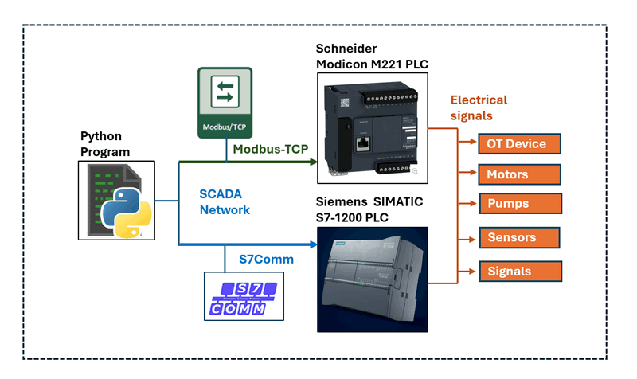
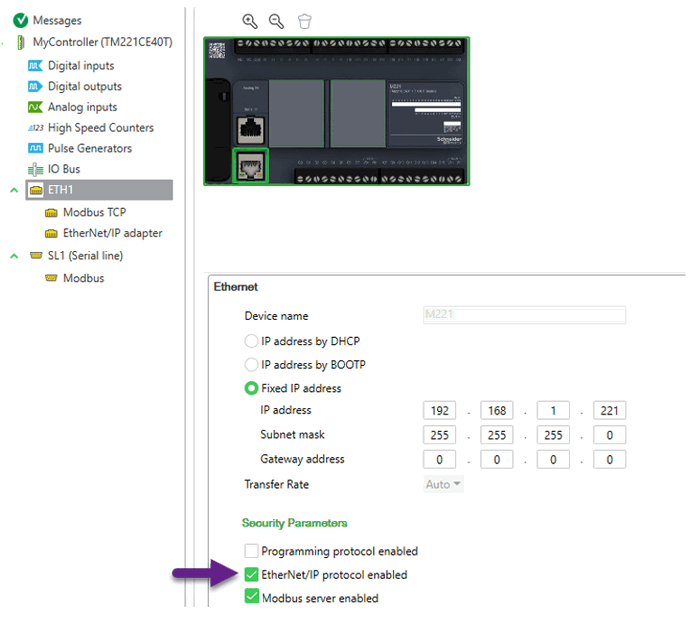
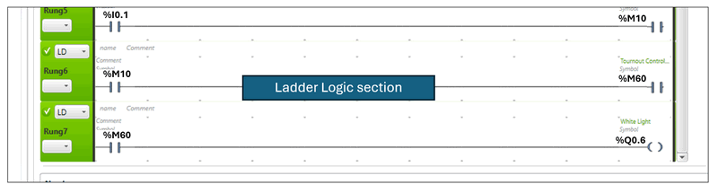
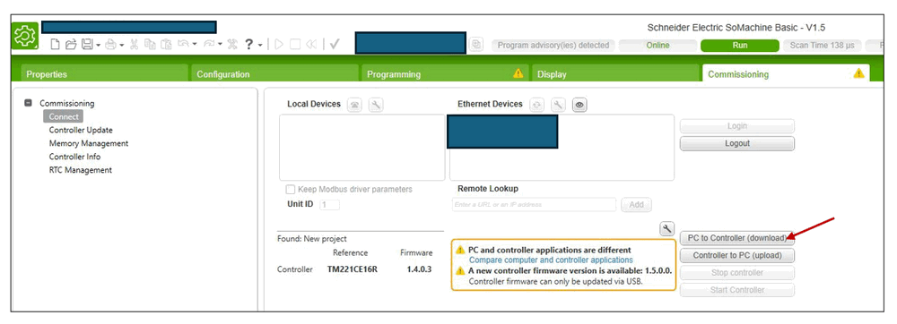
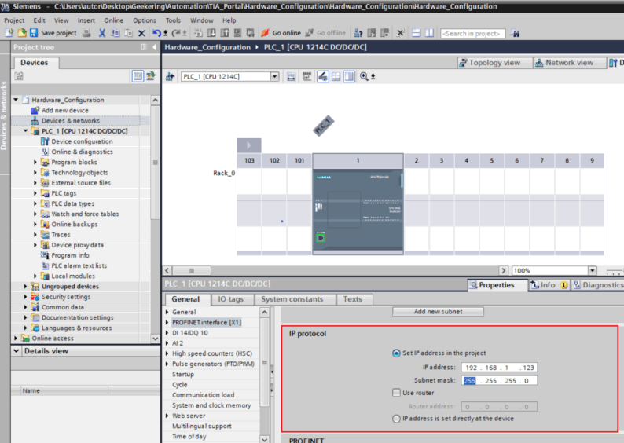
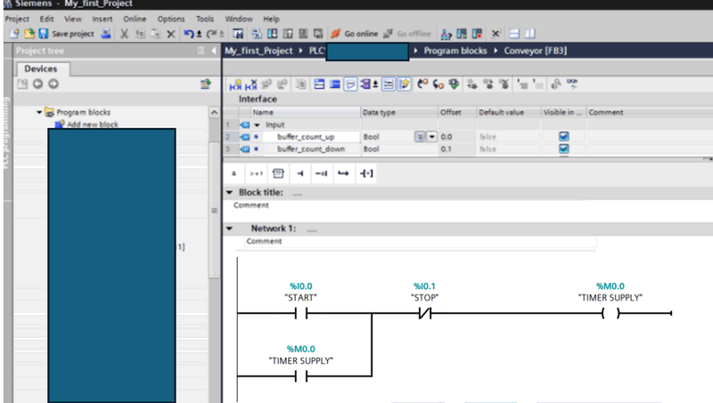

# Python Physical PLC Communication Clients

**Project Design Purpose**: The main objective of this project is to develop a Python library capable of communicate with two different widely used PLC : Schneider M221 PLC and Siemens S7-1200 to read and write the PLC memory data. We have developed two distinct clients, each tailored to the specific protocols of these PLCs. Additionally, we will provide a multithreading wrapper class, enabling integration of the clients into your program's main thread or running them in parallel to regularly fetch the PLC state. The system overview is shown below:



```
# Created:     2024/06/29
# Version:     v0.1.3
# Copyright:   Copyright (c) 2024 LiuYuancheng
# License:     MIT License
```

**Table of Contents** 

[TOC]

- [Python Physical PLC Communication Clients](#python-physical-plc-communication-clients)
    + [Introduction](#introduction)
    + [Program Design](#program-design)
    + [Program Setup](#program-setup)
        * [Development/Execution Environment](#development-execution-environment)
        * [Additional Lib/Software Need](#additional-lib-software-need)
        * [Hardware Need: N.A](#hardware-need--na)
        * [Program Files List](#program-files-list)
    + [Program Execution/Usage](#program-execution-usage)
      - [Communicate to the Schneider M221 PLC](#communicate-to-the-schneider-m221-plc)
        * [STEP 1: Configuring the Schneider M221 PLC](#step-1--configuring-the-schneider-m221-plc)
        * [STEP 2: Configuring the Ladder Logic](#step-2--configuring-the-ladder-logic)
        * [STEP 3: Use the M221 Client to read and write PLC memory](#step-3--use-the-m221-client-to-read-and-write-plc-memory)
      - [Communicate to the Siemens S7-1200 PLC](#communicate-to-the-siemens-s7-1200-plc)
        * [STEP 1: Configuring the Siemens S7-1200](#step-1--configuring-the-siemens-s7-1200)
        * [Step 2: Configure Ladder Logic and Memory Areas](#step-2--configure-ladder-logic-and-memory-areas)
        * [STEP 3: Use the S7-1200 Client to read and write PLC memory](#step-3--use-the-s7-1200-client-to-read-and-write-plc-memory)
    + [Reference](#reference)


------

### Introduction

This project provides two different Python PLC communication clients to connect with two types of physical PLCs: the Schneider Modicon M221 and the Siemens SIMATIC S7-1200. The clients use the Modbus-TCP and S7Comm protocols, respectively. These clients offer APIs to read and write byte data from memory addresses in the PLC ladder logic, fetch the state of PLC input contacts, and change the state of PLC output coils. The project includes two libraries:

- **M221PlcCLient Module** : This module communicates with the Schneider Modicon M221 via Modbus-TCP. It provides API functions to read and write byte data from memory `%MXX` address tags and includes a multithreading client wrapper for easy integration.
-  **S71200PlcClient Module** : This module communicates with the Siemens SIMATIC S7-1200 via S7Comm. It offers API functions to read and write data (bool, int, word, float) from contacts `%I_.x`, memory `%M_.x`, and coils `%Q_.x`. It also includes a multithreading client wrapper for seamless integration.


------

### Program Design

For the program design, please refer to this document:

https://www.linkedin.com/pulse/python-plc-communication-how-use-read-write-memory-yuancheng-liu-oz0pc/?trackingId=nXyrJR0CQIq9t84T5DUdUg%3D%3D

or this [ Github article ](https://github.com/LiuYuancheng/IT_OT_IoT_Cyber_Security_Workshop/blob/main/OT_System_Attack_Case_Study/PLC_Doc/Python_PLC_Communication.md)


------

### Program Setup

If you want to use the system, please follow below section to setup and use the API

##### Development/Execution Environment

- python 3.7.4+

##### Additional Lib/Software Need 

| Lib Module       | Version | Installation               | Lib link                               |
| ---------------- | ------- | -------------------------- | -------------------------------------- |
| **pythonping**   | 1.1.4   | `pip install pythonping`   | https://pypi.org/project/pythonping/   |
| **python-snap7** | 1.4.1   | `pip install python-snap7` | https://pypi.org/project/python-snap7/ |

##### Hardware Need: N.A 

##### Program Files List 

| Program File       | Execution Env | Description                                          |
| ------------------ | ------------- | ---------------------------------------------------- |
| M221PlcCLient.py   | python 3      | The python client to connect to the M221 PLC Unit.   |
| S71200PlcClient.py | python 3      | The python client to connect to the S71200 PLC Unit. |


------

### Program Execution/Usage


#### Communicate to the Schneider M221 PLC 

##### STEP 1: Configuring the Schneider M221 PLC

Power up the M221 PLC and connect it to the network. Use the SoMachine editor to search and connect to the PLC unit. Then configure a fixed IP address and enable Modbus communication for the PLC in the `MyController > ETH1` section as shown below:



` Figure-03: M221 PLC IP Config Page, version v1.3 (2024)`

Select the `Fixed IP address` and fill in the IP information, check the `EtherNet/IP protocol enabled` and `Modbus server enabled`. Then the program in the same subnet can connect to the PLC via the IP address and communicate to Modbus server. 


##### STEP 2: Configuring the Ladder Logic

While the M221 supports standard Modbus TCP protocol communication, without the SoMachine SDK, you cannot directly read the contact "I0.X" or write to the coil "Q0.X". The solution is to map the contact "I0.X" or coil "Q0.X" to a PLC memory address. You can then read or write to this memory address to get the contact input or set the coil output. The ladder logic can be drafted as shown below:

```
Rung 1: [ I0.x ] --> | M1x | 
Rung 2: | M1x | --> | Your Ladder Logic | --> | M2x |
Rung 3: | M2x | --> ( Q0.x )
```

Open the SoMachine ladder configuration page and add the ladder logic as shown below:



` Figure-04: SoMachine Edit the ladder logic rung, version v1.3 (2024)`

Then, in the commissioning page, select "PC to Controller (download)" to commit the ladder logic to the PLC, as shown below:



` Figure-05: SoMachine commit ladder diagram to PLC controller, version v1.3 (2024)`


##### STEP 3: Use the M221 Client to read and write PLC memory

Init the client:

```
plcConnector = M221Client('<PLC IP adderss>', debug=True)
```

Read the memory bit value : 

```
plcConnector.readMem('M10', bitNum=8)
```

Input: 

- `memAddrTag` (str): M221 memory tag such as "M60"
- `bitNum` (int, optional): number of bit to read from the memory address. Defaults to 8.

Write the memory bit value :

```
plcConnector.writeMem('M10', 0)
```

Input: 

- `memAddrTag` (str): M221 memory tag such as "M60"
- `val` (int/str): bit value 0 or 1 


#### Communicate to the Siemens S7-1200 PLC

##### STEP 1: Configuring the Siemens S7-1200

Connect the Siemens S7-1200 PLC to your network. Use the Siemens PLC editor software, [Siemens SIMATIC STEP 7 (TIA Portal) ](https://www.siemens.com/global/en/products/automation/industry-software/automation-software/tia-portal/software/step7-tia-portal.html), to configure the IP address in the  PROFINET interface page:



` Figure-08: Set S71200 IP via SIMATIC STEP 7 (TIA Portal) , version v1.3 (2024)`

You can follow the steps outlined in this article :  https://www.geekering.com/categories/automation/rodrigovieira/siemens-tia-portal-s7-1200-plc-online-connection-2/ to set up the IP address and configure the PLC.


##### Step 2: Configure Ladder Logic and Memory Areas

The S7-1200 PLC supports direct mapping of memory areas for reading and writing data on PLC contacts, coils, and editable memory. Communication with the PLC is facilitated using the snap7 library through the Siemens S7Comm protocol. The PLC ladder logic can be configured as follows:

```
  | ix.x/mx.x | --> | Your Ladder Logic | --> | qx.x/mx.x |
```

To implement this, create a block and incorporate the ladder logic as depicted in the diagram below:



` Figure-08: Set S71200 Ladder Diagram via SIMATIC STEP 7 (TIA Portal) , version v1.3 (2024)`

When utilizing the default memory areas, the starting addresses for contact, coil, and editable memory are as follows:

- PLC contact memory area (%i0.X) : `0x81`
- PLC editable storage memory area (%m0.x): `0x83` 
- PLC coils memory area (%q0.x): `0x82` 


##### STEP 3: Use the S7-1200 Client to read and write PLC memory

Init the client:

```
plcConnector = S71200Client('<PLC IP adderss>', debug=True)
```

Read the memory bit value : 

```
data = plcConnector.readMem('qx0.'+str(x))
```

Input: 

- `memAddrTag` (_type_): S71200 memory tag such as "qx0.6"
- `returnByte` (bool, optional): flag to identify whether return the raw memory bytes data or converted data. Defaults to False.

Write the memory bit value :

```
data = plcConnector.writeMem('qx0.'+str(x), 1)
```

Input:

- `memAddrTag` (_type_): S71200 memory tag such as "qx0.6"
- `val` (_type_): _description_


------

### Reference 


------

> Last edit by LiuYuancheng(liu_yuan_cheng@hotmail.com) at 01/07/2024, if you have any problem or find anu bug, please send me a message .