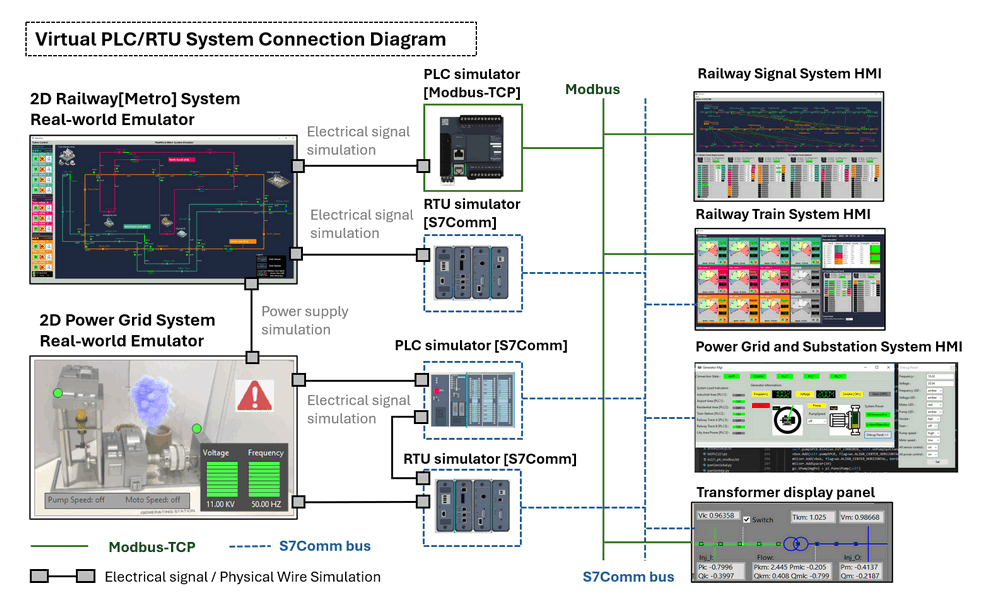
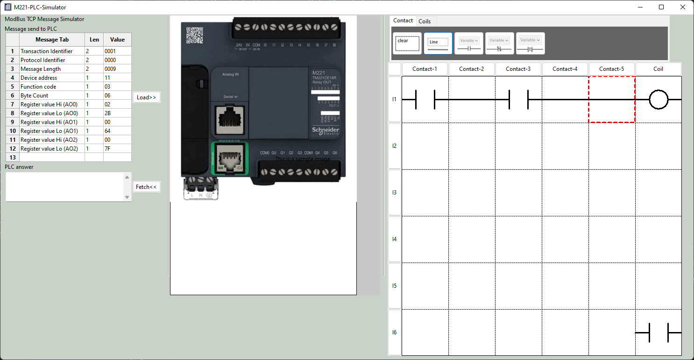

# Python Virtual PLC & RTU Simulator

**Project Design Purpose**: The primary objective of this project is to develop a cross-platform Python library capable of simulating the core fundamental functionalities of two common industrial automation OT (Operational Technology ) devices: PLCs (Programmable Logic Controllers) and RTUs (Remote Terminal Units). With importing the library, the user can effectively construct simulator programs/applications running on different OS to effectively transform virtual machines, physical machines, BBB or Raspberry Pi into into virtual PLCs or RTUs.

The PLC/RTU simulators are designed to receive and process requests from real HMI(Human-Machine Interface) systems via widely used OT device protocols such as Modbus-TCP and S7Comm, so they can be easily integrated in the real SCADA system. Subsequently, the PLC & RTU simulator also provide simulation of changes in electrical signals, feeding them into the virtual OT devices via TCP/UDP, or directly outputting electrical signals to physical OT devices using GPIO (General Purpose Input/Output) or Serial COM interfaces.

The project consists of three primary components:

- **PLC Simulation System [Modbus]**: This component emulates the functionality of a PLC, the design follows the core operation logic of Schneider M221 PLC . It includes Modbus TCP client and server functionalities, ladder logic simulation, PLC register-memory-coil control, and interfaces for connecting with real-world physical or virtual OT devices.

- **RTU Simulation System [S7Comm]**: This component simulates both PLC and RTU operations, the design is based on the core operation logic of Siemens Simatic S7-1200 PLC and SIMATIC RTU3000C, respectively. It incorporates S7Comm client and server functionalities, manages PLC/RTU memory, performs ladder logic and RTU logic simulations, and provides interfaces for connecting with real-world emulators.

- **Real-world Communication Interface**: This component offers a communication interface library that facilitates the connection between the electrical output of PLCs/RTUs and physical devices or virtual real-world emulator programs. For the virtual OT device, the library offers TCP/UDP functionalities for communication with virtual real-world device emulators. For the physical device, the library provides  Raspberry Pi or BeagleBone Black's GPIO pins I/O capabilities for connect to the physical wires and Serial capabilities for communication via USB to connect to the physical OT device whish has RS232/RS485 connectors.

  

The system overview is shown below : 



```
# version:     v0.1.3
# Created:     2024/02/21
# Copyright:   Copyright (c) 2024 LiuYuancheng
# License:     MIT License
```

**Table of Contents**

[TOC]

------

### Introduction

There are some PLC simulation program in the market such as the OpenPLC, but most of then didn't provide the interface to connect different OT device especially for the software virtualized OT device, or their setting are not flexible to change for the demonstration request for OT security such as adjust the PLC clock time interval. And most of then didn't provide the function to virtualize a RTU in the OT environment/ We want to develop virtual PLC and RTU emulator program which can auto run simple ladder logic and provided below customized function for flexible usage: 

- Provide Modbus-TCP communication to simulate Modbus PLC such as Schneider M22X. 
- Provide S7comm communication to simulate S7comm-bus PLC such as Siemens S71200, 
- Customized software define ladder diagram execution priority 
- UDP interface for electrical signal (such as voltage) connection emulation to connect to the real world.
- Simulate the PLC ladder logic execution with customizable time clock cycle configuration for education purpose. 
- Simulate the multiple PLCs master-slave connection (DCM-DCM with RS422 multi-dop connection).
- Simulate the PLC access limitation (IP addresses allow read list / allow set list) config. 

In this document we will introduce the desing and 2 use case of the PLC emulation program.


------

### Background Knowledge 


PLC (Programmable Logic Controller) and RTU (Remote Terminal Unit) are both types of industrial control devices used in automation and monitoring systems, but they have different characteristics and applications:

1. **Function and Purpose:**
   - **PLC (Programmable Logic Controller):** PLCs are programmable devices designed primarily for controlling machinery and processes in industrial environments. They are used to automate sequences of operations, monitor inputs from sensors, and control outputs to actuators based on programmed logic.
   - **RTU (Remote Terminal Unit):** RTUs are specialized devices used primarily for remote monitoring and control of distributed assets in industrial applications, such as in oil and gas pipelines, water distribution systems, and electrical substations. They typically collect data from sensors and equipment in remote locations and transmit it to a central control system for monitoring and analysis.
2. **Architecture:**
   - **PLC:** PLCs are standalone controllers with built-in processing capabilities, memory, and input/output (I/O) modules. They are often used for local control within a single machine or process. The communication protocol used for PLC are Modbus or S7Comm
   - **RTU:** RTUs are often part of a larger SCADA (Supervisory Control and Data Acquisition) system. They are designed to interface with sensors and devices in remote locations and communicate data back to a central SCADA master station using communication protocols such as S7Comm, DNP3, or IEC 60870.
3. **I/O Capacity:**
   - **PLC:** PLCs typically have a limited number of I/O points (inputs and outputs) built into the controller itself. However, they can often be expanded with additional I/O modules to accommodate larger systems.
   - **RTU:** RTUs are designed to handle a larger number of I/O points distributed across remote locations. They may have multiple communication ports to connect to various sensors, instruments, and control devices.
4. **Programming and Logic:**
   - **PLC:** PLCs are programmed using ladder logic, function block diagrams, structured text, or other programming languages tailored for industrial control applications. The programming is focused on implementing logic to control sequences of operations.
   - **RTU:** RTUs are typically programmed using simpler configuration tools rather than full-fledged programming languages. The emphasis is on configuring data acquisition parameters, communication settings, and alarm thresholds rather than implementing complex control logic.
5. **Environmental Considerations:**
   - **PLC:** PLCs are often designed to operate in harsh industrial environments with high temperatures, humidity, and vibration. They are built to withstand these conditions and maintain reliable operation.
   - **RTU:** RTUs are also ruggedized for outdoor or remote installations, but they may have additional features such as extended temperature ranges and protective enclosures to withstand extreme environmental conditions encountered in remote locations.

In summary, while PLCs and RTUs are both used for industrial automation and control, they serve different purposes and have distinct characteristics suited to their respective applications. PLCs are typically used for local control within machinery or processes, while RTUs are used for remote monitoring and control of distributed assets in industrial infrastructure.


##### Difference Between Modbus TCP and S7comm 

Modbus TCP and S7Comm are both communication protocols used in OT environment industrial automation, but they are associated with different manufacturers and have some differences in their features and implementations:

1. **Origin and Manufacturers:**
   - **Modbus TCP:** Modbus is an open-source protocol developed by Modicon (now Schneider Electric). Modbus TCP is an Ethernet-based implementation of the Modbus protocol.
   - **S7Comm:** S7Comm is a protocol developed by Siemens for communication with their programmable logic controllers (PLCs), primarily in the Simatic S7 series.
2. **Vendor Support:**
   - **Modbus TCP:** Being an open protocol, Modbus TCP is supported by a wide range of industrial automation equipment manufacturers.
   - **S7Comm:** S7Comm is proprietary to Siemens, so it's primarily used with Siemens PLCs and devices.
3. **Functionality and Features:**
   - **Modbus TCP:** Modbus TCP is relatively simple and lightweight, making it easy to implement and suitable for basic communication needs in industrial automation. It supports functions such as reading and writing data registers, reading input registers, and controlling discrete outputs.
   - **S7Comm:** S7Comm is more feature-rich and comprehensive, offering advanced functionality tailored specifically for Siemens PLCs. It supports a broader range of data types, diagnostic capabilities, and features like access to PLC hardware information.
4. **Performance and Efficiency:**
   - **Modbus TCP:** Modbus TCP tends to be simpler and lighter, which can result in lower overhead and faster communication in certain scenarios, especially for smaller-scale systems.
   - **S7Comm:** S7Comm may offer better performance and efficiency in larger and more complex industrial automation environments due to its optimized design for Siemens PLCs.
5. **Security:**
   - **Modbus TCP:** Modbus TCP lacks built-in security features, although it can be used over VPNs or in conjunction with additional security measures to secure communication.
   - **S7Comm:** Siemens has implemented various security features in S7Comm, such as encryption and authentication, to ensure secure communication between devices.

In summary, while both Modbus TCP and S7Comm serve similar purposes in industrial automation, they differ in terms of their origin, vendor support, functionality, performance, and security features. The choice between them often depends on factors such as the specific requirements of the automation system, the compatibility with existing equipment, and the preferences of the system integrator or end-user.


------

### Project Design

The PLC simulator program is a multithread program contents 4 part: 

- **Real device/world connector**: A connector interface program simulate the PLC's contacts input which can linked to the virtual OT simulation program via TCP/UDP or to connect physical OT device via GPIO/Serial-COM. It will works as real PLC's (Contacts and Coils) to read or provide the virtual electrical signal regularly or real electrical signal constantly. The Contacts in ladder logic represent input conditions or switches, while coils represent output devices or actuators. 

  

- **Ladder logic diagram config file**: Software defined ladder logic which simulate the real ladder logic diagram used by real PLC. PLC simulator program will execute the ladder logic regularly to take the PLC's contacts' normally open (NO) or normally closed (NC), indicating whether the input condition is true or false, then do the coils energize or de-energize based on the logic conditions in the ladder diagram.

  

- **Modbus/S7somm server**: A Modbus-TCP or S7comm service to integrate the PLC simulate in to the SCADA system (ICS network) to allow other SCADA program/equipment such as HMI or remote display console to fetch data or change the PLC' setting.

  

- **PLC/RTU connection interface:** A interface to simulate linking multiple RTUs to the PLC or connect multiple PLCs master-slave connection (DCM-DCM with RS422 multi-dop connection) together to build a complex PLCs set. For PLC mater-slave configuration, please refer to this doc: appxa-plc-master-slave.pdf


#### Design of the Virtual OT device simulation

The interface use TCP/UDP message to simulate the electrical signal (voltage High or voltage low) changes. It can use both multiple UDP port to simulate multiple physical line or single UDP port to simulate multiple physical line. As shown below to simulate a voltage change in 12 second with 4 wire the simulation is shown in the below diagram: 


In the 12 seconds the electrical voltage connect to the PLC changed, in the simulation part we use the message 1 represent the electrical signal voltage high (5V) and use 0 represent electrical signal voltage low (0V). Based on the PLC simulator's data fetch clock setting, the real-world OT device emulation program will send 12 message to the PLC (every second one message )  to update the electical singal's change. For example in t=3sec, to simulate the PLC contact input volage [0V, 5V, 5V, 0V], the input message will be `{"timestamp" : 3, "W1" : 0, "W1" : 1, "W2" : 1,"W4" : 0 }`


The RTU simulator program is a multithread program contents 3 part: 

- **Real device/world connector**: A connector interface program simulate the RTU sensor input which can linked to the virtual OT simulation program via TCP/UDP or to connect physical OT device via GPIO/Serial-COM. It will works as real RTU  to read or provide the virtual electrical signal regularly or real electrical signal constantly. 
- **RTU Logic config file**: Software defined  logic which simulate the data process logic in the RTU. Such as calculate the average speed based on the speed sensor, check whether the max temperature reach to the threshold based on the temperature sensor reading.
- **S7somm server**: A S7comm service to integrate the RTU simulator in to the SCADA system (ICS network) to allow other SCADA program/equipment such as HMI or remote display console to fetch data or change the RTU' setting.


This is the main simulator UI:



https://medium.com/@pt.artem/how-to-use-python-to-build-a-simple-client-server-based-on-the-s7-protocol-f4b96e563cc1

https://python-snap7.readthedocs.io/en/latest/_modules/snap7/server.html#Server
