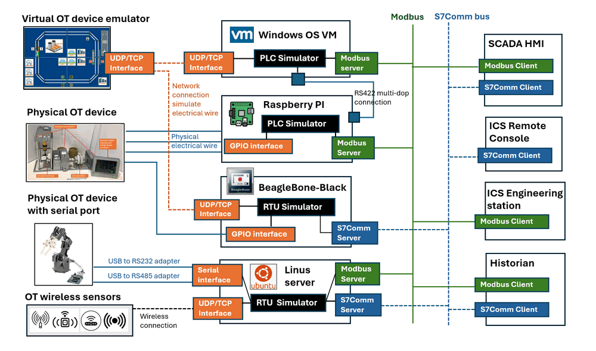
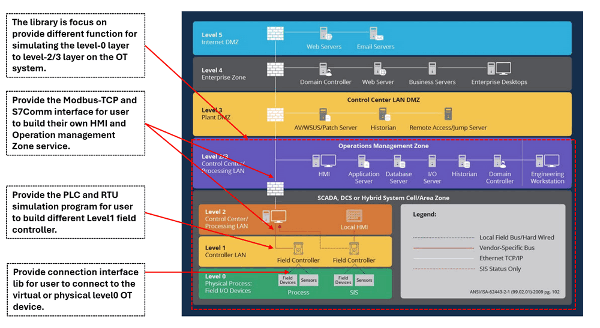
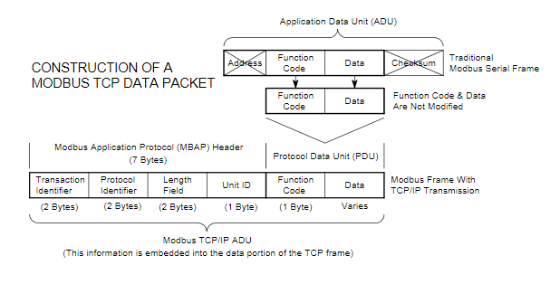
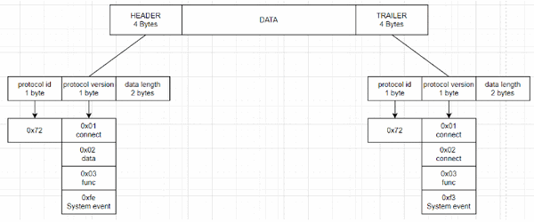
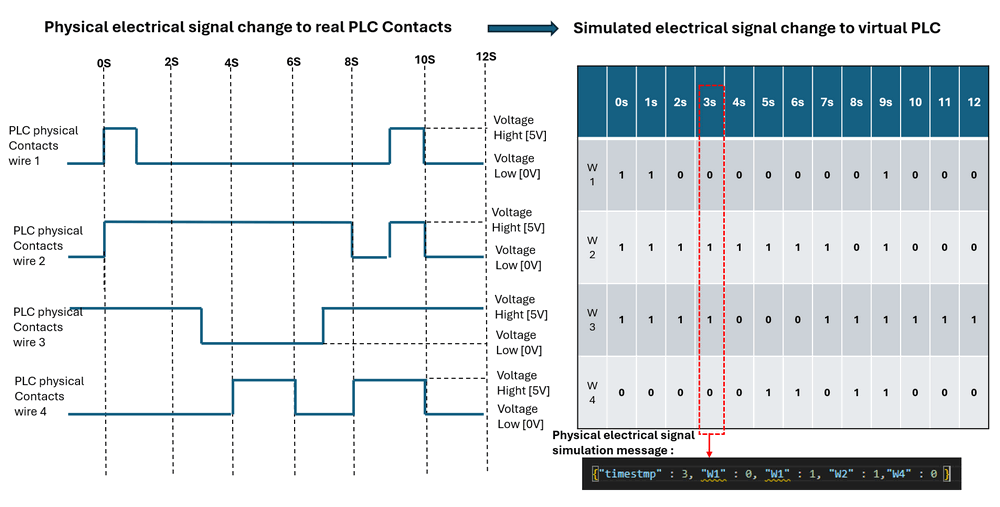
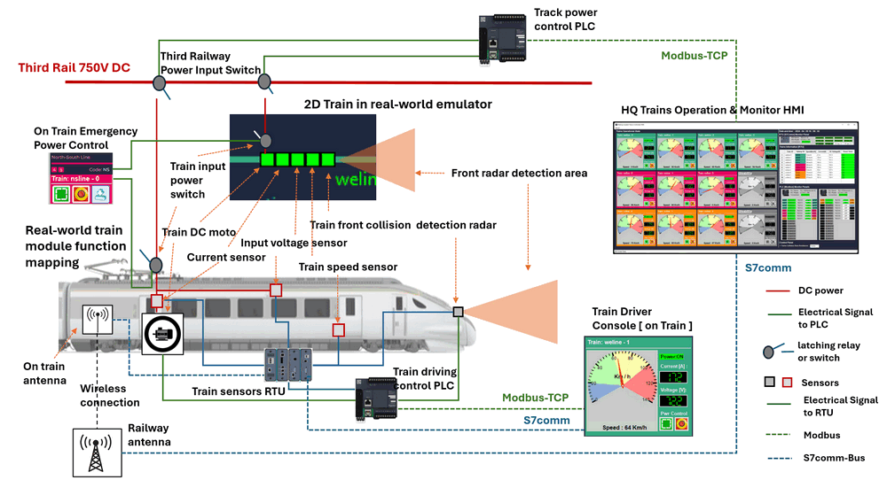
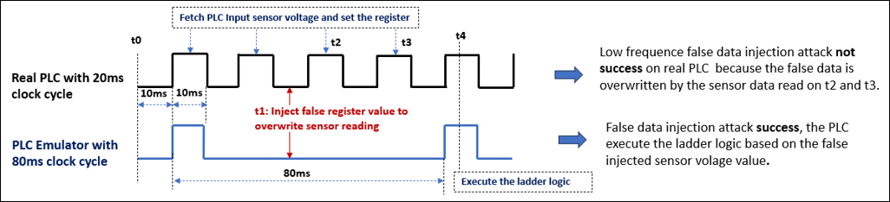

# Python Virtual PLC & RTU Simulator

**Project Design Purpose**: The primary objective of this project is to develop a cross-platform Python library capable of simulating the core fundamental functionalities of two common industrial automation OT (Operational Technology ) devices: PLCs (Programmable Logic Controllers) and RTUs (Remote Terminal Units). With importing the library, the user can effectively construct simulator programs/applications running on different OS to effectively transform virtual machines, physical machines, BBB or Raspberry Pi into into virtual PLCs or RTUs with different OT Protocols.

The PLC/RTU simulators are designed to receive and process requests from real HMI(Human-Machine Interface) systems via widely used OT device protocols such as  `IEC 60870-5-104 (IEC104)`, `Modbus-TCP` and `S7Comm`, so they can be easily integrated in the real SCADA system. Subsequently, the PLC & RTU simulator also provide simulation of changes in electrical signals, feeding them into the virtual OT devices via TCP/UDP, or directly outputting electrical signals to physical OT devices using GPIO (General Purpose Input/Output) or Serial COM interfaces.

The project consists of three primary components:

- **PLC Simulation System [Modbus]**: This component emulates the functionality of a PLC, the design follows the core operation logic of Schneider M221 PLC . It includes Modbus TCP client and server functionalities, ladder logic simulation, PLC register-memory-coil control, and interfaces for connecting with real-world physical or virtual OT devices.

- **RTU Simulation System [S7Comm]**: This component simulates both PLC and RTU operations, the design is based on the core operation logic of Siemens Simatic S7-1200 PLC and SIMATIC RTU3000C, respectively. It incorporates S7Comm client and server functionalities, manages PLC/RTU memory, performs ladder logic and RTU logic simulations, and provides interfaces for connecting with real-world emulators.

- **Real-world Communication Interface**: This component offers a communication interface library that facilitates the connection between the electrical output of PLCs/RTUs and physical devices or virtual real-world emulator programs. For the virtual OT device, the library offers TCP/UDP functionalities for communication with virtual real-world device emulators. For the physical device, the library provides  Raspberry Pi or BeagleBone Black's GPIO pins I/O capabilities for connect to the physical wires and Serial capabilities for communication via USB to connect to the physical OT device whish has RS232/RS485 connectors.

The system overview is shown below : 



We also provide the physical PLC communication module if you need to create a python program to connect to a real  Schneider M221PLC or  Siemens Simatic S7-1200 PLC.

```
# Author:      Yuancheng Liu
# version:     v_0.1.3
# Created:     2024/02/21
# Copyright:   Copyright (c) 2024 LiuYuancheng
# License:     MIT License
```

**Table of Contents**

[TOC]

- [Python Virtual PLC & RTU Simulator](#python-virtual-plc---rtu-simulator)
    + [Introduction](#introduction)
    + [Background Knowledge](#background-knowledge)
      - [Introduction of PLC and RTU](#introduction-of-plc-and-rtu)
      - [Introduction of Modbus-TCP and S7comm](#introduction-of-modbus-tcp-and-s7comm)
    + [Project Design](#project-design)
      - [Design of PLC Simulator Program](#design-of-plc-simulator-program)
      - [Design of RTU Simulator Program](#design-of-rtu-simulator-program)
      - [Design of the Virtual OT Device simulation](#design-of-the-virtual-ot-device-simulation)
    + [Project Usage](#project-usage)
      - [Library Usage Detail](#library-usage-detail)
      - [Project Usage Cases](#project-usage-cases)
        * [Use Case 1: Building a train control system with PLC and RTU](#use-case-1--building-a-train-control-system-with-plc-and-rtu)
        * [Use Case 2: PLC False-Data Injection Attack Demonstration](#use-case-2--plc-false-data-injection-attack-demonstration)
    + [Reference :](#reference--)
      - [Problem and Solution](#problem-and-solution)


------

### Introduction

While there are existing PLC simulation programs in the market, such as [OpenPLC](https://autonomylogic.com/), many of them lack the capability to interface with different Operational Technology (OT) devices, especially software-virtualized ones. Additionally, their settings often lack flexibility, hindering adjustments necessary for demonstrating OT security measures, such as modifying PLC clock time intervals. Moreover, few programs offer the functionality to virtualize RTUs within the OT environment. Our objective is to develop cross-platform Python library with virtual PLC and RTU emulator program and the related interface which user can use them to build/simulate the components from level-0 layer(Field I/O device) to level-2/3 layer(Operations management Zone ) on the OT system, as illustrated below:



> OT-layer diagram reference: https://www.redseal.net/purdue-2-0-exploring-a-new-model-for-it-ot-management/

The library will provide the following customizable functions for flexible system build usage:

- Provide Modbus-TCP communication to simulate Modbus PLCs, such as Schneider M22X.
- Provide S7Comm communication to simulate S7Comm-bus PLCs, such as Siemens S7-1200.
- Provide customized PLC ladder diagram to python function conversion and software-defined  execution priority.
- Provide UDP interface for emulating electrical signal (e.g., voltage, current, pressure) connections to the real world physical/virtual OT device.
- Simulation of PLC ladder logic execution with customizable time clock cycle configurations for educational purposes.
- Simulation of multiple PLCs in master-slave connections (DCM-DCM with RS422 multi-drop connection).
- Simulation of PLC access limitations (configuring IP address allow read list/allow set list).

In this document, we will introduce the design and present Two use cases of the PLC & RTU emulation program. 

- **Use Case 1:** Building a train control system using the PLC and RTU library.
- **Use Case 2:** Demonstrating an OT-False-data injection attack for ICS cybersecurity training by utilizing the PLC system to build a clock-adjustable PLC.


------

### Background Knowledge 

In this section, we will provide an basic background knowledge introduction to two widely used OT-Field-Controllers: PLC (Programmable Logic Controller) and RTU (Remote Terminal Unit), along with the protocols used to connect to these controllers from OT layer 2 and layer 3: Modbus TCP and S7Comm.

#### Introduction of PLC and RTU 

**PLC (Programmable Logic Controller)**: PLCs are programmable devices designed primarily for controlling machinery and processes in industrial environments. They are used to automate sequences of operations, monitor inputs from sensors, and control outputs to actuators based on programmed logic.

**RTU (Remote Terminal Unit):** RTUs are specialized devices used primarily for remote monitoring and control of distributed assets in industrial applications, such as in oil and gas pipelines, water distribution systems, and electrical substations. They typically collect data from sensors and equipment in remote locations and transmit it to a central control system for monitoring and analysis.

The PLC and RTU has function overlay, the may different between them are: 

| Feature Difference           | Programmable Logic Controller                                | Remote Terminal Unit                                         |
| ---------------------------- | ------------------------------------------------------------ | ------------------------------------------------------------ |
| Architecture                 | PLCs are standalone controllers with built-in processing capabilities, memory, and input/output (I/O) modules. They are often used for local control within a single machine or process. The communication protocol used for PLC are Modbus or S7Comm | RTUs are often part of a larger SCADA (Supervisory Control and Data Acquisition) system. They are designed to interface with sensors and devices in remote locations and communicate data back to a central SCADA master station using communication protocols such as S7Comm, DNP3, or IEC 60870. |
| I/O Capacity                 | PLCs typically have a limited number of I/O points (inputs and outputs) built into the controller itself. However, they can often be expanded with additional I/O modules to accommodate larger systems. | RTUs are designed to handle a larger number of I/O points distributed across remote locations. They may have multiple communication ports to connect to various sensors, instruments, and control devices. |
| Programming and Logic        | PLCs are programmed using ladder logic, function block diagrams, structured text, or other programming languages tailored for industrial control applications. The programming is focused on implementing logic to control sequences of operations. | RTUs are typically programmed using simpler configuration tools rather than full-fledged programming languages. The emphasis is on configuring data acquisition parameters, communication settings, and alarm thresholds rather than implementing complex control logic. |
| Environmental Considerations | PLCs are often designed to operate in harsh industrial environments with high temperatures, humidity, and vibration. They are built to withstand these conditions and maintain reliable operation. | RTUs are also ruggedized for outdoor or remote installations, but they may have additional features such as extended temperature ranges and protective enclosures to withstand extreme environmental conditions encountered in remote locations. |
|                              |                                                              |                                                              |

In summary, while PLCs and RTUs are both used for industrial automation and control, they serve different purposes and have distinct characteristics suited to their respective applications. PLCs are typically used for local control within machinery or processes, while RTUs are used for remote monitoring and control of distributed assets in industrial infrastructure.

> For more detail info please refer to this: https://www.plctable.com/plc-vs-rtu/#:~:text=PLCs%20are%20faster%20and%20more,distributed%20over%20a%20large%20area.


#### Introduction of Modbus-TCP and S7comm

Modbus TCP and S7Comm are both communication protocols used in OT environment industrial automation, but they are associated with different manufacturers and have some differences in their features and implementations:

**Modbus TCP:** Modbus is an open-source protocol developed by Modicon (now Schneider Electric). Modbus TCP is an Ethernet-based implementation of the Modbus protocol. The Modbus data packet structure is shown below:



> Reference : https://www.throughput.co.za/protocols/modbus-tcp-protocols.html

**S7Comm:** S7Comm is a protocol developed by Siemens for communication with their programmable logic controllers (PLCs), primarily in the Simatic S7 series. The S7Comm data packet structure is shown below:



> Reference: https://blog.viettelcybersecurity.com/security-wall-of-s7commplus-part-1/

The main different of Modbus TCP and S7comm

| Feature        | Modbus-TCP protocol                                          | S7comm protocol                                              |
| -------------- | ------------------------------------------------------------ | ------------------------------------------------------------ |
| Vendor Support | Being an open protocol, Modbus TCP is supported by a wide range of industrial automation equipment manufacturers. | S7Comm is proprietary to Siemens, so it's primarily used with Siemens PLCs and devices. |
| Functionality  | Modbus TCP is relatively simple and lightweight, making it easy to implement and suitable for basic communication needs in industrial automation. It supports functions such as reading and writing data registers, reading input registers, and controlling discrete outputs. | S7Comm is more feature-rich and comprehensive, offering advanced functionality tailored specifically for Siemens PLCs. It supports a broader range of data types, diagnostic capabilities, and features like access to PLC hardware information. |
| Performance    | Modbus TCP tends to be simpler and lighter, which can result in lower overhead and faster communication in certain scenarios, especially for smaller-scale systems. | S7Comm may offer better performance and efficiency in larger and more complex industrial automation environments due to its optimized design for Siemens PLCs. |
| Security       | Modbus TCP lacks built-in security features, although it can be used over VPNs or in conjunction with additional security measures to secure communication. | Siemens has implemented various security features in S7Comm, such as encryption and authentication, to ensure secure communication between devices. |
|                |                                                              |                                                              |

In summary, while both Modbus TCP and S7Comm serve similar purposes in industrial automation, they differ in terms of their origin, vendor support, functionality, performance, and security features. The choice between them often depends on factors such as the specific requirements of the automation system, the compatibility with existing equipment, and the preferences of the system integrator or end-user.


------

### Project Design

#### Design of PLC Simulator Program

The PLC simulator program is a multithreaded application consisting of four main components (the program module workflow diagram is shown below):


1. **Real Device/World Connector:** This component serves as a connector interface program that simulates the PLC's input contacts and output coils. It can link to virtual OT simulation programs via TCP/UDP or connect to physical OT devices via GPIO/Serial-COM. Similar to a real PLC, it reads or provides the virtual electrical signals periodically or the real electrical signals continuously.
2. **Ladder Logic Diagram Configuration File:** This component defines the software-based ladder logic, simulating the actual ladder logic diagrams used in real PLCs. The PLC simulator program executes this ladder logic in real time when the contacts state change (In ladder logic, contacts represent input conditions or switches, while coils represent output devices or actuators), assessing the status of the PLC's contacts (whether they are normally open (NO) or normally closed (NC)) to determine true or false input conditions. Based on these logic conditions, coils are energized or de-energized as specified in the ladder logic.
3. **Modbus/S7Comm Server:** This component functions as a Modbus-TCP or S7Comm service or both, integrating the PLC simulator into the real SCADA system (Industrial Control System network). This integration allows other SCADA programs or application, such as Human-Machine Interfaces (HMIs) or remote display consoles, to fetch data from or change settings in the PLC.
4. **PLC/RTU Connection Interface:** This interface simulates the connection of multiple RTUs to the PLC or establishes master-slave connections between multiple PLCs (DCM-DCM with RS422 multi-drop connection). It enables the creation of complex PLC setups. For PLC master-slave configuration details, please refer to the documentation: appxa-plc-master-slave.pdf.

#### Design of RTU Simulator Program

The RTU simulator program follows a similar design to the PLC simulator but with a simpler structure comprising only two components: the Real Device/World Connector and the S7Comm Server. Additionally, it incorporates a straightforward memory processing logic to handle memory values. This logic may involve tasks such as calculating average speed or checking if the maximum temperature exceeds a predefined threshold. The program module workflow diagram is shown below:


#### Design of the Virtual OT Device simulation

The virtual OT device interface utilizes TCP/UDP messages to simulate changes in electrical signals, representing voltage levels as either high or low. It can employ multiple TCP/UDP ports to simulate multiple physical lines or a single UDP port to simulate multiple physical lines simultaneously. The TCP/UDP message format follow `{ "timestamp" : <timesstamp val>, "wire1": <electrical signal change on wire1>, ..., "wire N": <electrical siganl on wireN> }` . For instance, to simulate a voltage change over a 12-second period across four wires, the simulation is depicted in the diagram below:



During the 12-second interval, the electrical voltage connected to the PLC undergoes changes. In the simulation, a value of "1" represents a high electrical signal (5V), while "0" represents a low electrical signal (0V). Based on the PLC simulator's data fetch clock setting, the real-world OT device emulation program will send 12 messages to the PLC, with one message being transmitted every second to update the electrical signal changes. For example, at t=3sec, to simulate the PLC contact input voltages as [ 0V, 5V, 5V, 0V ], the input message would be `{"timestamp": 3, "W1": 0, "W2": 1, "W3": 1, "W4": 0}`.

For the RTU sensor reading, the message format is `{ "timestamp" : <timesstamp val>, "sensor1": [<sensor1 data>, <data1 type>], ..., "sensor N": [<sensorN data>, <dataN type>] }`


------

### Project Usage 

#### Library Usage Detail

To use the PLC simulation library in your program, please refer to this API usage manual:

- [Modbus PLC Simulator Usage Manual](Modbus_PLC_Simulator/Readme.md)

To use the RTU simulation library in your program, please refer to this API usage manual:

- [S7Comm RTU Simulator Usage Manual](S7Comm_RTU_Simulator/Readme.md)

To use the physical PLC client library in your program, please refer to this document:

- [Physical PLC Communication Client Usage Manual](Physical_PLC_Client/readme.md) 

#### Project Usage Cases

In this section we will introduce two use cases of the PLC and RTU simulators. 

##### Use Case 1: Building a train control system with PLC and RTU

In this train control system scenario, we employ one PLC simulator to manage the third railway track's power supply, along with a Train RTU tasked with reading sensor data onboard the train. Additionally, we utilize another on-board Train PLC to read essential functions such as motor throttle, braking, front collision radar, and the auto-collision avoidance mechanism. The system workflow is depicted below:



The railway dispatches power control PLC sends signals to the Human-Machine Interface (HMI) via Modbus-TCP, while the on-board RTU transmits train data to the HMI using S7Comm through a wireless connection. All the on train PLC and RTU will also be controlled by the train driver console. 


##### Use Case 2: PLC False-Data Injection Attack Demonstration

Given the adjustability of the PLC simulator's execution clock,  the ISC security training instructors can effectively demonstrate the implementation of false data injection attacks on PLCs. This allows for a comparison between the injection rate of fake data on the simulator versus a real PLC. The clock configuration is detailed below:



When utilizing a real PLC, due to its high clock frequency, injecting data at the necessary speed and precise timing, just before ladder logic execution, becomes challenging. However, with the PLC simulator, instructors can extend the clock time interval significantly, facilitating the occurrence and observation of the injection attack's effects.


------

### Reference : 

- https://medium.com/@pt.artem/how-to-use-python-to-build-a-simple-client-server-based-on-the-s7-protocol-f4b96e563cc1

- https://python-snap7.readthedocs.io/en/latest/_modules/snap7/server.html#Server


------

### Problem and Solution

Refer to `doc/ProblemAndSolution.md`

------

> last edit by LiuYuancheng (liu_yuan_cheng@hotmail.com) by 07/04/2024 if you have any problem, please send me a message. 