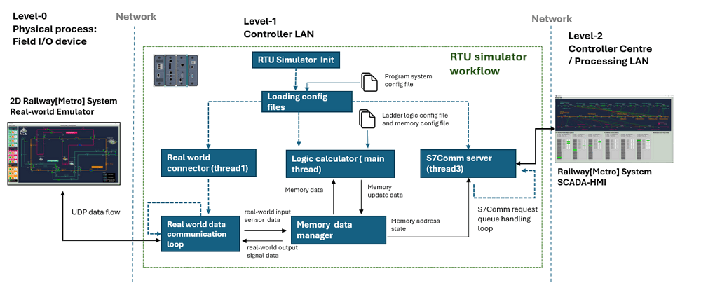

# S7Comm RTU Simulator [Usage Manual]

```powershell
# Library Usage Manual
```

**Project Design Purpose**: The main objective of this project is to develop a Python library capable of simulating the OT RTUs (Remote Terminal Units) device which use the Siemens S7Comm protocol. 

This component can simulate the fundamental operations of both PLC and RTU , the design is based on the core operation logic of Siemens Simatic S7-1200 PLC and SIMATIC RTU3000C, respectively. It incorporates S7Comm client and server functionalities, manages PLC/RTU memory, performs ladder logic and RTU logic simulations, and provides interfaces for connecting with real-world emulators. The program module workflow diagram is shown below:



```
# version:     v0.1.3
# Created:     2024/02/21
# Copyright:   Copyright (c) 2024 LiuYuancheng
# License:     MIT License
```

**Table of Contents** 

[TOC]

- [S7Comm Remote Terminal Unit Simulator](#s7comm-remote-terminal-unit-simulator)
    + [Introduction](#introduction)
      - [Module 1: rtuSimulator](#module-1--rtusimulator)
      - [Module 2: snap7Comm](#module-2--snap7comm)
    + [Program Setup](#program-setup)
        * [Development Environment](#development-environment)
        * [Additional Lib/Software Need](#additional-lib-software-need)
        * [Hardware Needed : None](#hardware-needed---none)
        * [Program Files List](#program-files-list)
    + [Program Usage](#program-usage)
        * [Run the Test Case](#run-the-test-case)
        * [Build a Customized RTU](#build-a-customized-rtu)

------

### Introduction 

RTUs are specialized devices used primarily for remote monitoring and control of distributed assets in industrial applications, such as in oil and gas pipelines, water distribution systems, and electrical substations. They typically collect data from sensors and equipment in remote locations and transmit it to a central control system for monitoring and analysis. This library provides the software simulation solution for user to build their customized RTU by using a virtual machine, physical server or Raspberry PI, then integrated the emulation App as a bridge to link the OT level-0 components (physical field device) and level-2/3 components (HMI or remote field control console). This lib provides two main modules: `rtuSimulator` and `snap7Comm`

#### Module 1: rtuSimulator  

A simple RTU simulation lib module to connect and control the real-world emulator via UDP (to simulate the electrical signals changes) and handle SCADA system S7Comm request. The module contents three components: 

- `RealWorldConnector`: A UDP client to fetch and parse the data from the real world simulation app and update the real world components. (i.e. Simulate fetching the electrical signal from sensors and change the switches' state, For the RTU sensor reading, the message format is `{ "timestamp" : <timesstamp val>, "sensor1": [<sensor1 data>, <data1 type>], ..., "sensor N": [<sensorN data>, <dataN type>] }`) 
- `s7CommService`: A sub-threading service to run the S7Comm server parallel with the main program thread to handle the OT system level-2/3 components request. 
- `rtuSimuInterface`: A interface class with the basic RTU function for the user to inherit it to build their RTU module.

#### Module 2: snap7Comm

This module will provide a packaged Siemens S7Comm client and server communication API for testing or simulating the data connection flow between PLC/RTU and SCADA system. The module is implemented based on python-snap7 lib module: https://github.com/gijzelaerr/python-snap7. Three components will be provided in this module:

- `ladder logic interface`: An interface class hold the ladder logic calculation algorithm. User can build their own ladder logic by inheriting this interface by overwritten the `init()` and `runLadderLogic()` function by adding the memory info and the detail control.
- `S7CommClient`: S7Comm client module to read source memory address's value or write destination memory  address' value from/to the target PLC/RTU. 
- `S7CommServer`: S7Comm server module used by RTU/PLC module to handle the S7Comm data read/set request.


------

### Program Setup

Follow the below configuration before run the program. The library folder contents 3 section in different sub folders:

- `S7Comm_RTU_Simulator / src` : All the python library files are under this folder, you can develop you app in this folder by import them or copy it in your project. 
- `S7Comm_RTU_Simulator / testcase`: The RTU server and client test case programs, you can follow the code to integrate the S7Comm client and server in your program.
- `S7Comm_RTU_Simulator / example`:  The detail example to use the lib to create a complex RTU simulation program.(You can follow the design in the example, but the example program may not be execute directly)

##### Development Environment

- python 3.7.2rc2+ 64bit [ Windows11 ]

##### Additional Lib/Software Need

- python-snap7: https://python-snap7.readthedocs.io/en/latest/, install: `pip install python-snap7`

##### Hardware Needed : None

##### Program Files List 

| Program File                 | Execution Env | Description                                                  |
| ---------------------------- | ------------- | ------------------------------------------------------------ |
| src/rtuSimulator.py          | python 3.7 +  | The main RTU simulator lib provides the simulator interface, real world emulation App connector and the S7Comm sub-threading service. |
| src/snap7.dll                | Windows-OS    | The Windows OS platform Snap7 lib dll file.                  |
| src/snap7Comm.py             | python 3.7 +  | The S7Comm protocol handling lib provides the S7Comm client, server and the RTU internal logic execution interface. |
| src/udpCom.py                | python 3.7 +  | UDP communication handling library module.                   |
| testcase/rtuClientTest.py    | python 3.7 +  | The test case of the `<snap7Comm.py>` lib module to test as a HMI to connect to a RTU simulator. |
| testcase/rtuServerTest.py    | python 3.7 +  | The test case of the `<snap7Comm.py>` lib module to test as a RTU to handle the HMI's connection request. |
| example/rtuSimulatorTrain.py | python 3.7 +  | An example of how to inherit the rtuSimulator interface to build a customized  RTU application. |


------

### Program Usage

To create a S7comm server, follow the example in test case program `rtuServerTest.py` , to create a S7Comm client to connect other RTU device follow the example in the test case program `rtuClientTest.py`

##### Run the Test Case

Run RTU server testcase program: 

```shell
WinOS: python rtuServerTest.py	LinuxOS: sudo python3 rtuServerTest.py
```

Run RTU client testcase program:

```shell
WinOS: python rtuClientTest.py	LinuxOS: sudo python rtuClientTest.py
```

##### Build a Customized RTU

To build a customized RTU,  please import the `rtuSimulator` and follow the example `rtuSimulatorTrain.py` with the below steps: 

**Step 1**: Inherit the RTU simulator interface class : 

```python
class trainPowerRtu(rtuSimulator.rtuSimuInterface):
```

**Step-2**: Overwrite the private function `_initRealWorldConnectionParm` if need to set special parameters:

```python
def _initRealWorldConnectionParm(self):
	self.regSRWfetchKey = gv.gRealWorldKey 
```

As shown in the above example code, we need to set the RTU identify key to link to real world emulator. 

**Step3**: Initialize the RTU memory address you want to use to storge the data:

```python
   def _initMemoryAddrs(self):
        s7commServer = self.s7Service.getS7ServerRef()
        s7commServer.initNewMemoryAddr(1, [0, 2, 4, 6], [BOOL_TYPE, INT_TYPE, INT_TYPE, INT_TYPE])
        s7commServer.initNewMemoryAddr(2, [0, 2, 4, 6], [BOOL_TYPE, INT_TYPE, INT_TYPE, INT_TYPE])
        s7commServer.initNewMemoryAddr(3, [0, 2, 4, 6], [BOOL_TYPE, INT_TYPE, INT_TYPE, INT_TYPE])
        s7commServer.initNewMemoryAddr(4, [0, 2, 4, 6], [BOOL_TYPE, INT_TYPE, INT_TYPE, INT_TYPE])
        s7commServer.initNewMemoryAddr(5, [0, 2, 4, 6], [BOOL_TYPE, INT_TYPE, INT_TYPE, INT_TYPE])
        s7commServer.initNewMemoryAddr(6, [0, 2, 4, 6], [BOOL_TYPE, INT_TYPE, INT_TYPE, INT_TYPE])
        s7commServer.initNewMemoryAddr(7, [0, 2, 4, 6], [BOOL_TYPE, INT_TYPE, INT_TYPE, INT_TYPE])
        s7commServer.initNewMemoryAddr(8, [0, 2, 4, 6], [BOOL_TYPE, INT_TYPE, INT_TYPE, INT_TYPE])
        s7commServer.initNewMemoryAddr(9, [0, 2, 4, 6], [BOOL_TYPE, INT_TYPE, INT_TYPE, INT_TYPE])
        s7commServer.initNewMemoryAddr(10, [0, 2, 4, 6], [BOOL_TYPE, INT_TYPE, INT_TYPE, INT_TYPE])
```

As shown above example code, we want to use 10 memory addresses to store 40 parameters of the train, call the function `getS7ServerRef()` to get the reference of the S7comm server then init the 64 bits memory address from `0x00000001` to `0X0000000A`.  For the data each memory is  8 bytes data and for data type we provide 3 type of data storage:

| Data Type | Key world | Bytes length |
| --------- | --------- | ------------ |
| Boolean   | BOOL_TYPE | 2 Bytes      |
| Integer   | INT_TYPE  | 2 Bytes      |
| Float     | REAL_TYPE | 4 Bytes      |

**Step4**: Init the memory's default value:

```python
def _initMemoryDefaultVals(self):
	s7commServer = self.s7Service.getS7ServerRef()
	s7commServer.setMemoryVal(1, 4, 3)
```

As shown above example code, we want to set address `0x00000001`' s byte index [ 04 ] to value int(3) as default.

**Step5**: Overwrite the `_updateMemory()` function to process the memory changes every time RTU got the OT device data feed back.

```python
def _updateMemory(self, result):
s7commServer = self.s7Service.getS7ServerRef()
for key, value in self.regsStateRW.items():
    for idx, rstData in enumerate(result[key]):
        memoryIdx = value[idx]
        s7commServer.setMemoryVal(memoryIdx, 0, rstData[0])
        s7commServer.setMemoryVal(memoryIdx, 2, rstData[1])
        s7commServer.setMemoryVal(memoryIdx, 4, rstData[2])
        s7commServer.setMemoryVal(memoryIdx, 6, rstData[3])
```

As shown above example code, if you want to update some other memory address' value when there is memory update happens, overwrite the `_updateMemory()` function. If you need more complex execution, overwrite the function `_initLadderHandler()` and pass in the complex ladder logic in this function.


##### Build a Ladder Logic

If the user want to build a complex ladder logic which execute inside the RTU, they can inherit the `snap7Comm.rtuLadderLogic` class. For example if speed value save on memory Idx=0, dataIdx=0 and check whether the val more than the threshold then write the result to memory Idx=0 dataIdx=2:

1. Overwrite the `initLadderInfo()` to set the src and dest address info.
2. Overwrite the `runLadderLogic()` to do the value check and memory update.
3. Use or pass the ladder logic object in a handlerS7request() function.

This is a example to build a test ladder logic in the server test case code you can follow: 

```python
class testLadderLogic(snap7Comm.rtuLadderLogic):

    def __init__(self, parent, nameStr):
        super().__init__(parent, ladderName=nameStr)

    def initLadderInfo(self):
        self.srcAddrValInfo = {'addressIdx': 2, 'dataIdx': 4}
        self.destAddrValInfo = {'addressIdx': 2, 'dataIdx': 0}

    def runLadderLogic(self, inputData=None):
        print(" - runLadderLogic")
        addr, dataIdx, datalen = inputData
        print("Received data write request: ")
        print("Address: %s " %str(addr))
        print("dataIdx: %s " %str(dataIdx))
        print("datalen: %s" %str(datalen))
        if addr == self.srcAddrValInfo['addressIdx'] and dataIdx == self.srcAddrValInfo['dataIdx']:
            val = self.parent.getMemoryVal(self.srcAddrValInfo['addressIdx'], 
                                        self.srcAddrValInfo['dataIdx'])
            print("dataVal: %s" %str(print))
            self.parent.setMemoryVal(self.destAddrValInfo['addressIdx'],
                                    self.destAddrValInfo['dataIdx'], val)


testRtuLL = testLadderLogic(server, 'testRtuLL')
```

Import the ladder logic in your customized RTU: 

```python
# The auto data handling function.
def handlerS7request(parmList):
    """ ladder logic simulation function: when the user set the address Idx=2
        and dataIdx = 4 value, the ladder logic will change the address Idx=2
        dataIdx = 0 's value to the same value.
    """
    global testRtuLL
    if server: testRtuLL.runLadderLogic(inputData=parmList)
        
server.startService(eventHandlerFun=handlerS7request)
```


If you the logic is very simple, you can also implement in the handler function directly as shown in the below example:

```python
def handlerS7request_old(parmList):
    """ ladder logic simulation function: when the user set the address Idx=2
        and dataIdx = 4 value, the ladder logic will change the address Idx=2
        dataIdx = 0 's value to the same value.
    """
    global server
    addr, dataIdx, datalen = parmList
    print("Received data write request: ")
    print("Address: %s " %str(addr))
    print("dataIdx: %s " %str(dataIdx))
    print("datalen: %s" %str(datalen))
    if server:
        print("dataVal: %s" %str(server.getMemoryVal(addr, dataIdx)))
        if addr == 2 and dataIdx == 4:
            server.setMemoryVal(addr, 0, server.getMemoryVal(addr, dataIdx))
```


------

> last edit by LiuYuancheng (liu_yuan_cheng@hotmail.com) by 08/04/2024 if you have any problem, please send me a message. 